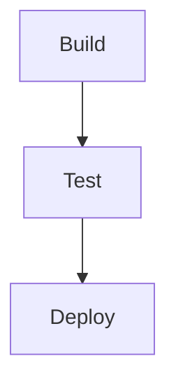
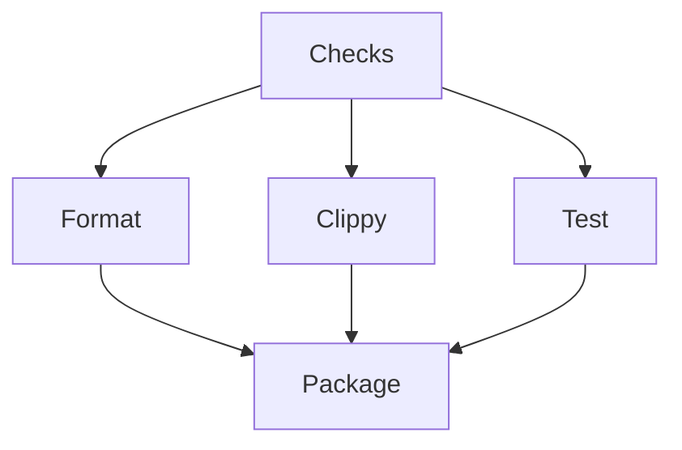
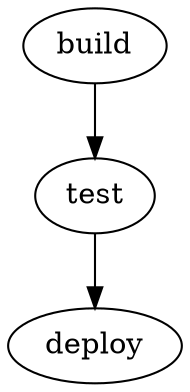

> From: https://chatgpt.com/c/6a074d44-8bfc-8391-b790-8050e8cca29b

# you asked

message time: 2026-05-15 18:43:49

Habilidad de entrevista incansable que pone a prueba planes y diseños mediante preguntas sistemáticas.

Realiza preguntas profundas sobre todos los aspectos de un plan, recorriendo árboles de decisión rama por rama hasta llegar a un entendimiento compartido
Explora automáticamente el código base para responder preguntas donde el contexto del código está disponible, reduciendo el intercambio redundante
Diseñado para revisiones de diseño, validación de arquitectura y planificación previa a la implementación, donde una investigación exhaustiva evita problemas posteriores
HABILIDADES.md
Entrevistame incansablemente sobre cada aspecto de este plan hasta que lleguemos a un entendimiento compartido. Recorra cada rama del árbol de diseño, resolviendo las dependencias entre las decisiones una por una. Para cada pregunta, proporcione su respuesta recomendada.

Haz las preguntas una a la vez.

---

# chatgpt response

Perfecto. Empezamos. Haré **una pregunta cada vez**, y en cada turno incluiré mi **respuesta recomendada** para que podamos ir cerrando decisiones.

### Pregunta 1

¿Cuál es exactamente el **plan/diseño** que quieres someter a revisión incansable?

Por el contexto reciente, sospecho que puede ser uno de estos:

1. **VTCode Workbench**, extrayendo lógica de `vtcode-tui` hacia `vtcode-workbench-ui-core`.
2. **Pipeliner / `rustline run`**, ejecutando pipelines Rust como scripts/proyectos efímeros.
3. **La propia habilidad `HABILIDADES.md`**, es decir, definir una skill de entrevista sistemática.
4. Otro plan distinto.

**Respuesta recomendada:**  
Empezaría por revisar **VTCode Workbench**, porque ya tiene axiomas, líneas rojas y decisiones arquitectónicas claras. Es buen candidato para recorrer árbol de decisiones: límites entre crates, extracción de lógica, compatibilidad con TUI, modelo de estado, renderers, acciones, efectos, snapshots, testing y estrategia de migración.

---

# you asked

message time: 2026-05-15 18:46:19

estoy pensando en un proyecto llamado pipeliner que pretende ser entre el proyecto rust-script like y un DSL jekins pipeline DSL like, pero no se como hacer efiente el DSL, empece con macros pero creo que me retraza porque tengo que simular todo el pipeline DSL de groovy en rust. Como podemos hacer DSL efientes y tipo script de groovy que se puedan lanzar con un cli

---

# chatgpt response

Voy a aterrizarlo como decisión de arquitectura, no como lista genérica de opciones. Primero contrasto rápidamente el estado actual de herramientas Rust tipo script/DSL para no apoyarnos en suposiciones viejas.

Sí: tu intuición es buena. **Si intentas clonar el Jenkins Pipeline DSL de Groovy con macros Rust, te vas a atascar.** No porque Rust no pueda, sino porque estarías forzando a Rust a comportarse como Groovy: dinámico, tolerante, tardío, extensible en runtime y orientado a bloques DSL. Rust es justo lo contrario: fuerte en tipos, compilación y estructura explícita.

Mi recomendación inicial para **Pipeliner** sería esta:

## Tesis recomendada

No construiría el DSL principal como macros Rust.

Construiría Pipeliner con **dos capas**:

1. **DSL declarativo propio**, pensado para pipelines:
   - YAML / TOML / Starlark-like / Rhai / Rune / mini DSL propio.
   - Fácil de escribir.
   - Ejecutable desde CLI.
   - Validable antes de ejecutar.
   - Parecido a Jenkins en ergonomía, pero no necesariamente en sintaxis exacta.

2. **Runtime Rust fuertemente tipado**, que interpreta ese DSL:
   - `Pipeline`
   - `Stage`
   - `Step`
   - `Agent`
   - `Environment`
   - `PostCondition`
   - `Artifact`
   - `Secret`
   - `Cache`
   - `Workspace`
   - `Executor`

Así evitas simular Groovy en Rust. En vez de eso, haces que Rust sea el **motor fiable**, no el lenguaje de scripting visible.

Rust-script existe y permite ejecutar ficheros Rust como scripts con dependencias embebidas y caché de compilación; también hay movimiento alrededor de single-file packages en Cargo mediante el RFC 3424, pero eso te sigue dejando dentro de Rust puro, con coste de compilación y sin la flexibilidad natural de un DSL dinámico. ([rust-script](https://rust-script.org/?utm_source=chatgpt.com))

Para un DSL más tipo “script embebido”, miraría especialmente **Rhai** o **Rune**. Rhai está diseñado como lenguaje de scripting embebible en Rust, con sintaxis familiar y API sencilla; Rune se presenta como lenguaje dinámico embebible, “async-first” y con integración limpia con Rust. ([Docs.rs](https://docs.rs/rhai/latest/rhai/?utm_source=chatgpt.com))

## Mi recomendación concreta

Para Pipeliner yo haría esto:

```text
pipeliner run pipeline.pipe
pipeliner check pipeline.pipe
pipeliner graph pipeline.pipe
pipeliner explain pipeline.pipe
```

Y el fichero podría tener una sintaxis propia sencilla:

```groovy
pipeline {
  agent any

  env {
    PETCLINIC_REPO = "https://github.com/spring-projects/spring-petclinic.git"
  }

  stages {
    stage "Checkout" {
      sh "git clone ${PETCLINIC_REPO} app"
    }

    stage "Build" {
      dir "app" {
        sh "mvn package"
      }
    }

    stage "Test" {
      dir "app" {
        sh "mvn test"
      }
    }
  }

  post {
    success {
      echo "Success"
    }

    failure {
      echo "Failed"
    }
  }
}
```

Pero internamente no lo trataría como Groovy. Lo parsearía a un AST propio:

```rust
struct Pipeline {
    agent: Agent,
    environment: EnvMap,
    stages: Vec<Stage>,
    post: PostBlock,
}
```

Y luego lo bajaría a un plan ejecutable:

```rust
struct ExecutionPlan {
    nodes: Vec<ExecutionNode>,
    edges: Vec<Dependency>,
    policies: ExecutionPolicies,
}
```

La idea clave: **el DSL no ejecuta directamente**. El DSL describe. El runtime decide, valida, ordena, ejecuta, reintenta, cachea y observa.

## Por qué no macros como DSL principal

Macros Rust te dan cosas buenas:

```rust
pipeline! {
    stage!("Build", steps!(
        sh!("cargo build")
    ))
}
```

Pero tienen problemas para tu caso:

- El usuario tiene que escribir Rust válido.
- Los errores serán errores de compilador Rust, no errores de pipeline.
- La sintaxis se vuelve rígida.
- Cada cambio del DSL puede requerir tocar macros.
- Es difícil conseguir ergonomía tipo Jenkins.
- Compilar para ejecutar un pipeline puede ser lento.
- Si quieres extensibilidad por plugins, condiciones dinámicas, includes, templates o steps cargados en runtime, las macros empiezan a estorbar.

Las macros podrían quedar como **API secundaria para usuarios avanzados**, no como camino principal.

## Arquitectura que veo más eficiente

```text
           ┌─────────────────────┐
           │  pipeline.pipe       │
           │  DSL humano          │
           └──────────┬──────────┘
                      │
                      ▼
           ┌─────────────────────┐
           │ Parser              │
           │ pest / chumsky / nom │
           └──────────┬──────────┘
                      │
                      ▼
           ┌─────────────────────┐
           │ AST                 │
           │ Pipeline syntax tree │
           └──────────┬──────────┘
                      │
                      ▼
           ┌─────────────────────┐
           │ Semantic analyzer   │
           │ valida nombres, env │
           │ secrets, stages     │
           └──────────┬──────────┘
                      │
                      ▼
           ┌─────────────────────┐
           │ ExecutionPlan       │
           │ DAG + policies      │
           └──────────┬──────────┘
                      │
                      ▼
           ┌─────────────────────┐
           │ Runtime Rust        │
           │ local/docker/k8s    │
           └─────────────────────┘
```

Esto te permite tener un DSL cómodo y, a la vez, un runtime serio.

## Decisión importante

Hay tres caminos razonables:

### Opción A: DSL propio Jenkins-like

Ejemplo:

```groovy
pipeline {
  agent docker("rust:1.78")

  stages {
    stage "Build" {
      sh "cargo build"
    }
  }
}
```

Ventajas:
- Máxima ergonomía.
- Control total del lenguaje.
- Errores adaptados al dominio.
- Puedes parecerte a Jenkins sin copiar Groovy.

Desventajas:
- Tienes que hacer parser, AST, formatter, LSP si crece.

Esta es mi opción recomendada para Pipeliner.

---

### Opción B: Rhai como lenguaje embebido

Ejemplo:

```rust
pipeline("demo", || {
  agent("any");

  stage("Build", || {
    sh("cargo build");
  });

  stage("Test", || {
    sh("cargo test");
  });
});
```

Ventajas:
- Ya tienes scripting dinámico.
- Integración sencilla con Rust.
- Menos trabajo inicial de parser.
- Buen MVP.

Desventajas:
- El lenguaje no es tuyo.
- La sintaxis no será exactamente Jenkins-like.
- Tendrás que adaptar el modelo mental de pipeline sobre Rhai.

Buena opción para validar rápido.

---

### Opción C: Rust-script como backend de ejecución

Ejemplo:

```rust
#!/usr/bin/env pipeliner

use pipeliner::*;

pipeline()
  .agent(any())
  .stage("Build", |s| {
      s.sh("cargo build");
  })
  .run();
```

Ventajas:
- Todo es Rust.
- Tipado fuerte.
- Reutilización directa de crates.
- Ideal para usuarios técnicos.

Desventajas:
- Menos “script Groovy”.
- Compilación.
- No tan cómodo para usuarios Jenkins.
- Peor para configuración corporativa sencilla.

Lo usaría como modo avanzado, no como DSL principal.

## Mi propuesta de producto

No hagas “Rust Groovy”.

Haz esto:

```text
Pipeliner = Jenkinsfile ergonomics + Rust runtime + DAG execution + plugins typed
```

El MVP podría ser:

```text
pipeliner check pipeline.pipe
pipeliner run pipeline.pipe
pipeliner run --dry-run pipeline.pipe
pipeliner graph pipeline.pipe
```

Con soporte inicial para:

```text
pipeline
agent
env
stages
stage
steps
sh
dir
parallel
when
post
success
failure
always
```

Y dejar fuera al principio:

```text
input
matrix
credentials complejas
shared libraries
dynamic loading
script blocks arbitrarios
```

Porque esas cosas son precisamente las que convirtieron Jenkins Pipeline en algo potente, pero también difícil de razonar.

---

# Pregunta 1

¿Quieres que Pipeliner sea principalmente un **lenguaje de pipeline declarativo** o un **lenguaje de scripting general que además permite pipelines**?

Esta decisión parte el árbol entero.

## Respuesta recomendada

Yo elegiría:

> **Pipeliner debe ser un lenguaje de pipeline declarativo con pequeñas zonas controladas de scripting, no un lenguaje general.**

Motivo: si lo haces lenguaje general, acabas recreando Groovy/Jenkins con todos sus problemas: ejecución dinámica, side effects por todas partes, análisis difícil, mala trazabilidad y poca capacidad de validar antes de ejecutar.

El núcleo debería poder responder antes de ejecutar:

```text
¿Qué stages hay?
¿Qué comandos se ejecutarán?
¿Qué secretos necesita?
¿Qué jobs pueden ir en paralelo?
¿Qué condiciones bloquean cada stage?
¿Qué artefactos produce?
¿Qué agentes necesita?
¿Qué pasa si falla?
```

Eso solo es fácil si el DSL es principalmente declarativo.

---

# you asked

message time: 2026-05-15 18:54:03

ok  estaba pensando en algo como rust-script el proyecto pero que tenga un DSL en rust,

---

# chatgpt response

Voy a enfocarlo como “Rust como lenguaje huésped, pero con ergonomía de script”. La clave será separar qué parte debe ser Rust compilado y qué parte debe parecer DSL.

Vale, entonces el diseño cambia bastante: **no quieres un DSL externo**, quieres algo tipo `rust-script`, pero donde el fichero sea Rust ejecutable y a la vez tenga una API DSL cómoda para definir pipelines.

Eso me parece viable, pero con una condición importante:

> No intentes hacer que Rust “parezca Groovy”. Haz que el DSL sea **Rust idiomático**, pero con una capa de ergonomía que esconda boilerplate.

`rust-script` permite ejecutar ficheros Rust sin crear un proyecto explícito y con dependencias embebidas; además, Cargo tiene el RFC 3424 para “single-file packages”, es decir, `.rs` con manifest embebido, aunque su tracking sigue asociado a `-Zscript`/Nightly y detalles de estabilización. ([crates.io](https://crates.io/crates/rust-script?utm_source=chatgpt.com))

La forma que yo perseguiría para **Pipeliner** sería esta:

```rust
#!/usr/bin/env pipeliner

//! ```cargo
//! [dependencies]
//! pipeliner = "0.1"
//! ```

use pipeliner::prelude::*;

pipeline("petclinic", |p| {
    p.agent(any());

    p.env("PETCLINIC_REPO", "https://github.com/spring-projects/spring-petclinic.git");

    p.stage("Checkout", |s| {
        s.sh("git clone ${PETCLINIC_REPO} app");
    });

    p.stage("Build", |s| {
        s.dir("app", |d| {
            d.sh("mvn package");
        });
    });

    p.stage("Test", |s| {
        s.dir("app", |d| {
            d.sh("mvn test");
        });
    });

    p.post(|post| {
        post.success(|ctx| {
            ctx.echo("Success");
        });

        post.failure(|ctx| {
            ctx.echo("Failed");
        });
    });
});
```

Ese DSL no es Groovy, pero se acerca mucho al modelo mental de Jenkins:

```text
pipeline
  agent
  env
  stage
    sh
    dir
  post
    success
    failure
```

La diferencia es que lo haces con closures Rust.

## Mi recomendación de arquitectura

Yo no empezaría con macros. Empezaría con **builder API + closures**.

Algo así:

```rust
pipeline("demo", |p| {
    p.stage("Build", |s| {
        s.sh("cargo build");
    });

    p.stage("Test", |s| {
        s.sh("cargo test");
    });
});
```

Internamente, eso construye un modelo:

```rust
PipelineSpec {
    name,
    agent,
    env,
    stages,
    post,
}
```

Y después el CLI hace:

```text
parse script -> compile/cache -> execute binary -> receive spec -> run plan
```

O incluso más simple al principio:

```text
pipeliner run file.pipe.rs
```

El fichero Rust se compila como script y ejecuta el pipeline directamente.

## La trampa principal

La gran pregunta técnica es esta:

> ¿El script Rust debe **ejecutar el pipeline** directamente, o solo debe **declararlo** y devolver una especificación al runtime?

Yo recomiendo lo segundo.

Es decir, este script:

```rust
pipeline("demo", |p| {
    p.stage("Build", |s| {
        s.sh("cargo build");
    });
});
```

No debería lanzar `cargo build` en el momento de construir el DSL.

Debería construir esto:

```rust
PipelineSpec {
    stages: [
        Stage {
            name: "Build",
            steps: [
                Step::Shell {
                    command: "cargo build"
                }
            ]
        }
    ]
}
```

Luego el runtime decide cómo ejecutar.

Eso te permite:

```text
pipeliner check pipeline.rs
pipeliner graph pipeline.rs
pipeliner dry-run pipeline.rs
pipeliner run pipeline.rs
pipeliner explain pipeline.rs
```

Si mezclas definición y ejecución, pierdes análisis previo.

## Cómo haría eficiente el DSL

Dividiría el proyecto así:

```text
pipeliner-cli
  Ejecuta scripts, gestiona caché, flags, configuración.

pipeliner-core
  Modelo: PipelineSpec, StageSpec, StepSpec, Agent, Env, Conditions.

pipeliner-dsl
  Builder API cómoda para escribir pipelines en Rust.

pipeliner-runtime
  Ejecuta ExecutionPlan local/docker/k8s.

pipeliner-protocol
  Serialización entre script y CLI, probablemente JSON/MessagePack.
```

El usuario escribe Rust, pero solo toca esto:

```rust
use pipeliner::prelude::*;
```

## Ejemplo de DSL más idiomático

```rust
pipeline("release", |p| {
    p.agent(docker("rust:1.86"));

    p.envs([
        ("RUST_BACKTRACE", "1"),
        ("CARGO_TERM_COLOR", "always"),
    ]);

    p.stage("Format", |s| {
        s.sh("cargo fmt --check");
    });

    p.stage("Clippy", |s| {
        s.sh("cargo clippy -- -D warnings");
    });

    p.stage("Test", |s| {
        s.sh("cargo test");
    });

    p.stage("Package", |s| {
        s.when(branch("main"));
        s.sh("cargo build --release");
        s.archive("target/release/pipeliner");
    });

    p.post(|post| {
        post.always(|ctx| ctx.echo("Pipeline finished"));
        post.failure(|ctx| ctx.echo("Pipeline failed"));
    });
});
```

Este enfoque es mucho más sostenible que macros tipo:

```rust
pipeline! {
    stages {
        stage!("Build", steps!(
            sh!("cargo build")
        ))
    }
}
```

Las macros parecen bonitas al principio, pero cada feature compleja te obliga a ampliar una mini-gramática dentro de Rust.

## Dónde sí usaría macros

Las usaría muy poco, para azúcar opcional:

```rust
env! {
    RUST_BACKTRACE = "1",
    CARGO_TERM_COLOR = "always",
}
```

O para declarar steps personalizados:

```rust
#[step]
fn notify_slack(channel: String, message: String) {
    // ...
}
```

Pero no haría que todo el DSL dependa de macros.

## Modelo mental recomendado

Tu proyecto no sería exactamente “rust-script + Jenkins DSL”.

Sería más bien:

```text
Pipeliner =
  single-file Rust pipelines
  + DSL builder idiomático
  + runtime CI/CD
  + caché de compilación
  + análisis antes de ejecución
```

Y el usuario ejecuta:

```bash
pipeliner run Jenkinsfile.rs
```

o:

```bash
pipeliner check pipeline.rs
pipeliner graph pipeline.rs
pipeliner run --local pipeline.rs
pipeliner run --docker pipeline.rs
pipeliner run --k8s pipeline.rs
```

## Pregunta 2

¿Quieres que el fichero `pipeline.rs` sea un **programa Rust normal que ejecuta el pipeline**, o un **script Rust que solo declara el pipeline y se lo entrega al runtime de Pipeliner**?

Mi respuesta recomendada:

> Que el script Rust **solo declare** el pipeline y produzca un `PipelineSpec` serializable.  
> El runtime de Pipeliner debe ser quien ejecute, observe, reintente, paralelice, gestione secretos, workspaces y errores.

Esto es más trabajo al principio, pero desbloquea las features importantes: `check`, `dry-run`, `graph`, ejecución remota, caché, auditoría y validación previa.

---

# you asked

message time: 2026-05-15 18:55:46

no puedo tener un estilo groovy pipeline DSL en groovy, no hay tecnologias que ayuden con DSL en rust?,

---

# chatgpt response

Voy a separar “parecerse visualmente a Groovy” de “tener capacidades de DSL”. En Rust sí hay tecnologías útiles, pero cada una empuja el diseño hacia límites distintos.

Sí, hay tecnologías que ayudan mucho, pero hay que aceptar una frontera:

> En Rust puedes hacer un DSL cómodo, potente y estático, pero **no puedes tener exactamente el estilo Groovy/Jenkins Pipeline sin pagar un coste alto** en macros, parsing raro o lenguaje externo.

Groovy permite esto:

```groovy
pipeline {
  agent any

  stages {
    stage('Build') {
      steps {
        sh 'cargo build'
      }
    }
  }
}
```

En Rust puro, esa sintaxis exacta no existe porque Rust necesita llamadas, macros, closures, tipos y delimitadores más estrictos.

Pero puedes acercarte por varios caminos.

---

## Tecnologías útiles para DSL en Rust

### 1. Builder API con closures

Esta sería mi primera opción.

```rust
pipeline("demo", |p| {
    p.agent(any());

    p.stages(|stages| {
        stages.stage("Build", |s| {
            s.steps(|steps| {
                steps.sh("cargo build");
            });
        });

        stages.stage("Test", |s| {
            s.steps(|steps| {
                steps.sh("cargo test");
            });
        });
    });
});
```

No parece Groovy al 100%, pero conceptualmente es muy parecido.

Ventajas:

- Rust normal.
- Buen autocompletado.
- Buen tipado.
- Fácil de testear.
- Fácil de evolucionar.
- No necesitas pelearte con macros complejas.
- Puedes hacer que solo construya un `PipelineSpec`.

Desventajas:

- Tiene más ruido: `|p|`, `|s|`, paréntesis, punto y coma.
- No puedes escribir `agent any` como en Groovy.

**Mi recomendación:** empezar aquí.

---

### 2. Macros declarativas `macro_rules!`

Puedes acercarte más a Groovy:

```rust
pipeline! {
    agent any;

    stages {
        stage "Build" {
            steps {
                sh "cargo build";
            }
        }

        stage "Test" {
            steps {
                sh "cargo test";
            }
        }
    }

    post {
        success {
            echo "OK";
        }

        failure {
            echo "KO";
        }
    }
}
```

Esto ya empieza a parecer Jenkins.

`macro_rules!` permite definir mini-sintaxis basada en patrones, pero para DSLs grandes se vuelve difícil de mantener. Sirve muy bien para azúcar sintáctico controlado, no tanto para recrear todo Jenkins Pipeline.

Ventajas:

- Sintaxis muy DSL.
- No necesitas parser externo.
- Sigue siendo Rust.
- Puede expandir a tu builder API.

Desventajas:

- Errores menos claros.
- Las macros grandes se vuelven frágiles.
- Difícil soportar muchas variantes.
- Complica tooling, debugging y evolución.

**Mi recomendación:** úsalo después, como capa de azúcar sobre una API builder estable.

---

### 3. Procedural macros

Aquí podrías hacer algo más potente:

```rust
pipeline! {
    agent any

    stages {
        stage("Build") {
            sh("cargo build")
        }
    }
}
```

Las procedural macros operan sobre `TokenStream` y generan código Rust en tiempo de compilación. La referencia oficial las describe precisamente como macros que consumen y producen sintaxis Rust durante compilación. ([Documentación de Rust](https://doc.rust-lang.org/reference/procedural-macros.html?utm_source=chatgpt.com))

Normalmente usarías crates como:

```text
syn
quote
proc-macro2
darling
```

Ventajas:

- Mucho más flexibles que `macro_rules!`.
- Puedes construir parser propio dentro de la macro.
- Puedes emitir errores mejores con spans.
- Buenas para atributos tipo `#[step]`.

Desventajas:

- Más complejidad.
- Necesitas un crate `proc-macro` separado.
- Ciclo de desarrollo más lento.
- Sigues limitado por el lexer/tokenizer de Rust.
- No puedes crear cualquier sintaxis arbitraria.

**Mi recomendación:** no usaría procedural macros para el DSL principal al principio. Sí las usaría para declarar steps/plugins:

```rust
#[step]
fn docker_build(ctx: StepContext, image: String) -> StepResult {
    ctx.sh(format!("docker build -t {image} ."))
}
```

---

### 4. Parser externo con Chumsky, Pest, Nom o Logos

Esto ya sería un DSL propio, no Rust-script puro.

Por ejemplo:

```groovy
pipeline {
  agent any

  stages {
    stage "Build" {
      sh "cargo build"
    }
  }
}
```

Lo parseas tú con `chumsky`, `pest`, `nom`, etc. Chumsky está orientado a parsers con ergonomía y recuperación de errores, especialmente útil para lenguajes o formatos donde importan buenos mensajes de error. ([rustprojectprimer.com](https://rustprojectprimer.com/ecosystem/parsing.html?utm_source=chatgpt.com))

Ventajas:

- Sintaxis casi Groovy si quieres.
- Control total.
- Errores de dominio.
- Puedes hacer `pipeliner check` sin compilar Rust.

Desventajas:

- Ya no es Rust-script.
- Tienes que mantener parser, AST, formatter, quizá LSP.
- Menos reutilización directa de crates Rust desde el pipeline.

**Mi recomendación:** no lo elegiría si tu objetivo principal es “como rust-script pero con DSL en Rust”.

---

### 5. Rhai embebido

Rhai es un lenguaje de scripting embebible en Rust, y su documentación dice explícitamente que puede usarse como DSL. ([rhai.rs](https://rhai.rs/book/engine/dsl.html?utm_source=chatgpt.com))

Podrías escribir algo así:

```rust
pipeline("demo", || {
    agent("any");

    stage("Build", || {
        sh("cargo build");
    });

    stage("Test", || {
        sh("cargo test");
    });
});
```

Ventajas:

- Es scripting real.
- No compilas cada pipeline como Rust.
- Puedes controlar qué funciones expones.
- Bueno para experiencia tipo Groovy.

Desventajas:

- Ya no es Rust.
- Pierdes tipado Rust fuerte en el fichero.
- La integración con crates Rust pasa por APIs expuestas por ti.
- El DSL queda atado a Rhai.

**Mi recomendación:** lo tendría como posible segunda vía, pero no como núcleo si quieres “rust-script-like”.

---

## Entonces, ¿qué haría yo?

Haría **tres niveles**, pero en este orden:

```text
Nivel 1: Builder API Rust
Nivel 2: macro_rules! DSL que expande al builder
Nivel 3: proc macros solo para plugins/steps
```

Es decir:

### Núcleo real

```rust
pipeline("demo", |p| {
    p.agent(any());

    p.stage("Build", |s| {
        s.sh("cargo build");
    });
});
```

### Azúcar DSL opcional

```rust
pipeline! {
    agent any;

    stage "Build" {
        sh "cargo build";
    }

    stage "Test" {
        sh "cargo test";
    }
}
```

Ambos deberían generar el mismo modelo:

```rust
PipelineSpec {
    agent: Agent::Any,
    stages: vec![
        StageSpec {
            name: "Build",
            steps: vec![
                StepSpec::Shell("cargo build")
            ]
        }
    ]
}
```

Así no te casas con las macros. Las macros solo son fachada.

---

## La forma más “Groovy-like” viable en Rust

Yo intentaría llegar a esto:

```rust
#!/usr/bin/env pipeliner

use pipeliner::prelude::*;

pipeline! {
    agent docker("rust:1.86");

    env {
        RUST_BACKTRACE = "1";
        CARGO_TERM_COLOR = "always";
    }

    stages {
        stage "Format" {
            sh "cargo fmt --check";
        }

        stage "Clippy" {
            sh "cargo clippy -- -D warnings";
        }

        stage "Test" {
            sh "cargo test";
        }

        stage "Package" {
            when branch("main");
            sh "cargo build --release";
            archive "target/release/pipeliner";
        }
    }

    post {
        always {
            echo "Pipeline finished";
        }

        failure {
            echo "Pipeline failed";
        }
    }
}
```

Esto no es Groovy, pero sí tiene el mismo sabor.

Internamente expandiría a:

```rust
fn main() {
    pipeliner::submit(
        PipelineBuilder::new()
            .agent(docker("rust:1.86"))
            .env("RUST_BACKTRACE", "1")
            .stage("Format", |s| {
                s.sh("cargo fmt --check");
            })
            .build()
    );
}
```

---

# Pregunta 3

¿Quieres que el DSL de Pipeliner sea **Rust válido visible para el usuario**, o aceptas una macro que parezca otro lenguaje dentro de Rust?

Ejemplo A, Rust visible:

```rust
pipeline("demo", |p| {
    p.stage("Build", |s| {
        s.sh("cargo build");
    });
});
```

Ejemplo B, mini-lenguaje dentro de macro:

```rust
pipeline! {
    stage "Build" {
        sh "cargo build";
    }
}
```

## Respuesta recomendada

Yo elegiría **ambos**, pero con prioridad clara:

> El núcleo debe ser Rust visible con builder API.  
> La sintaxis tipo Groovy debe ser una macro opcional que expande a ese builder.

Así evitas que el proyecto dependa de una macro gigante desde el día uno. Primero haces sólido el modelo, el runtime y la ejecución. Luego añades la experiencia bonita.

---

# you asked

message time: 2026-05-15 19:00:51

la opcion b

---

# chatgpt response

Bien, cerramos esta rama: priorizamos **mini-lenguaje dentro de macro**. Ahora la siguiente decisión crítica es si esa macro será una fachada pequeña o si va a intentar absorber toda la semántica del pipeline.

Perfecto: **opción B**.

Entonces el objetivo queda así:

```rust
pipeline! {
    agent any;

    stages {
        stage "Build" {
            sh "cargo build";
        }

        stage "Test" {
            sh "cargo test";
        }
    }

    post {
        success {
            echo "OK";
        }

        failure {
            echo "KO";
        }
    }
}
```

Esto es viable en Rust, pero lo diseñaría con una regla de oro:

> `pipeline! { ... }` debe ser **azúcar sintáctico**, no el núcleo del sistema.

Rust tiene dos familias de macros: `macro_rules!`, que define extensiones de sintaxis mediante patrones declarativos, y procedural macros, que consumen y producen sintaxis Rust mediante `TokenStream` en tiempo de compilación. ([Documentación de Rust](https://doc.rust-lang.org/reference/macros-by-example.html?utm_source=chatgpt.com))

Mi recomendación sería:

```text
pipeline! DSL
    ↓ expande a
PipelineBuilder
    ↓ construye
PipelineSpec
    ↓ valida
ExecutionPlan
    ↓ ejecuta
Runtime
```

No haría esto:

```text
pipeline! DSL
    ↓
ejecución directa
```

Porque entonces pierdes `check`, `dry-run`, `graph`, validación previa, ejecución remota y buena observabilidad.

## Diseño recomendado para la opción B

El usuario escribe:

```rust
#!/usr/bin/env pipeliner

use pipeliner::prelude::*;

pipeline! {
    agent docker("rust:1.86");

    env {
        RUST_BACKTRACE = "1";
        CARGO_TERM_COLOR = "always";
    }

    stages {
        stage "Format" {
            sh "cargo fmt --check";
        }

        stage "Clippy" {
            sh "cargo clippy -- -D warnings";
        }

        stage "Test" {
            sh "cargo test";
        }

        stage "Package" {
            when branch("main");
            sh "cargo build --release";
            archive "target/release/pipeliner";
        }
    }

    post {
        always {
            echo "Pipeline finished";
        }

        failure {
            echo "Pipeline failed";
        }
    }
}
```

Y la macro expande, conceptualmente, a algo como:

```rust
fn main() {
    let spec = PipelineBuilder::new()
        .agent(docker("rust:1.86"))
        .env("RUST_BACKTRACE", "1")
        .env("CARGO_TERM_COLOR", "always")
        .stage("Format", |s| {
            s.sh("cargo fmt --check");
        })
        .stage("Clippy", |s| {
            s.sh("cargo clippy -- -D warnings");
        })
        .stage("Test", |s| {
            s.sh("cargo test");
        })
        .stage("Package", |s| {
            s.when(branch("main"));
            s.sh("cargo build --release");
            s.archive("target/release/pipeliner");
        })
        .post(|p| {
            p.always(|ctx| ctx.echo("Pipeline finished"));
            p.failure(|ctx| ctx.echo("Pipeline failed"));
        })
        .build();

    pipeliner::submit(spec);
}
```

El **DSL bonito** vive arriba.  
La **semántica real** vive abajo.

## Qué tecnología usaría

Para un primer MVP, usaría **`macro_rules!`**, no procedural macro.

Motivo: tu DSL inicial puede ser bastante regular:

```text
agent ...
env { ... }
stages { stage ... { ... } }
post { ... }
```

Eso encaja bien con `macro_rules!`.

Usaría procedural macros más adelante solo si necesitas:

```text
mejores errores con spans
parseo más flexible
atributos #[step]
validaciones en compilación más ricas
generación de código compleja
```

## Límite importante

No intentes aceptar toda la sintaxis de Jenkins:

```groovy
script {
  if (...) {
    ...
  }
}
```

Eso sería mala señal.

Tu macro debería aceptar una gramática cerrada. Por ejemplo:

```text
pipeline
  agent
  env
  options
  stages
    stage
      when
      steps implícitos
      sh
      echo
      dir
      with_env
      archive
      parallel
  post
    always
    success
    failure
```

Y rechazar todo lo demás.

## Decisión cerrada hasta ahora

Tenemos:

```text
Pipeliner será rust-script-like.
El usuario escribirá un fichero Rust ejecutable.
El DSL principal será un mini-lenguaje dentro de una macro pipeline!.
La macro construirá un PipelineSpec, no ejecutará directamente.
La ejecución real quedará en un runtime separado.
```

Ahora seguimos una rama más profunda.

# Pregunta 4

¿Quieres que dentro de `stage` haya un bloque explícito `steps { ... }`, como Jenkins, o prefieres que los steps estén directamente dentro del `stage`?

Opción A, más Jenkins-like:

```rust
pipeline! {
    stages {
        stage "Build" {
            steps {
                sh "cargo build";
                echo "done";
            }
        }
    }
}
```

Opción B, más compacta:

```rust
pipeline! {
    stages {
        stage "Build" {
            sh "cargo build";
            echo "done";
        }
    }
}
```

## Respuesta recomendada

Yo elegiría **opción B para el MVP**:

```rust
stage "Build" {
    sh "cargo build";
    echo "done";
}
```

Motivo: en Jenkins `steps {}` existe porque el DSL mezcla varias secciones dentro del stage. En tu caso puedes diseñarlo mejor: todo lo que sea step se identifica por palabra clave (`sh`, `echo`, `dir`, `archive`) y todo lo que sea metadato también (`agent`, `when`, `env`, `timeout`).

Luego, si quieres máxima familiaridad, puedes permitir `steps {}` como alias opcional, pero no lo haría obligatorio.

---

# you asked

message time: 2026-05-15 19:03:37

dentro de stages no solo esta steps tambien parallel y toros opcion A

---

# chatgpt response

Perfecto: **opción A**. Entonces cerramos otra decisión:

```rust
pipeline! {
    stages {
        stage "Build" {
            steps {
                sh "cargo build";
                echo "done";
            }
        }
    }
}
```

Y tienes razón: si dentro de `stage` pueden vivir más cosas además de `steps`, conviene mantener bloques explícitos.

Un `stage` debería poder contener, como mínimo:

```rust
stage "Deploy" {
    agent docker("kubectl:latest");

    when {
        branch "main";
    }

    env {
        NAMESPACE = "production";
    }

    steps {
        sh "kubectl apply -f k8s/";
    }

    post {
        success {
            echo "Deploy OK";
        }

        failure {
            echo "Deploy failed";
        }
    }
}
```

Y para paralelismo:

```rust
stage "Checks" {
    parallel {
        stage "Format" {
            steps {
                sh "cargo fmt --check";
            }
        }

        stage "Clippy" {
            steps {
                sh "cargo clippy -- -D warnings";
            }
        }

        stage "Test" {
            steps {
                sh "cargo test";
            }
        }
    }
}
```

La gramática empieza a parecerse más a Jenkins, pero con una diferencia importante: **nosotros podemos hacerla más estricta**.

Yo impondría esta regla:

> Un `stage` puede tener `steps { ... }` o `parallel { ... }`, pero no ambos a la vez en el MVP.

Es decir, válido:

```rust
stage "Build" {
    steps {
        sh "cargo build";
    }
}
```

Válido:

```rust
stage "Checks" {
    parallel {
        stage "Format" {
            steps {
                sh "cargo fmt --check";
            }
        }

        stage "Test" {
            steps {
                sh "cargo test";
            }
        }
    }
}
```

No válido inicialmente:

```rust
stage "Mixed" {
    steps {
        echo "before";
    }

    parallel {
        stage "A" {
            steps {
                sh "task-a";
            }
        }
    }

    steps {
        echo "after";
    }
}
```

Porque eso obliga a modelar secuencia + fan-out + fan-in dentro del mismo stage. Se puede hacer, pero te mete antes de tiempo en diseño de DAG complejo.

## Recomendación cerrada

Para el MVP:

```text
pipeline
  stages
    stage
      agent? 
      env?
      when?
      options?
      steps | parallel
      post?
```

Con esta restricción:

```text
stage_body = metadata* + execution_block + post?
execution_block = steps | parallel
```

Esto hace que el AST sea limpio:

```rust
enum StageExecution {
    Steps(Vec<StepSpec>),
    Parallel(Vec<StageSpec>),
}
```

Y no algo ambiguo como:

```rust
Vec<StageItem>
```

que luego sería más difícil de validar y ejecutar.

# Pregunta 5

¿Quieres permitir **stages anidados arbitrariamente** dentro de `parallel`, o limitamos la profundidad al principio?

Opción A, profundidad limitada:

```rust
stage "Checks" {
    parallel {
        stage "Format" {
            steps {
                sh "cargo fmt --check";
            }
        }

        stage "Test" {
            steps {
                sh "cargo test";
            }
        }
    }
}
```

Pero no permites esto:

```rust
stage "Mega" {
    parallel {
        stage "Backend" {
            parallel {
                stage "Unit" {
                    steps {
                        sh "cargo test --lib";
                    }
                }

                stage "Integration" {
                    steps {
                        sh "cargo test --test integration";
                    }
                }
            }
        }
    }
}
```

Opción B, anidamiento arbitrario:

```rust
stage "Mega" {
    parallel {
        stage "Backend" {
            parallel {
                stage "Unit" {
                    steps {
                        sh "cargo test --lib";
                    }
                }

                stage "Integration" {
                    steps {
                        sh "cargo test --test integration";
                    }
                }
            }
        }

        stage "Frontend" {
            steps {
                sh "npm test";
            }
        }
    }
}
```

## Respuesta recomendada

Yo elegiría **opción B internamente, pero con límite configurable de seguridad**.

Modelo recomendado:

```rust
enum StageExecution {
    Steps(Vec<StepSpec>),
    Parallel(Vec<StageSpec>),
}
```

Eso ya soporta recursividad natural. Pero en validación pondría un límite por defecto, por ejemplo:

```text
max_stage_depth = 4
```

Así no te cierras puertas en el modelo, pero evitas pipelines monstruosos o recursivos difíciles de visualizar.

---

# you asked

message time: 2026-05-15 19:06:01

OK Opcion b

---

# chatgpt response

Perfecto: **opción B**.

Cerramos:

```text id="dy2jna"
Permitimos stages anidados arbitrariamente en el modelo,
pero validamos con max_stage_depth configurable.
```

El AST queda naturalmente recursivo:

```rust id="6zktzx"
struct StageSpec {
    name: String,
    agent: Option<AgentSpec>,
    env: EnvMap,
    when: Vec<ConditionSpec>,
    options: StageOptions,
    execution: StageExecution,
    post: Option<PostSpec>,
}

enum StageExecution {
    Steps(Vec<StepSpec>),
    Parallel(Vec<StageSpec>),
}
```

Ejemplo válido:

```rust id="vjxgu3"
pipeline! {
    stages {
        stage "Mega" {
            parallel {
                stage "Backend" {
                    parallel {
                        stage "Unit" {
                            steps {
                                sh "cargo test --lib";
                            }
                        }

                        stage "Integration" {
                            steps {
                                sh "cargo test --test integration";
                            }
                        }
                    }
                }

                stage "Frontend" {
                    steps {
                        sh "npm test";
                    }
                }
            }
        }
    }
}
```

La validación semántica diría:

```text id="rpq60j"
OK si depth <= max_stage_depth
Error si depth > max_stage_depth
```

Y más adelante el usuario podría configurar:

```rust id="wosjwi"
pipeline! {
    options {
        max_stage_depth 8;
    }

    stages {
        // ...
    }
}
```

---

# Pregunta 6

Cuando un `parallel { ... }` contiene varias ramas, ¿qué semántica de fallo quieres?

Opción A: **fail-fast**

Si una rama falla, se cancelan las demás:

```rust id="73jmks"
stage "Checks" {
    parallel {
        stage "Fast Failure" {
            steps {
                sh "exit 1";
            }
        }

        stage "Long Test" {
            steps {
                sh "sleep 300";
            }
        }
    }
}
```

Resultado:

```text id="vbtr45"
Fast Failure falla
Long Test se cancela
El stage Checks falla
```

Opción B: **wait-all**

Aunque una rama falle, las demás continúan hasta terminar:

```text id="mjg0p2"
Fast Failure falla
Long Test continúa
El stage Checks falla al final si alguna rama falló
```

Opción C: configurable por stage:

```rust id="7i2qvq"
stage "Checks" {
    options {
        fail_fast true;
    }

    parallel {
        stage "Format" {
            steps {
                sh "cargo fmt --check";
            }
        }

        stage "Tests" {
            steps {
                sh "cargo test";
            }
        }
    }
}
```

## Respuesta recomendada

Yo elegiría **opción C**, con default **wait-all**.

Motivo:

```text id="kludmc"
default wait-all = mejor diagnóstico CI
fail_fast true = mejor eficiencia cuando el primer fallo invalida todo
```

En CI suele ser muy útil ver todos los fallos de una pasada: formato, clippy, tests, frontend, backend. Por eso el default debería ser `wait-all`.

Pero para despliegues o pruebas caras, `fail_fast true` es necesario.

---

# you asked

message time: 2026-05-15 19:07:03

configurable la opcion C

---

# chatgpt response

Perfecto: **opción C**.

Cerramos:

```text id="kktt2j"
parallel soporta política de fallo configurable.
Default: wait-all.
Opción: fail_fast true.
```

Ejemplo:

```rust id="kd622j"
pipeline! {
    stages {
        stage "Checks" {
            options {
                fail_fast true;
            }

            parallel {
                stage "Format" {
                    steps {
                        sh "cargo fmt --check";
                    }
                }

                stage "Tests" {
                    steps {
                        sh "cargo test";
                    }
                }
            }
        }
    }
}
```

Modelo:

```rust id="pqhlh2"
struct StageOptions {
    fail_fast: Option<bool>,
    timeout: Option<DurationSpec>,
    retry: Option<RetrySpec>,
}

enum ParallelFailurePolicy {
    WaitAll,
    FailFast,
}
```

Regla semántica recomendada:

```text id="8vd96r"
Si stage.execution = Parallel:
  fail_fast = stage.options.fail_fast.unwrap_or(false)

Si stage.execution = Steps:
  fail_fast no aplica
```

Y el validador debería avisar si alguien pone esto:

```rust id="xqfcvu"
stage "Build" {
    options {
        fail_fast true;
    }

    steps {
        sh "cargo build";
    }
}
```

Mensaje recomendado:

```text id="4lzo56"
warning: option `fail_fast` has no effect in a stage with `steps`.
```

---

# Pregunta 7

¿Cómo quieres modelar `when`?

Opción A: condiciones simples declarativas:

```rust id="3q1iay"
stage "Deploy" {
    when {
        branch "main";
    }

    steps {
        sh "kubectl apply -f k8s/";
    }
}
```

Opción B: condiciones booleanas composables:

```rust id="xbi8bl"
stage "Deploy" {
    when {
        all_of {
            branch "main";
            env "DEPLOY", "true";
        }
    }

    steps {
        sh "kubectl apply -f k8s/";
    }
}
```

Opción C: condiciones mediante expresión Rust:

```rust id="qfx7l1"
stage "Deploy" {
    when {
        expr |ctx| ctx.branch() == "main" && ctx.env("DEPLOY") == Some("true")
    }

    steps {
        sh "kubectl apply -f k8s/";
    }
}
```

## Respuesta recomendada

Yo elegiría **opción B como DSL principal**, y dejaría la opción C para más adelante.

Motivo:

```text id="wpy6vv"
B es declarativa, serializable, validable y representable en graph/explain.
C es potente, pero rompe análisis estático y ejecución remota.
```

DSL recomendado:

```rust id="oae4a1"
when {
    all_of {
        branch "main";
        env "DEPLOY", "true";
    }
}
```

AST:

```rust id="gq9p0t"
enum ConditionSpec {
    Branch(String),
    EnvEquals { name: String, value: String },
    AnyOf(Vec<ConditionSpec>),
    AllOf(Vec<ConditionSpec>),
    Not(Box<ConditionSpec>),
}
```

Más adelante podrías permitir:

```rust id="ubfr51"
when {
    rust_expr deploy_condition;
}
```

pero yo no lo metería en el MVP.

---

# you asked

message time: 2026-05-15 19:07:50

c

---

# chatgpt response

Perfecto: eliges **opción C** para `when`: condiciones mediante expresión Rust.

Cerramos esta decisión:

```rust
stage "Deploy" {
    when {
        expr |ctx| ctx.branch() == "main" && ctx.env("DEPLOY") == Some("true")
    }

    steps {
        sh "kubectl apply -f k8s/";
    }
}
```

Esto hace el DSL más potente y más “Rust-script-like”, pero cambia una frontera importante:

```text
El PipelineSpec ya no será 100% declarativo/serializable si metemos closures Rust directas.
```

Por eso mi recomendación sería **no meter la closure directamente en el AST serializable**, sino guardar una referencia invocable dentro del binario/script compilado.

Modelo recomendado:

```rust
struct StageSpec {
    name: String,
    when: Option<WhenSpec>,
    execution: StageExecution,
}

enum WhenSpec {
    Builtin(BuiltinCondition),
    RustExpr(RustConditionId),
}
```

Y en runtime local:

```rust
type RustCondition = Box<dyn Fn(&PipelineContext) -> bool + Send + Sync>;
```

Así puedes hacer:

```rust
when {
    expr |ctx| {
        ctx.branch() == "main"
            && ctx.env("DEPLOY").as_deref() == Some("true")
    };
}
```

Pero debes aceptar esta consecuencia:

```text
check/graph/explain podrán decir:
"stage Deploy has a dynamic Rust condition"

pero no siempre podrán explicar completamente la lógica interna.
```

Eso está bien si Pipeliner prioriza potencia Rust sobre portabilidad total.

---

# Pregunta 8

Si `when` permite expresiones Rust, ¿quieres que las condiciones dinámicas sean **puras y sin efectos secundarios**, o permitimos que hagan I/O, lean ficheros, llamen APIs, etc.?

Opción A: condiciones puras, solo consultan `ctx`

```rust
when {
    expr |ctx| ctx.branch() == "main";
}
```

Permitido:

```text
ctx.branch()
ctx.env("DEPLOY")
ctx.changed_files()
ctx.previous_result()
ctx.has_secret("TOKEN")
```

No permitido conceptualmente:

```text
leer ficheros
hacer HTTP
ejecutar comandos
modificar workspace
```

Opción B: condiciones libres, son Rust normal

```rust
when {
    expr |_ctx| {
        std::fs::metadata("deploy.flag").is_ok()
    };
}
```

Opción C: ambas, pero separadas explícitamente

```rust
when {
    expr |ctx| ctx.branch() == "main";
}
```

y para I/O:

```rust
when {
    probe "deploy flag", |ctx| {
        ctx.workspace().exists("deploy.flag")
    };
}
```

## Respuesta recomendada

Yo elegiría **opción C**.

Motivo:

```text
expr = condición pura, rápida, explicable y cacheable
probe = condición dinámica con I/O, marcada como potencialmente cara/no determinista
```

Así no engañas al usuario. El DSL deja claro cuándo una condición es análisis puro y cuándo está inspeccionando el mundo exterior.

Ejemplo recomendado:

```rust
stage "Deploy" {
    when {
        all {
            expr |ctx| ctx.branch() == "main";
            probe "deploy flag exists", |ctx| {
                ctx.workspace().exists("deploy.flag")
            };
        }
    }

    steps {
        sh "kubectl apply -f k8s/";
    }
}
```

Esto te permitirá que `pipeliner explain` diga algo útil:

```text
Deploy:
  condition 1: dynamic Rust expr
  condition 2: probe "deploy flag exists" reads workspace
```

---

# you asked

message time: 2026-05-15 19:08:28

puras

---

# chatgpt response

Perfecto: `when expr` será **puro**.

Cerramos:

```text id="l7gw9h"
Las condiciones dinámicas Rust solo pueden consultar ctx.
No deben hacer I/O, ejecutar comandos, modificar workspace ni llamar APIs.
```

Ejemplo válido:

```rust id="t08zla"
stage "Deploy" {
    when {
        expr |ctx| {
            ctx.branch() == "main"
                && ctx.env("DEPLOY").as_deref() == Some("true")
        };
    }

    steps {
        sh "kubectl apply -f k8s/";
    }
}
```

Conceptualmente no permitido:

```rust id="lxvwfu"
when {
    expr |_ctx| {
        std::fs::metadata("deploy.flag").is_ok()
    };
}
```

Ahora, matiz importante: **Rust no puede impedir completamente que una closure haga I/O** si le dejas escribir Rust normal. Puedes diseñar la API para desincentivarlo, pero no puedes garantizarlo al 100% en compile-time sin sandboxing, análisis estático muy limitado o un lenguaje restringido.

Por eso yo definiría la regla como contrato de DSL:

```text id="ccf86q"
when expr debe ser pura.
El runtime puede evaluarla varias veces.
El runtime puede cachearla.
El runtime puede evaluarla antes de reservar agente.
No debe depender de estado externo no representado en ctx.
```

Y documentaría:

```rust id="b5kinh"
when {
    expr |ctx| ctx.branch() == "main";
}
```

como equivalente a:

```text id="h3xvf1"
function(ctx) -> bool
```

sin efectos.

## Recomendación técnica

Para reforzar la pureza, haría que `ctx` sea de solo lectura:

```rust id="3wq5he"
pub struct WhenContext<'a> {
    branch: Option<&'a str>,
    env: &'a EnvView,
    changed_files: &'a [PathBuf],
    previous_result: Option<StageResult>,
}
```

Y que la closure sea:

```rust id="3n98kx"
Box<dyn Fn(&WhenContext) -> bool + Send + Sync + 'static>
```

Nada de `&mut ctx`.

Además, avisaría en docs:

```text id="osgb6o"
Las condiciones `expr` deben ser deterministas y sin efectos.
Para inspeccionar el workspace o llamar servicios externos, usa un futuro bloque `probe`.
```

Aunque `probe` no exista en el MVP, dejas la puerta abierta.

---

# Pregunta 9

Si `when expr` es una closure Rust pura, ¿cuándo debe evaluarse?

Opción A: **antes de reservar agente**

```text id="230hoi"
Evaluar when
Si false, skip stage
Si true, reservar agent y ejecutar steps
```

Ventaja: ahorra recursos.

Problema: no puede depender de datos que solo existen dentro del agente o workspace.

Opción B: **después de preparar workspace/agente**

```text id="2d1x5u"
Reservar agent
Preparar workspace
Evaluar when
Si false, skip stage
```

Ventaja: contexto más rico.

Problema: puedes gastar recursos para luego saltar el stage.

Opción C: configurable por stage:

```rust id="jg5m2z"
stage "Deploy" {
    when {
        before_agent true;
        expr |ctx| ctx.branch() == "main";
    }

    steps {
        sh "deploy.sh";
    }
}
```

## Respuesta recomendada

Yo elegiría **opción C**, con default **before_agent true**.

Motivo:

```text id="ondhbk"
Las condiciones puras deberían poder evaluarse pronto.
Pero algunos casos futuros quizá necesiten contexto preparado.
```

En el MVP puedes soportar solo `before_agent true` y reservar la sintaxis para después:

```rust id="63gvj9"
when {
    before_agent true;
    expr |ctx| ctx.branch() == "main";
}
```

---

# you asked

message time: 2026-05-15 19:09:55

opcion c

---

# chatgpt response

Perfecto: **opción C**.

Cerramos:

```text id="bmxw0e"
when expr es puro.
when puede evaluarse antes o después de preparar agente.
Default: before_agent true.
```

Ejemplo:

```rust id="izgybm"
stage "Deploy" {
    when {
        before_agent true;

        expr |ctx| {
            ctx.branch() == "main"
                && ctx.env("DEPLOY").as_deref() == Some("true")
        };
    }

    steps {
        sh "kubectl apply -f k8s/";
    }
}
```

Modelo recomendado:

```rust id="vzoq0r"
struct WhenSpec {
    before_agent: bool,
    condition: ConditionSpec,
}

enum ConditionSpec {
    RustExpr(RustConditionId),
}
```

Default:

```rust id="n2u60n"
impl Default for WhenSpec {
    fn default() -> Self {
        Self {
            before_agent: true,
            condition: ConditionSpec::Always,
        }
    }
}
```

Regla semántica:

```text id="u1fipf"
before_agent true:
  evalúa la condición antes de reservar agente/workspace.

before_agent false:
  prepara agente/workspace y luego evalúa la condición.
```

Y dado que has decidido que las expresiones son puras, el runtime puede hacer cosas interesantes:

```text id="ivwvog"
cachear resultado de condición
mostrar condición en explain
evaluar anticipadamente
evitar reservar agentes innecesarios
```

Con el matiz de que si `before_agent false`, la condición sigue siendo pura, pero se evalúa más tarde porque el contexto disponible podría incluir datos preparados por el runtime.

---

# Pregunta 10

¿Cómo quieres tratar `env`?

Opción A: `env` solo admite literales estáticos:

```rust id="0lmjgf"
env {
    RUST_BACKTRACE = "1";
    CARGO_TERM_COLOR = "always";
}
```

Ventaja:
- Serializable.
- Validable.
- Muy simple.
- Compatible con ejecución remota.

Desventaja:
- Poco flexible.

Opción B: `env` admite expresiones Rust:

```rust id="2a1qxm"
env {
    BUILD_ID = expr |ctx| format!("{}-{}", ctx.branch(), ctx.run_number());
}
```

Ventaja:
- Flexible.
- Muy Rust-script-like.

Desventaja:
- Más difícil de explicar, serializar y cachear.

Opción C: mixto, pero separando literales y dinámicos explícitamente:

```rust id="fv76q3"
env {
    RUST_BACKTRACE = "1";
    CARGO_TERM_COLOR = "always";

    dynamic BUILD_ID = |ctx| {
        format!("{}-{}", ctx.branch(), ctx.run_number())
    };
}
```

## Respuesta recomendada

Yo elegiría **opción C**.

Motivo:

```text id="98qndi"
La mayoría de env son literales.
Pero en pipelines reales necesitas algunos valores dinámicos.
Separarlos evita ambigüedad.
```

Modelo:

```rust id="xge1p0"
enum EnvValue {
    Literal(String),
    Dynamic(DynamicEnvId),
}
```

Y regla de oro:

```text id="vey7xe"
env literal = aparece completo en check/graph/explain
env dynamic = aparece como valor calculado en runtime
```

---

# you asked

message time: 2026-05-15 19:11:19

mixto

---

# chatgpt response

Perfecto: **env mixto**.

Cerramos:

```text id="h35j65"
env admite literales estáticos y valores dinámicos explícitos.
```

DSL:

```rust id="iubkba"
pipeline! {
    env {
        RUST_BACKTRACE = "1";
        CARGO_TERM_COLOR = "always";

        dynamic BUILD_ID = |ctx| {
            format!("{}-{}", ctx.branch(), ctx.run_number())
        };
    }

    stages {
        stage "Build" {
            steps {
                sh "cargo build";
            }
        }
    }
}
```

Modelo recomendado:

```rust id="2cw3tw"
enum EnvValue {
    Literal(String),
    Dynamic(DynamicEnvId),
}

struct EnvSpec {
    vars: IndexMap<String, EnvValue>,
}
```

Y la API interna podría registrar dinámicos así:

```rust id="jepfsf"
type DynamicEnvFn =
    Box<dyn Fn(&EnvContext) -> String + Send + Sync + 'static>;
```

Reglas semánticas recomendadas:

```text id="b7l5jw"
1. env literal se resuelve durante construcción/validación.
2. env dynamic se resuelve justo antes de ejecutar el scope correspondiente.
3. env de stage sobrescribe env de pipeline.
4. env de step/bloque, si existe, sobrescribe env de stage.
5. dynamic puede leer ctx, pero debe ser pura.
```

Ejemplo de precedencia:

```rust id="56dl54"
pipeline! {
    env {
        MODE = "global";
    }

    stages {
        stage "Test" {
            env {
                MODE = "test";
            }

            steps {
                sh "echo $MODE";
            }
        }
    }
}
```

Resultado:

```text id="miifrw"
MODE=test
```

---

# Pregunta 11

¿Dónde permitimos `env`?

Opción A: solo a nivel de pipeline y stage:

```rust id="6jrreg"
pipeline! {
    env {
        GLOBAL = "1";
    }

    stages {
        stage "Build" {
            env {
                LOCAL = "2";
            }

            steps {
                sh "cargo build";
            }
        }
    }
}
```

Opción B: también dentro de `steps`, como bloque scoped:

```rust id="a9l7l6"
steps {
    with_env {
        TEMP_FLAG = "true";
    } {
        sh "cargo test";
    }
}
```

Opción C: pipeline, stage, y step individual:

```rust id="n9yhn3"
steps {
    sh "cargo test", env {
        RUST_LOG = "debug";
    };
}
```

## Respuesta recomendada

Yo elegiría **A + B**, pero no C en el MVP.

Motivo:

```text id="lhltxb"
pipeline env = valores globales
stage env = valores del stage
with_env = override temporal claro
step-level env inline = demasiada gramática al principio
```

DSL recomendado:

```rust id="1s5xln"
pipeline! {
    env {
        GLOBAL = "1";
    }

    stages {
        stage "Test" {
            env {
                RUST_LOG = "info";
            }

            steps {
                with_env {
                    RUST_LOG = "debug";
                } {
                    sh "cargo test";
                }

                sh "cargo build";
            }
        }
    }
}
```

Semántica:

```text id="bso946"
GLOBAL está disponible en todo.
RUST_LOG=info para todo el stage.
Dentro de with_env, RUST_LOG=debug.
Al salir de with_env, vuelve RUST_LOG=info.
```

---

# you asked

message time: 2026-05-15 19:12:32

como en jenkins a y b creo

---

# chatgpt response

Sí, **A + B** encaja muy bien con Jenkins y con un diseño limpio.

Cerramos:

```text id="e74wfr"
env se permite a nivel de pipeline.
env se permite a nivel de stage.
Dentro de steps se permite un bloque scoped tipo with_env.
No metemos env inline por step en el MVP.
```

DSL recomendado:

```rust id="6fhjzw"
pipeline! {
    env {
        GLOBAL = "1";
        CARGO_TERM_COLOR = "always";
    }

    stages {
        stage "Test" {
            env {
                RUST_LOG = "info";
            }

            steps {
                with_env {
                    RUST_LOG = "debug";
                    TEST_THREADS = "1";
                } {
                    sh "cargo test";
                }

                sh "cargo build";
            }
        }
    }
}
```

Semántica:

```text id="15m1cp"
pipeline env
  < stage env
      < with_env env
```

Es decir, cada nivel más interno puede sobrescribir al externo.

Modelo:

```rust id="u364e0"
struct PipelineSpec {
    env: EnvSpec,
    stages: Vec<StageSpec>,
}

struct StageSpec {
    env: EnvSpec,
    execution: StageExecution,
}

enum StepSpec {
    Shell(String),
    Echo(String),
    WithEnv {
        env: EnvSpec,
        steps: Vec<StepSpec>,
    },
}
```

Esto permite que `with_env` sea un step compuesto:

```rust id="putgj5"
StepSpec::WithEnv {
    env,
    steps,
}
```

Y se ejecuta con un stack de entorno:

```text id="rwnvp8"
push env
run nested steps
pop env
```

---

# Pregunta 12

¿Cómo quieres tratar los **secrets/credentials**?

Esta rama es importante porque afecta a seguridad, logs, serialización, ejecución remota y compatibilidad con Jenkins-like DSL.

Opción A: secretos como variables de entorno normales, pero marcadas:

```rust id="pck3ca"
env {
    secret NPM_TOKEN = credentials("npm-token");
}
```

Luego:

```rust id="82njk7"
steps {
    sh "npm publish";
}
```

El runtime inyecta `NPM_TOKEN` y oculta su valor en logs.

Opción B: bloque scoped tipo Jenkins `withCredentials`:

```rust id="jr6xv9"
steps {
    with_credentials {
        string "npm-token" as NPM_TOKEN;
        username_password "dockerhub" as DOCKER_USER, DOCKER_PASS;
    } {
        sh "npm publish";
    }
}
```

El secreto solo existe dentro del bloque.

Opción C: ambas:

```rust id="7xf6ir"
env {
    secret NPM_TOKEN = credentials("npm-token");
}

steps {
    with_credentials {
        username_password "dockerhub" as DOCKER_USER, DOCKER_PASS;
    } {
        sh "docker login";
    }
}
```

## Respuesta recomendada

Yo elegiría **opción C**, pero con preferencia por B.

Motivo:

```text id="ouyzue"
with_credentials es más seguro por scope.
env secret es cómodo para secretos globales o de stage.
```

Regla recomendada:

```text id="hpa9rd"
Los secretos deben tener scope mínimo.
El runtime debe enmascarar valores en logs.
Los secretos nunca deben serializarse con valor real.
Los dynamic env no deben poder leer secretos salvo API explícita.
```

---

# you asked

message time: 2026-05-15 19:14:00

ambas

---

# chatgpt response

Perfecto: **opción C, ambas**.

Cerramos:

```text id="r8nfg7"
Los secrets/credentials pueden declararse como env secret.
También pueden usarse en bloques scoped with_credentials.
Preferencia recomendada: with_credentials cuando sea posible.
```

DSL:

```rust id="6k2i3b"
pipeline! {
    env {
        secret NPM_TOKEN = credentials("npm-token");
    }

    stages {
        stage "Publish" {
            steps {
                with_credentials {
                    username_password "dockerhub" as DOCKER_USER, DOCKER_PASS;
                } {
                    sh "docker login -u $DOCKER_USER -p $DOCKER_PASS";
                    sh "npm publish";
                }
            }
        }
    }
}
```

Modelo:

```rust id="wrf2bp"
enum EnvValue {
    Literal(String),
    Dynamic(DynamicEnvId),
    Secret(CredentialRef),
}

enum StepSpec {
    Shell(String),
    Echo(String),
    WithEnv {
        env: EnvSpec,
        steps: Vec<StepSpec>,
    },
    WithCredentials {
        bindings: Vec<CredentialBinding>,
        steps: Vec<StepSpec>,
    },
}
```

Binding:

```rust id="4dcy74"
enum CredentialBinding {
    String {
        credential_id: String,
        variable: String,
    },
    UsernamePassword {
        credential_id: String,
        username_variable: String,
        password_variable: String,
    },
    File {
        credential_id: String,
        variable: String,
    },
}
```

Reglas recomendadas:

```text id="8xqe2o"
1. El valor real del secreto nunca entra en PipelineSpec serializado.
2. PipelineSpec solo guarda credential_id y binding.
3. El runtime resuelve secretos justo antes de ejecutar el scope.
4. Al salir del scope, el secreto desaparece del entorno.
5. Los logs deben enmascarar cualquier valor secreto conocido.
6. dynamic env no puede leer secretos salvo API explícita futura.
7. Los secretos no deben imprimirse en dry-run ni explain.
```

Ejemplo de `explain`:

```text id="x3yx45"
Stage Publish:
  credentials:
    - dockerhub as DOCKER_USER, DOCKER_PASS
  env:
    - NPM_TOKEN = secret(npm-token)
```

No:

```text id="pj21du"
NPM_TOKEN = abc123realvalue
```

---

# Pregunta 13

¿Cómo quieres resolver el **provider** de credenciales?

Opción A: provider local simple para MVP

```bash id="zsdr8j"
pipeliner credentials set npm-token
pipeliner credentials list
pipeliner run pipeline.rs
```

Guardado local cifrado o integrado con el sistema.

Opción B: providers externos desde el principio

```rust id="wjm2cw"
credentials("vault:secret/data/npm#token")
credentials("aws-sm:prod/npm-token")
credentials("k8s:secret/npm-token#token")
```

Opción C: interfaz abstracta de providers, pero MVP local

```rust id="kndcv5"
trait CredentialProvider {
    fn resolve(&self, id: &CredentialId) -> Result<SecretValue>;
}
```

El MVP trae:

```text id="mkckwu"
local
env
file
```

Y luego:

```text id="vhu7sv"
vault
aws secrets manager
gcp secret manager
azure key vault
kubernetes secrets
jenkins credentials import
```

## Respuesta recomendada

Yo elegiría **opción C**.

Motivo:

```text id="3hr0d3"
Diseñas bien la abstracción desde el principio,
pero no te atas implementando todos los backends.
```

---

# you asked

message time: 2026-05-15 19:15:24

C

---

# chatgpt response

Perfecto: **opción C**.

Cerramos:

```text id="tx40m9"
Credentials tendrá interfaz abstracta de providers.
El MVP implementará providers simples: local, env, file.
Más adelante: Vault, AWS, GCP, Azure, Kubernetes, Jenkins import.
```

Diseño base:

```rust id="0b44zm"
trait CredentialProvider: Send + Sync {
    fn can_resolve(&self, id: &CredentialId) -> bool;

    fn resolve(&self, id: &CredentialId) -> Result<ResolvedCredential, CredentialError>;
}
```

Identificador:

```rust id="p6xkc4"
struct CredentialId {
    provider: Option<String>,
    name: String,
    selector: Option<String>,
}
```

Ejemplos:

```rust id="05g5pn"
credentials("npm-token")
credentials("env:NPM_TOKEN")
credentials("file:/run/secrets/npm-token")
credentials("vault:secret/data/npm#token")
credentials("k8s:secret/npm-token#token")
```

Resolución recomendada:

```text id="4c8dsi"
Si hay prefijo:
  env:NPM_TOKEN -> EnvCredentialProvider
  file:/path -> FileCredentialProvider
  vault:... -> VaultCredentialProvider

Si no hay prefijo:
  usar provider default configurado
```

Para MVP:

```text id="4nyglq"
local:npm-token
env:NPM_TOKEN
file:/path/to/secret
```

Modelo de valor secreto:

```rust id="h8fquz"
enum ResolvedCredential {
    SecretString(SecretValue),
    UsernamePassword {
        username: SecretValue,
        password: SecretValue,
    },
    SecretFile {
        path: SecretValue,
    },
}
```

Muy importante: usaría un tipo específico `SecretValue`, no `String` normal:

```rust id="c3j4vb"
struct SecretValue {
    value: zeroize::Zeroizing<String>,
}
```

Y le bloquearía `Debug` inseguro:

```rust id="06h31q"
impl std::fmt::Debug for SecretValue {
    fn fmt(&self, f: &mut std::fmt::Formatter<'_>) -> std::fmt::Result {
        f.write_str("***")
    }
}
```

---

# Pregunta 14

¿Cómo debe comportarse `sh`?

Opción A: `sh` simple, solo comando string:

```rust id="qf98sy"
steps {
    sh "cargo test";
}
```

Equivale a:

```bash id="usm1qz"
sh -c "cargo test"
```

Opción B: `sh` con opciones explícitas:

```rust id="h1a0pc"
steps {
    sh "cargo test", return_status true;
    sh "cargo metadata", capture_stdout true;
}
```

Opción C: dos niveles: simple para MVP, forma extendida para casos avanzados:

```rust id="m1zuwp"
steps {
    sh "cargo test";

    sh {
        script "cargo metadata --format-version 1";
        capture_stdout true;
        return_status true;
        label "Read cargo metadata";
    }
}
```

## Respuesta recomendada

Yo elegiría **opción C**.

Motivo:

```text id="gomv1q"
El 80% de usos necesita sh "cmd".
El 20% necesita label, capture, status, shell, timeout, cwd.
No conviene contaminar la forma simple.
```

---

# you asked

message time: 2026-05-15 19:18:11

c

---

# chatgpt response

Perfecto: **opción C**.

Cerramos:

```text id="hdfrjq"
sh tendrá dos formas:
1. forma simple: sh "command";
2. forma extendida: sh { ... }
```

DSL:

```rust id="t1q9k7"
steps {
    sh "cargo test";

    sh {
        label "Read cargo metadata";
        script "cargo metadata --format-version 1";
        capture_stdout true;
        return_status true;
    }
}
```

Modelo recomendado:

```rust id="x6uy7z"
enum StepSpec {
    Shell(ShellStepSpec),
}

struct ShellStepSpec {
    script: String,
    label: Option<String>,
    shell: ShellKind,
    capture_stdout: bool,
    return_status: bool,
    fail_on_nonzero: bool,
}
```

Defaults:

```rust id="gcmlfe"
sh "cargo test";
```

equivale a:

```rust id="mg64zu"
ShellStepSpec {
    script: "cargo test".into(),
    label: None,
    shell: ShellKind::Default,
    capture_stdout: false,
    return_status: false,
    fail_on_nonzero: true,
}
```

Forma extendida:

```rust id="7v1fmv"
sh {
    label "Unit tests";
    script "cargo test";
    shell bash;
    capture_stdout false;
    return_status false;
    fail_on_nonzero true;
}
```

## Reglas recomendadas

```text id="q4kayd"
1. Si fail_on_nonzero = true, exit code != 0 falla el step.
2. Si return_status = true, no falla automáticamente por exit code.
3. Si capture_stdout = true, stdout se captura como valor del step.
4. Si capture_stdout = false, stdout va al log en streaming.
5. stderr siempre va al log, salvo opción futura.
```

Y pondría una validación:

```text id="pizkkp"
warning/error si return_status true y fail_on_nonzero true se contradicen
```

De hecho, yo definiría:

```text id="12m3fk"
return_status true implica fail_on_nonzero false
```

---

# Pregunta 15

Cuando `sh` tiene `capture_stdout true`, ¿cómo se usa ese valor?

Opción A: no se usa en el DSL declarativo; solo queda disponible para APIs futuras/logs.

```rust id="m3x42q"
sh {
    script "cargo metadata";
    capture_stdout true;
}
```

Opción B: asignación explícita a variable de pipeline:

```rust id="sn9anb"
steps {
    let_output CARGO_META = sh {
        script "cargo metadata --format-version 1";
        capture_stdout true;
    };

    echo "${CARGO_META}";
}
```

Opción C: permitir Rust en steps para capturar valores:

```rust id="55qezk"
steps {
    rust |ctx| {
        let meta = ctx.sh_capture("cargo metadata --format-version 1")?;
        ctx.set_var("CARGO_META", meta);
        Ok(())
    };
}
```

## Respuesta recomendada

Yo elegiría **opción B para el DSL**, y dejaría C para un step avanzado futuro.

Motivo:

```text id="6mvjd2"
B mantiene el pipeline declarativo y rastreable.
C es potente pero abre una vía imperativa difícil de analizar.
```

DSL recomendado:

```rust id="ezlvvm"
steps {
    let_output CARGO_META = sh {
        script "cargo metadata --format-version 1";
        capture_stdout true;
    };

    echo "${CARGO_META}";
}
```

---

# you asked

message time: 2026-05-15 19:19:54

B

---

# chatgpt response

Perfecto: **opción B**.

Cerramos:

```text id="p2tu4z"
stdout capturado se usa mediante asignación explícita:
let_output NAME = sh { ... };
```

DSL:

```rust id="z9i01v"
steps {
    let_output CARGO_META = sh {
        label "Read cargo metadata";
        script "cargo metadata --format-version 1";
        capture_stdout true;
    };

    echo "${CARGO_META}";
}
```

Semántica:

```text id="j6nyeh"
1. Ejecuta el step sh.
2. Captura stdout.
3. Si el comando termina correctamente, guarda stdout en variable de step scope.
4. La variable queda disponible para steps posteriores del mismo scope.
```

Modelo:

```rust id="w43dab"
enum StepSpec {
    Shell(ShellStepSpec),
    LetOutput {
        name: String,
        step: Box<StepSpec>,
    },
    Echo(String),
}
```

O, más estricto:

```rust id="nx9fcj"
enum StepSpec {
    Shell(ShellStepSpec),
    LetOutput {
        name: String,
        command: ShellStepSpec,
    },
}
```

Yo elegiría la segunda inicialmente, para que `let_output` solo capture `sh`.

Reglas recomendadas:

```text id="vec30y"
let_output solo acepta steps que producen stdout.
let_output implica capture_stdout true.
let_output guarda stdout como string.
Por defecto trim_final_newline true.
La variable no debe sobrevivir fuera del stage salvo export explícito futuro.
```

Entonces esto:

```rust id="j6tu41"
let_output CARGO_META = sh {
    script "cargo metadata --format-version 1";
};
```

equivale a:

```text id="hj2yar"
script = cargo metadata --format-version 1
capture_stdout = true
assign output to CARGO_META
```

---

# Pregunta 16

¿Qué sintaxis quieres para interpolar variables en strings como `sh` y `echo`?

Opción A: estilo shell/Jenkins:

```rust id="awn7j7"
sh "echo $BUILD_ID";
sh "echo ${CARGO_META}";
```

Opción B: estilo Rust format:

```rust id="gzmbyu"
sh "echo {BUILD_ID}";
sh "echo {CARGO_META}";
```

Opción C: ambas, pero con reglas claras:

```rust id="m2rk7l"
sh "echo $BUILD_ID";
echo "Cargo meta: {CARGO_META}";
```

## Respuesta recomendada

Yo elegiría **opción A**.

Motivo:

```text id="waz0lb"
sh vive cerca del mundo shell.
Jenkins usa $VAR / ${VAR}.
Los usuarios CI/CD lo esperan.
```

Pero sería estricto:

```text id="pmplh8"
$VAR y ${VAR} se expanden desde env/outputs/contexto.
Para literales, usar escape: $$VAR.
```

---

# you asked

message time: 2026-05-15 19:21:17

a

---

# chatgpt response

Perfecto: **opción A**.

Cerramos:

```text id="k7mc2o"
Interpolación estilo shell/Jenkins:
$VAR
${VAR}
Escape con $$VAR
```

Ejemplo:

```rust id="h36dfr"
steps {
    let_output BUILD_VERSION = sh {
        script "git rev-parse --short HEAD";
    };

    echo "Building version ${BUILD_VERSION}";
    sh "docker build -t my-app:${BUILD_VERSION} .";
    sh "echo $$PATH";
}
```

Semántica:

```text id="i5wblf"
${BUILD_VERSION} se expande desde variables de pipeline.
$$PATH produce $PATH literal para que lo interprete la shell.
```

Orden de resolución recomendado:

```text id="bwlvt3"
1. variables let_output del scope actual
2. with_env
3. stage env
4. pipeline env
5. context vars: BRANCH_NAME, BUILD_ID, RUN_NUMBER, WORKSPACE...
6. process env heredado, si se permite
```

Yo tendría cuidado con el punto 6. Recomiendo que sea configurable:

```text id="geujqv"
inherit_process_env = false por defecto en CI
inherit_process_env = true por defecto en local
```

O incluso más explícito:

```rust id="z34xud"
options {
    inherit_process_env true;
}
```

Esto evita que un pipeline dependa accidentalmente de variables locales invisibles.

---

# Pregunta 17

¿La interpolación debe hacerla Pipeliner antes de ejecutar el shell, o debe dejarla al shell?

Opción A: Pipeliner interpola antes

```rust id="cxokdf"
sh "echo ${BUILD_VERSION}";
```

Pipeliner transforma a:

```bash id="5i5vk5"
echo abc123
```

Ventaja:
- Igual en Windows/Linux.
- Puede fallar pronto si falta una variable.
- Puede ocultar secretos mejor.
- `dry-run` sabe qué se ejecutará.

Riesgo:
- Hay que gestionar escaping.
- Puede sorprender a usuarios shell.

Opción B: dejar que el shell interpole

```rust id="nqqsul"
sh "echo ${BUILD_VERSION}";
```

Pipeliner pasa env al proceso, el shell expande.

Ventaja:
- Comportamiento natural de shell.
- Menos lógica propia.

Riesgo:
- Menos control.
- Windows/PowerShell cambia semántica.
- Variables `let_output` tendrían que convertirse en env.
- Errores de variables faltantes son tardíos.

Opción C: mixto explícito

```rust id="egm8o6"
sh "echo ${BUILD_VERSION}";      // interpolación Pipeliner
sh raw "echo ${BUILD_VERSION}";  // interpolación shell
```

## Respuesta recomendada

Yo elegiría **opción C**.

Default: Pipeliner interpola.  
Escape hatch: `sh raw`.

Motivo:

```text id="sux4jc"
El DSL debe ser portable y explicable.
Pero a veces necesitas shell nativo sin tocar.
```

---

# you asked

message time: 2026-05-15 19:23:12

C

---

# chatgpt response

Perfecto: **opción C**.

Cerramos:

```text id="1d7rqs"
Por defecto, Pipeliner interpola strings antes de ejecutar.
Para delegar en el shell, se usa sh raw.
```

DSL:

```rust id="vh7lnq"
steps {
    let_output BUILD_VERSION = sh {
        script "git rev-parse --short HEAD";
    };

    sh "echo ${BUILD_VERSION}";       // interpola Pipeliner
    sh raw "echo ${BUILD_VERSION}";   // interpola la shell
    sh "echo $$PATH";                 // pasa $PATH literal
}
```

Semántica:

```text id="vtp6xb"
sh "echo ${BUILD_VERSION}"
  -> Pipeliner resuelve BUILD_VERSION antes de ejecutar.

sh raw "echo ${BUILD_VERSION}"
  -> Pipeliner no toca la cadena.
  -> La shell la resuelve si existe como env.

$$PATH
  -> escape de Pipeliner.
  -> llega como $PATH al shell.
```

Modelo:

```rust id="ji2myy"
struct ShellStepSpec {
    script: String,
    interpolation: InterpolationMode,
    // ...
}

enum InterpolationMode {
    Pipeliner,
    Raw,
}
```

Reglas recomendadas:

```text id="1fgis3"
1. sh usa InterpolationMode::Pipeliner por defecto.
2. sh raw usa InterpolationMode::Raw.
3. echo también usa interpolación Pipeliner por defecto.
4. Variables no encontradas en modo Pipeliner producen error antes de ejecutar.
5. Variables secretas se expanden para el proceso, pero se enmascaran en logs.
```

Ejemplo de error temprano:

```rust id="jklb5y"
steps {
    sh "docker build -t app:${VERSION} .";
}
```

Si `VERSION` no existe:

```text id="ncex4u"
error: unresolved variable VERSION in shell step
stage: Build
step: sh "docker build -t app:${VERSION} ."
```

---

# Pregunta 18

¿Cómo quieres tratar **shells multiplataforma**?

Opción A: asumir Unix shell para MVP

```rust id="sqo55l"
sh "cargo test";
```

Equivale a:

```bash id="me2w07"
/bin/sh -c "cargo test"
```

Windows queda fuera del MVP.

Opción B: steps separados por plataforma

```rust id="08xro1"
steps {
    sh "cargo test";
    powershell "Write-Host test";
    cmd "echo test";
}
```

Opción C: shell configurable por agente/stage/step

```rust id="hd9k8y"
stage "Build" {
    options {
        shell bash;
    }

    steps {
        sh "cargo test";

        sh {
            shell powershell;
            script "cargo test";
        }
    }
}
```

## Respuesta recomendada

Yo elegiría **opción C**, pero con MVP Unix-first.

Motivo:

```text id="96weo7"
El modelo debe admitir multiplataforma desde el principio.
La implementación inicial puede soportar bien bash/sh y dejar PowerShell para después.
```

---

# you asked

message time: 2026-05-15 19:24:13

b

---

# chatgpt response

Perfecto: **opción B**.

Cerramos:

```text id="v0mu8s"
Habrá steps separados por plataforma:
sh
powershell
cmd
```

DSL:

```rust id="2r6glc"
steps {
    sh "cargo test";
    powershell "Write-Host test";
    cmd "echo test";
}
```

Y con forma extendida:

```rust id="tu4ktu"
steps {
    sh {
        label "Unix tests";
        script "cargo test";
    }

    powershell {
        label "Windows tests";
        script "cargo test";
    }

    cmd {
        label "Windows CMD tests";
        script "cargo test";
    }
}
```

Modelo:

```rust id="qlkawt"
enum ShellKind {
    Sh,
    PowerShell,
    Cmd,
}

struct ShellStepSpec {
    kind: ShellKind,
    script: String,
    label: Option<String>,
    interpolation: InterpolationMode,
    capture_stdout: bool,
    return_status: bool,
    fail_on_nonzero: bool,
}
```

Reglas recomendadas:

```text id="d4gjw4"
sh         -> /bin/sh -c en Unix
powershell -> pwsh -Command preferentemente
cmd        -> cmd.exe /C en Windows
```

Y validación según agente:

```text id="m1ecid"
Si agent.os = linux y aparece cmd:
  error o warning según configuración.

Si agent.os = windows y aparece sh:
  permitido solo si agent declara shell sh disponible.
```

Yo pondría el default estricto:

```text id="u3jgnl"
error si el step no es compatible con el agente.
```

Y permitiría override futuro:

```rust id="bel701"
options {
    allow_cross_shell true;
}
```

---

# Pregunta 19

¿Cómo quieres que funcione `agent`?

Opción A: agentes simples tipo Jenkins:

```rust id="1j07k8"
pipeline! {
    agent any;

    stages {
        stage "Build" {
            agent docker("rust:1.86");

            steps {
                sh "cargo build";
            }
        }
    }
}
```

Opción B: agentes como backend explícito:

```rust id="rixs4z"
agent {
    backend local;
    image "rust:1.86";
    os linux;
}
```

Opción C: ambos: forma corta para casos comunes y forma extendida para control avanzado:

```rust id="s59cqe"
agent any;
agent docker("rust:1.86");

agent {
    backend kubernetes;
    image "rust:1.86";
    namespace "ci";
    service_account "builder";
}
```

## Respuesta recomendada

Yo elegiría **opción C**.

Motivo:

```text id="s6rfvj"
agent any y agent docker(...) dan ergonomía.
agent { ... } da futuro para k8s, ssh, remote, labels, os, arch.
```

---

# you asked

message time: 2026-05-15 19:24:59

dejamos fuera agent

---

# chatgpt response

Perfecto. Cerramos una decisión importante:

```text id="4lvpf6"
agent queda fuera del MVP del DSL.
```

Eso simplifica muchísimo.

El runtime inicial puede asumir:

```text id="9p3eiw"
backend local
workspace local
shell disponible en la máquina actual
sin scheduling
sin docker/kubernetes/ssh todavía
```

El DSL MVP quedaría sin `agent`:

```rust id="2ylfn9"
pipeline! {
    env {
        RUST_BACKTRACE = "1";
    }

    stages {
        stage "Build" {
            steps {
                sh "cargo build";
            }
        }

        stage "Test" {
            steps {
                sh "cargo test";
            }
        }
    }

    post {
        success {
            echo "OK";
        }

        failure {
            echo "KO";
        }
    }
}
```

Y el modelo puede dejar hueco sin exponerlo:

```rust id="mjn3gk"
struct PipelineSpec {
    // agent: Option<AgentSpec>, // reservado para futuro
    env: EnvSpec,
    stages: Vec<StageSpec>,
    post: Option<PostSpec>,
}
```

Recomendación: **no meter `agent` ni como sintaxis reservada todavía**, pero sí diseñar el runtime con una abstracción mínima:

```rust id="fvm8ow"
trait Executor {
    fn run_step(&self, step: StepSpec, ctx: ExecutionContext) -> StepResult;
}
```

Así hoy tienes:

```rust id="7iolh6"
LocalExecutor
```

y mañana puedes tener:

```rust id="ex84j4"
DockerExecutor
KubernetesExecutor
SshExecutor
```

sin reventar el DSL.

---

# Pregunta 20

Si dejamos fuera `agent`, ¿cómo quieres tratar el **workspace**?

Opción A: workspace implícito = directorio actual

```bash id="oo2gh4"
pipeliner run pipeline.rs
```

Ejecuta en el directorio donde lanzas el comando.

Opción B: workspace explícito por CLI

```bash id="30cgob"
pipeliner run pipeline.rs --workspace ./work
```

El DSL no habla de workspace.

Opción C: workspace configurable en DSL y CLI

```rust id="ixrz1v"
pipeline! {
    workspace "./work";

    stages {
        stage "Build" {
            steps {
                sh "cargo build";
            }
        }
    }
}
```

Y CLI puede sobrescribir:

```bash id="4vgoj7"
pipeliner run pipeline.rs --workspace ./tmp
```

## Respuesta recomendada

Yo elegiría **opción B para el MVP**.

Motivo:

```text id="gojwvh"
workspace es responsabilidad de ejecución, no de definición.
Mantiene el DSL más limpio.
Permite cambiar workspace sin editar pipeline.rs.
```

Default:

```text id="qawrn5"
workspace = current_dir
```

Override:

```bash id="wus542"
pipeliner run pipeline.rs --workspace ./work
```

---

# you asked

message time: 2026-05-15 19:26:00

B

---

# chatgpt response

Perfecto: **opción B**.

Cerramos:

```text id="qitofw"
workspace se configura por CLI, no por DSL.
Default: directorio actual.
Override: --workspace ./work
```

Ejemplos:

```bash id="7tsojo"
pipeliner run pipeline.rs
```

usa:

```text id="2f5pf2"
workspace = current_dir
```

Y:

```bash id="zx9r8j"
pipeliner run pipeline.rs --workspace ./work
```

usa:

```text id="o4b9kg"
workspace = ./work
```

El DSL queda limpio:

```rust id="fz6m4z"
pipeline! {
    stages {
        stage "Build" {
            steps {
                sh "cargo build";
            }
        }
    }
}
```

Modelo runtime:

```rust id="yc71lp"
struct RunOptions {
    workspace: PathBuf,
}
```

Y el contexto de ejecución:

```rust id="w42dkx"
struct ExecutionContext {
    workspace: PathBuf,
    env: ResolvedEnv,
    variables: VariableStore,
    credentials: CredentialRuntime,
}
```

Reglas recomendadas:

```text id="sc143w"
1. Todos los steps se ejecutan desde workspace por defecto.
2. paths relativos se resuelven contra workspace.
3. workspace no se borra automáticamente salvo flag explícito.
4. pipeliner puede crear subdirectorios internos bajo .pipeliner/.
```

Ejemplo:

```text id="d24vrg"
./work
  .pipeliner/
    cache/
    logs/
    tmp/
```

---

# Pregunta 21

¿Quieres soportar un step `dir`, como Jenkins, para cambiar temporalmente el directorio de trabajo?

Opción A: sí, bloque scoped:

```rust id="00kbfz"
steps {
    dir "app" {
        sh "cargo build";
        sh "cargo test";
    }

    sh "echo back to workspace";
}
```

Opción B: no en MVP; usar comandos shell:

```rust id="lus1np"
steps {
    sh "cd app && cargo build";
}
```

Opción C: soportar `dir`, pero solo un nivel sin anidamiento.

## Respuesta recomendada

Yo elegiría **opción A**.

Motivo:

```text id="3b99e0"
dir es muy usado en Jenkins.
Evita scripts frágiles con cd && ...
Permite que el runtime conozca cwd de cada step.
Es fácil de modelar como step compuesto.
```

---

# you asked

message time: 2026-05-15 19:26:42

a

---

# chatgpt response

Perfecto: **opción A**.

Cerramos:

```text id="s9dufu"
Soportamos step dir como bloque scoped.
Puede anidarse.
Al salir, vuelve al cwd anterior.
```

DSL:

```rust id="hiye7h"
steps {
    dir "app" {
        sh "cargo build";
        sh "cargo test";
    }

    sh "echo back to workspace";
}
```

Modelo:

```rust id="s04e9f"
enum StepSpec {
    Shell(ShellStepSpec),
    Echo(String),
    WithEnv {
        env: EnvSpec,
        steps: Vec<StepSpec>,
    },
    WithCredentials {
        bindings: Vec<CredentialBinding>,
        steps: Vec<StepSpec>,
    },
    Dir {
        path: String,
        steps: Vec<StepSpec>,
    },
}
```

Semántica:

```text id="h34zfn"
workspace = /repo

dir "app" {
  sh "cargo build"
}

ejecuta:
  cwd = /repo/app

después:
  cwd = /repo
```

Reglas recomendadas:

```text id="xtrt6z"
1. path relativo se resuelve contra cwd actual.
2. path absoluto se permite solo si options.allow_absolute_paths = true.
3. dir puede anidarse.
4. dir no crea el directorio automáticamente salvo opción futura.
5. si el directorio no existe, falla antes de ejecutar steps internos.
```

Yo pondría por defecto:

```text id="5qukge"
allow_absolute_paths = false
```

Porque mejora reproducibilidad.

---

# Pregunta 22

¿Cómo quieres tratar `post`?

Opción A: solo `post` global de pipeline:

```rust id="bqqkh2"
pipeline! {
    stages {
        stage "Build" {
            steps {
                sh "cargo build";
            }
        }
    }

    post {
        success {
            echo "Pipeline OK";
        }

        failure {
            echo "Pipeline failed";
        }
    }
}
```

Opción B: `post` global y también por stage:

```rust id="u5z8mr"
pipeline! {
    stages {
        stage "Build" {
            steps {
                sh "cargo build";
            }

            post {
                failure {
                    echo "Build failed";
                }
            }
        }
    }

    post {
        always {
            echo "Pipeline finished";
        }
    }
}
```

Opción C: solo por stage; pipeline global fuera del MVP.

## Respuesta recomendada

Yo elegiría **opción B**.

Motivo:

```text id="qy1ecj"
Jenkins permite post en pipeline y en stage.
Stage post permite cleanup local.
Pipeline post permite notificación final.
Ambos son útiles y fáciles de modelar.
```

---

# you asked

message time: 2026-05-15 19:27:23

B

---

# chatgpt response

Perfecto: **opción B**.

Cerramos:

```text id="06297n"
post se permite a nivel de pipeline y de stage.
```

DSL:

```rust id="97g6ew"
pipeline! {
    stages {
        stage "Build" {
            steps {
                sh "cargo build";
            }

            post {
                failure {
                    echo "Build failed";
                }

                always {
                    echo "Build stage finished";
                }
            }
        }
    }

    post {
        success {
            echo "Pipeline OK";
        }

        failure {
            echo "Pipeline failed";
        }

        always {
            echo "Pipeline finished";
        }
    }
}
```

Modelo:

```rust id="kjmavq"
struct PipelineSpec {
    stages: Vec<StageSpec>,
    post: Option<PostSpec>,
}

struct StageSpec {
    execution: StageExecution,
    post: Option<PostSpec>,
}

struct PostSpec {
    always: Vec<StepSpec>,
    success: Vec<StepSpec>,
    failure: Vec<StepSpec>,
}
```

Yo permitiría que cada condición tenga varios steps:

```rust id="hnw070"
post {
    failure {
        echo "failed";
        sh "collect-logs.sh";
    }
}
```

Semántica recomendada:

```text id="eis3vq"
stage post:
  corre después del stage, según resultado del stage.

pipeline post:
  corre después de todos los stages, según resultado global.
```

Orden:

```text id="v5woxg"
1. Ejecutar stage steps/parallel.
2. Ejecutar stage post correspondiente.
3. Pasar al siguiente stage.
4. Al final, ejecutar pipeline post correspondiente.
```

---

# Pregunta 23

¿Qué condiciones de `post` quieres soportar en el MVP?

Opción A: mínimo:

```rust id="3aixlz"
post {
    always { ... }
    success { ... }
    failure { ... }
}
```

Opción B: estilo Jenkins más completo:

```rust id="6vg9tx"
post {
    always { ... }
    changed { ... }
    fixed { ... }
    regression { ... }
    aborted { ... }
    failure { ... }
    success { ... }
    unstable { ... }
    unsuccessful { ... }
    cleanup { ... }
}
```

Opción C: MVP mínimo pero reservando extensibilidad:

```rust id="lgl7fa"
post {
    always { ... }
    success { ... }
    failure { ... }
    aborted { ... }
    cleanup { ... }
}
```

## Respuesta recomendada

Yo elegiría **opción C**.

Motivo:

```text id="a1jiyz"
always/success/failure son imprescindibles.
aborted será necesario por fail_fast/cancelaciones.
cleanup es útil y tiene semántica especial: corre al final del post.
```

Orden recomendado:

```text id="gfk3af"
always
success | failure | aborted
cleanup
```

---

# you asked

message time: 2026-05-15 19:28:28

c

---

# chatgpt response

Perfecto: **opción C**.

Cerramos:

```text id="o4u404"
post MVP soporta:
always
success
failure
aborted
cleanup
```

DSL:

```rust id="4ug9sq"
post {
    always {
        echo "Finished";
    }

    success {
        echo "OK";
    }

    failure {
        echo "Failed";
    }

    aborted {
        echo "Aborted";
    }

    cleanup {
        sh "rm -rf tmp";
    }
}
```

Modelo:

```rust id="zljfd5"
struct PostSpec {
    always: Vec<StepSpec>,
    success: Vec<StepSpec>,
    failure: Vec<StepSpec>,
    aborted: Vec<StepSpec>,
    cleanup: Vec<StepSpec>,
}
```

Resultado base:

```rust id="mzvxrk"
enum ExecutionResult {
    Success,
    Failure,
    Aborted,
}
```

Semántica recomendada:

```text id="h27yum"
1. always corre siempre.
2. Después corre exactamente una rama entre success/failure/aborted.
3. cleanup corre siempre al final, incluso si always o failure fallan.
```

Orden:

```text id="9jdwk7"
always
success | failure | aborted
cleanup
```

Regla importante:

```text id="y0njfm"
Si falla un step dentro de post, se registra como post failure,
pero cleanup debe intentarse igualmente.
```

Ejemplo:

```rust id="pd6cj8"
post {
    always {
        sh "collect-logs.sh"; // falla
    }

    cleanup {
        sh "rm -rf tmp"; // se intenta igualmente
    }
}
```

---

# Pregunta 24

Si un `post` falla, ¿debe cambiar el resultado del stage/pipeline?

Opción A: sí, cualquier fallo en `post` convierte el resultado en failure.

```text id="mxjvel"
stage success
post always falla
resultado final = failure
```

Opción B: no, el resultado principal se conserva y el fallo de post queda como warning/error separado.

```text id="y5wftl"
stage success
post always falla
resultado principal = success
post_result = failure
```

Opción C: configurable:

```rust id="xelyv2"
options {
    post_failure_affects_result true;
}
```

## Respuesta recomendada

Yo elegiría **opción A por defecto**, con futura opción C.

Motivo:

```text id="ui2cyd"
Si cleanup/notificación/archivo crítico falla, muchas veces quieres saberlo como pipeline fallido.
Pero algunos equipos preferirán warning.
```

Para MVP, opción A es más simple y segura.

---

# you asked

message time: 2026-05-15 19:30:02

A

---

# chatgpt response

Perfecto: **opción A**.

Cerramos:

```text id="58exr8"
Si un post falla, cambia el resultado del stage/pipeline a failure.
```

Ejemplo:

```text id="iu29c2"
stage steps = success
post always = failure
resultado final del stage = failure
```

Semántica completa recomendada:

```text id="kt0yal"
1. Ejecutas el cuerpo principal del stage.
2. Calculas resultado inicial: success/failure/aborted.
3. Ejecutas post según ese resultado inicial.
4. Si cualquier step de post falla, resultado final = failure.
5. cleanup se intenta siempre aunque fallen otros bloques de post.
```

Matiz importante:

```text id="l9abq6"
La rama de post que se ejecuta se decide con el resultado inicial,
no con el resultado modificado por fallos previos del propio post.
```

Ejemplo:

```rust id="2fbbza"
post {
    success {
        sh "notify-success.sh"; // falla
    }

    failure {
        sh "notify-failure.sh";
    }

    cleanup {
        sh "cleanup.sh";
    }
}
```

Si el stage principal fue `success`:

```text id="7mras3"
1. Se ejecuta success.
2. notify-success.sh falla.
3. No se ejecuta failure.
4. Se ejecuta cleanup.
5. Resultado final = failure.
```

Eso evita dobles ramas raras dentro del mismo `post`.

---

# Pregunta 25

¿Cómo quieres manejar `options`?

Opción A: `options` globales solamente:

```rust id="scxfid"
pipeline! {
    options {
        timeout "30m";
        retry 2;
        fail_fast true;
    }

    stages {
        stage "Build" {
            steps {
                sh "cargo build";
            }
        }
    }
}
```

Opción B: globales y por stage:

```rust id="rkh4kj"
pipeline! {
    options {
        timeout "60m";
    }

    stages {
        stage "Test" {
            options {
                timeout "10m";
                retry 1;
            }

            steps {
                sh "cargo test";
            }
        }
    }
}
```

Opción C: no meter `options` en MVP, salvo las que ya decidimos localmente (`fail_fast`, `before_agent`, etc.).

## Respuesta recomendada

Yo elegiría **opción B**.

Motivo:

```text id="j76ip7"
timeout/retry/fail_fast tienen sentido global y por stage.
Las opciones por stage sobrescriben o afinan las globales.
```

---

# you asked

message time: 2026-05-15 19:31:24

B

---

# chatgpt response

Perfecto: **opción B**.

Cerramos:

```text id="psx3fo"
options se permiten a nivel global de pipeline y a nivel de stage.
```

DSL:

```rust id="rgca9j"
pipeline! {
    options {
        timeout "60m";
        retry 0;
    }

    stages {
        stage "Test" {
            options {
                timeout "10m";
                retry 1;
            }

            steps {
                sh "cargo test";
            }
        }
    }
}
```

Modelo:

```rust id="e8a5zo"
struct PipelineSpec {
    options: PipelineOptions,
    stages: Vec<StageSpec>,
}

struct StageSpec {
    options: StageOptions,
    execution: StageExecution,
}
```

Opciones iniciales recomendadas:

```rust id="yxitfq"
struct PipelineOptions {
    timeout: Option<DurationSpec>,
    retry: Option<u32>,
    fail_fast: Option<bool>,
    inherit_process_env: Option<bool>,
    max_stage_depth: Option<u32>,
}

struct StageOptions {
    timeout: Option<DurationSpec>,
    retry: Option<u32>,
    fail_fast: Option<bool>,
}
```

Regla de herencia:

```text id="6n80n5"
pipeline options = defaults
stage options = override específico
```

Ejemplo:

```rust id="6dxiyi"
pipeline! {
    options {
        timeout "60m";
        retry 0;
    }

    stages {
        stage "Test" {
            options {
                timeout "10m";
                retry 1;
            }

            steps {
                sh "cargo test";
            }
        }

        stage "Build" {
            steps {
                sh "cargo build";
            }
        }
    }
}
```

Resultado:

```text id="08vht6"
Test:
  timeout = 10m
  retry = 1

Build:
  timeout = 60m
  retry = 0
```

---

# Pregunta 26

¿Cómo quieres definir la semántica de `retry`?

Opción A: retry por stage completo

```rust id="6bk8gj"
stage "Test" {
    options {
        retry 2;
    }

    steps {
        sh "cargo test";
        sh "cargo test --doc";
    }
}
```

Si falla cualquier step, se repite todo el stage desde el inicio.

Opción B: retry por step individual:

```rust id="ytcxcl"
steps {
    retry 2 {
        sh "cargo test";
    }
}
```

Solo se repite ese bloque.

Opción C: ambos:

```rust id="dy2jr8"
stage "Test" {
    options {
        retry 1;
    }

    steps {
        retry 2 {
            sh "cargo test";
        }
    }
}
```

## Respuesta recomendada

Yo elegiría **opción C**, pero para MVP implementaría primero stage-level retry.

Motivo:

```text id="3m6j1r"
stage-level retry es simple y útil.
step/block retry da control fino y puede venir después.
```

---

# you asked

message time: 2026-05-15 19:35:16

c

---

# chatgpt response

Perfecto: **opción C**.

Cerramos:

```text id="y4idvs"
retry existe a nivel de stage mediante options.
retry también existirá como bloque dentro de steps.
Para MVP: implementar primero stage-level retry.
```

DSL completo previsto:

```rust id="bflq5f"
pipeline! {
    stages {
        stage "Test" {
            options {
                retry 1;
            }

            steps {
                retry 2 {
                    sh "cargo test";
                }

                sh "cargo test --doc";
            }
        }
    }
}
```

Modelo:

```rust id="msgpnk"
struct StageOptions {
    retry: Option<u32>,
}

enum StepSpec {
    Retry {
        attempts: u32,
        steps: Vec<StepSpec>,
    },
    Shell(ShellStepSpec),
}
```

Semántica recomendada:

```text id="uy0o3d"
retry 0 = no reintentos.
retry 1 = un reintento adicional tras el primer fallo.
retry 2 = dos reintentos adicionales.
```

Es decir:

```text id="71afxj"
total attempts = 1 + retry
```

Ejemplo:

```rust id="e73rmw"
options {
    retry 2;
}
```

significa:

```text id="n2j8mu"
intento 1
si falla, intento 2
si falla, intento 3
si falla, failure
```

## Regla importante

Si hay `stage retry` y `step retry`, no los mezclaría mágicamente. Se anidan según estructura.

Ejemplo:

```rust id="ee0dqi"
stage "Test" {
    options {
        retry 1;
    }

    steps {
        retry 2 {
            sh "cargo test";
        }
    }
}
```

Semántica:

```text id="0z2h58"
El stage entero puede repetirse 1 vez.
Dentro de cada intento del stage,
el bloque cargo test puede repetirse 2 veces.
```

Esto puede multiplicar ejecuciones, pero es explícito.

---

# Pregunta 27

¿Cómo quieres definir `timeout`?

Opción A: timeout por stage completo:

```rust id="br4r11"
stage "Test" {
    options {
        timeout "10m";
    }

    steps {
        sh "cargo test";
    }
}
```

Opción B: timeout como bloque dentro de steps:

```rust id="bq5v0h"
steps {
    timeout "2m" {
        sh "cargo test --doc";
    }
}
```

Opción C: ambos:

```rust id="f39zrh"
stage "Test" {
    options {
        timeout "10m";
    }

    steps {
        timeout "2m" {
            sh "cargo test --doc";
        }
    }
}
```

## Respuesta recomendada

Yo elegiría **opción C**, igual que retry.

Motivo:

```text id="4vl0er"
stage timeout protege el stage completo.
block timeout protege operaciones concretas.
Ambos son útiles.
```

---

# you asked

message time: 2026-05-15 19:35:54

C

---

# chatgpt response

Perfecto: **opción C**.

Cerramos:

```text id="6ow4n5"
timeout existe a nivel de stage mediante options.
timeout también existirá como bloque dentro de steps.
```

DSL:

```rust id="hkrs69"
pipeline! {
    options {
        timeout "60m";
    }

    stages {
        stage "Test" {
            options {
                timeout "10m";
            }

            steps {
                timeout "2m" {
                    sh "cargo test --doc";
                }

                sh "cargo test";
            }
        }
    }
}
```

Modelo:

```rust id="d0m8ml"
struct PipelineOptions {
    timeout: Option<DurationSpec>,
}

struct StageOptions {
    timeout: Option<DurationSpec>,
}

enum StepSpec {
    Timeout {
        duration: DurationSpec,
        steps: Vec<StepSpec>,
    },
    Shell(ShellStepSpec),
}
```

Semántica recomendada:

```text id="812zyf"
pipeline timeout:
  límite total del pipeline.

stage timeout:
  límite total del stage, incluyendo retries y post de stage si decides incluirlo.

block timeout:
  límite solo del bloque interno.
```

Yo haría que `stage timeout` incluya:

```text id="5kuw17"
steps/parallel principal
stage post
retries del stage
```

Porque si no, un `post` colgado podría bloquear el pipeline.

Y que `pipeline timeout` incluya todo:

```text id="anp7jv"
todos los stages
todos los post
cleanup
```

---

# Pregunta 28

¿Qué sintaxis quieres para duraciones?

Opción A: strings humanas:

```rust id="35wdjd"
timeout "30s";
timeout "10m";
timeout "2h";
```

Opción B: funciones Rust-like:

```rust id="5gxas7"
timeout minutes(10);
timeout seconds(30);
```

Opción C: ambas:

```rust id="p2wqms"
timeout "10m";
timeout minutes(10);
```

## Respuesta recomendada

Yo elegiría **opción A**.

Motivo:

```text id="c3c4gx"
Es compacta.
Encaja bien en DSL macro.
Es familiar en herramientas CI.
Fácil de parsear con humantime.
```

---

# you asked

message time: 2026-05-15 19:36:54

b

---

# chatgpt response

Perfecto: **opción B**.

Cerramos:

```text id="2rpt1b"
Las duraciones se expresan con funciones Rust-like:
seconds(30)
minutes(10)
hours(2)
```

DSL:

```rust id="6kw77f"
pipeline! {
    options {
        timeout minutes(60);
    }

    stages {
        stage "Test" {
            options {
                timeout minutes(10);
            }

            steps {
                timeout seconds(30) {
                    sh "cargo test --doc";
                }

                sh "cargo test";
            }
        }
    }
}
```

Modelo:

```rust id="rfh889"
struct DurationSpec {
    amount: u64,
    unit: DurationUnit,
}

enum DurationUnit {
    Seconds,
    Minutes,
    Hours,
}
```

API interna:

```rust id="2rxn7f"
fn seconds(n: u64) -> DurationSpec;
fn minutes(n: u64) -> DurationSpec;
fn hours(n: u64) -> DurationSpec;
```

Y quizá más adelante:

```rust id="cp04z6"
millis(500)
days(1)
```

Pero para MVP yo dejaría solo:

```text id="ma81ku"
seconds
minutes
hours
```

Ventaja importante de tu elección: como el DSL vive dentro de Rust/macro, `minutes(10)` puede expandir o pasar directamente como expresión Rust válida, según implementes la macro.

---

# Pregunta 29

¿Cómo quieres manejar artefactos?

Opción A: step simple:

```rust id="j7h7tk"
steps {
    archive "target/release/pipeliner";
}
```

Opción B: bloque con opciones:

```rust id="8d4xb2"
steps {
    archive {
        path "target/release/pipeliner";
        name "pipeliner-linux";
        fingerprint true;
        allow_empty false;
    }
}
```

Opción C: ambas: forma corta + forma extendida.

## Respuesta recomendada

Yo elegiría **opción C**.

Motivo:

```text id="4xilbka"
archive "path" cubre el caso común.
archive { ... } cubre nombres, fingerprint, allow_empty, patterns.
```

---

# you asked

message time: 2026-05-15 19:37:34

C

---

# chatgpt response

Perfecto: **opción C**.

Cerramos:

```text id="qxaemr"
archive tendrá forma corta y forma extendida.
```

DSL:

```rust id="grfp6z"
steps {
    archive "target/release/pipeliner";

    archive {
        path "target/release/pipeliner";
        name "pipeliner-linux";
        fingerprint true;
        allow_empty false;
    }
}
```

Modelo:

```rust id="kaqiv6"
enum StepSpec {
    Archive(ArchiveSpec),
}

struct ArchiveSpec {
    path: String,
    name: Option<String>,
    fingerprint: bool,
    allow_empty: bool,
}
```

Defaults:

```rust id="b8c6h1"
archive "target/release/pipeliner";
```

equivale a:

```rust id="qoj5iu"
ArchiveSpec {
    path: "target/release/pipeliner".into(),
    name: None,
    fingerprint: false,
    allow_empty: false,
}
```

Reglas recomendadas:

```text id="4zmuq7"
1. path relativo se resuelve contra cwd actual.
2. soportar glob en path más adelante, por ejemplo target/**/*.jar.
3. allow_empty false falla si no hay coincidencias.
4. fingerprint true calcula hash sha256.
5. name permite renombrar el artefacto lógico, no necesariamente el fichero físico.
```

En runtime local, los artefactos podrían guardarse en:

```text id="55hjtv"
.pipeliner/artifacts/<run_id>/
```

---

# Pregunta 30

¿Cómo quieres tratar `test reports` / resultados JUnit?

Opción A: fuera del MVP.

```rust id="c85igz"
steps {
    sh "cargo test";
}
```

Solo logs.

Opción B: step específico:

```rust id="bry4m9"
steps {
    junit "target/test-results/**/*.xml";
}
```

Opción C: integrado dentro de `archive` como tipo especial:

```rust id="ug5h6k"
steps {
    archive {
        path "target/test-results/**/*.xml";
        kind junit;
    }
}
```

## Respuesta recomendada

Yo elegiría **opción B**.

Motivo:

```text id="12ob37"
junit no es solo un artefacto.
Tiene semántica de test report, conteo, fallos, trend futuro.
Jenkins lo modela como step propio.
```

---

# you asked

message time: 2026-05-15 19:38:44

B

---

# chatgpt response

Perfecto: **opción B**.

Cerramos:

```text id="it0n5w"
Los reportes JUnit serán un step específico:
junit "pattern";
```

DSL:

```rust id="8b2gp0"
steps {
    sh "cargo test";
    junit "target/test-results/**/*.xml";
}
```

Modelo:

```rust id="r0qlln"
enum StepSpec {
    JUnit(JUnitReportSpec),
}

struct JUnitReportSpec {
    pattern: String,
    allow_empty: bool,
}
```

Forma extendida futura:

```rust id="dyrufa"
junit {
    pattern "target/test-results/**/*.xml";
    allow_empty false;
}
```

Defaults:

```text id="7swjas"
allow_empty = false
```

Semántica recomendada:

```text id="mzi5qp"
1. Busca XMLs JUnit por glob.
2. Si no encuentra y allow_empty=false, falla el step.
3. Parsear resultados JUnit.
4. Si hay test failures, marcar stage como failure o unstable.
```

Y aquí aparece una decisión importante: Jenkins distingue `failure` y `unstable`. Tú todavía solo tienes:

```rust id="lvqukp"
enum ExecutionResult {
    Success,
    Failure,
    Aborted,
}
```

Pero JUnit suele necesitar:

```rust id="unpnxw"
Unstable
```

Por eso seguimos.

---

# Pregunta 31

¿Quieres introducir estado `unstable` en el modelo de resultados?

Opción A: no, cualquier test failure es `failure`.

```text id="77u6tv"
JUnit con tests fallidos => stage failure
```

Opción B: sí, añadir `unstable`.

```text id="zv4e0r"
Comando cargo test puede terminar 0,
pero junit detecta fallos => unstable
```

Opción C: configurable en `junit`.

```rust id="b1vgfi"
junit {
    pattern "target/**/*.xml";
    mark unstable;
}
```

o:

```rust id="wkcfem"
junit {
    pattern "target/**/*.xml";
    mark failure;
}
```

## Respuesta recomendada

Yo elegiría **opción B o C**, pero si quieres mantener el MVP simple, **C con default unstable** es mejor diseño.

Motivo:

```text id="7gd4qo"
unstable es útil para CI real.
Pero no todos los equipos quieren la misma semántica.
```

---

# you asked

message time: 2026-05-15 19:39:51

A

---

# chatgpt response

Perfecto: **opción A**.

Cerramos:

```text id="67zcjo"
No introducimos unstable en el MVP.
JUnit con tests fallidos => failure.
```

Resultado final sigue simple:

```rust id="x4bda5"
enum ExecutionResult {
    Success,
    Failure,
    Aborted,
}
```

Semántica de `junit`:

```text id="aa0r3a"
1. No encuentra reportes y allow_empty=false => failure.
2. XML inválido => failure.
3. Reportes con tests fallidos => failure.
4. Reportes sin fallos => success.
```

Eso simplifica mucho `post`, porque mantenemos:

```rust id="3jxdf6"
post {
    success { ... }
    failure { ... }
    aborted { ... }
}
```

Sin añadir:

```rust id="41hpbd"
unstable { ... }
```

---

# Pregunta 32

¿Cómo quieres tratar `input` / aprobación manual?

Opción A: fuera del MVP.

```text id="8kc3xu"
No hay pausas manuales.
```

Opción B: step simple:

```rust id="q8mjdh"
steps {
    input "Deploy to production?";
}
```

Opción C: step con opciones:

```rust id="1eodsk"
steps {
    input {
        message "Deploy to production?";
        submitter "ops-team";
        timeout minutes(30);
    }
}
```

## Respuesta recomendada

Yo elegiría **opción A para MVP**.

Motivo:

```text id="w3p6mv"
input requiere estado pausado, UI/TTY, permisos, timeouts, reanudación.
Complica mucho el runtime inicial.
```

---

# you asked

message time: 2026-05-15 19:40:34

sin input

---

# chatgpt response

Perfecto.

Cerramos:

```text id="0bj6v2"
input/aprobaciones manuales quedan fuera del MVP.
```

Esto mantiene el runtime inicial como ejecución continua, sin estados pausados ni reanudación interactiva.

El DSL MVP no tendrá:

```rust id="hwgq7q"
input "Deploy to production?";
```

Ni:

```rust id="4thjfn"
input {
    message "Deploy?";
    submitter "ops-team";
}
```

Motivo técnico:

```text id="tw6k3t"
input exige:
- persistencia de estado
- pausa/reanudación
- UI o API interactiva
- autorización de usuarios
- timeout de aprobación
- manejo de abort
```

Todo eso puede venir después, pero no debe bloquear el núcleo.

---

# Pregunta 33

¿Cómo quieres tratar `matrix` builds?

Opción A: fuera del MVP.

```text id="h23bbp"
No hay matrix.
Usar parallel manual.
```

Opción B: sintaxis propia:

```rust id="hc32lx"
stage "Test Matrix" {
    matrix {
        axis OS = ["linux", "windows"];
        axis RUST = ["stable

---

# you asked

message time: 2026-05-15 19:41:15

sin matrix

---

# chatgpt response

Perfecto.

Cerramos:

```text id="slo6f5"
matrix queda fuera del MVP.
```

Para el MVP, quien quiera algo parecido puede escribir `parallel` manual:

```rust id="9vpm64"
stage "Checks" {
    parallel {
        stage "Linux stable" {
            steps {
                sh "cargo test";
            }
        }

        stage "Linux nightly" {
            steps {
                sh "cargo +nightly test";
            }
        }
    }
}
```

No metemos aún:

```rust id="iorlbo"
matrix {
    axis OS = ["linux", "windows"];
    axis RUST = ["stable", "nightly"];
}
```

Buena decisión, porque `matrix` implica:

```text id="xj31ij"
expansión combinatoria
nombres generados
excludes/includes
fail_fast por combinación
env por eje
reportes agregados
visualización especial
```

Todo eso vendrá mejor cuando `parallel` y el modelo recursivo estén sólidos.

---

# Pregunta 34

¿Cómo quieres tratar `parallel` respecto a concurrencia real en el MVP?

Opción A: `parallel` se modela en AST, pero se ejecuta secuencialmente al principio.

```text id="ni28ul"
Stage A
Stage B
Stage C
```

Opción B: concurrencia real usando runtime async/threadpool.

```text id="buoeap"
Stage A, B, C a la vez
```

Opción C: configurable:

```bash id="lygp47"
pipeliner run pipeline.rs --parallelism 4
```

Y por defecto:

```text id="yos2b0"
parallelism = num_cpus
```

## Respuesta recomendada

Yo elegiría **opción C**, pero con default conservador:

```text id="qo3xmf"
parallelism = 1 en MVP inicial
parallelism configurable por CLI
```

Así el modelo ya soporta `parallel`, pero puedes madurar ejecución concurrente sin romper DSL.

---

# you asked

message time: 2026-05-15 19:42:49

C

---

# chatgpt response

Perfecto: **opción C**.

Cerramos:

```text id="iw1u1k"
parallel tendrá concurrencia configurable por CLI.
```

CLI:

```bash id="5mfblg"
pipeliner run pipeline.rs --parallelism 4
```

Default recomendado para el MVP:

```text id="8lzr7y"
parallelism = 1
```

Así `parallel` existe en el DSL y en el AST, pero al principio puedes ejecutarlo de forma determinista y segura. Luego subes concurrencia sin cambiar el pipeline.

Modelo runtime:

```rust id="q10utl"
struct RunOptions {
    workspace: PathBuf,
    parallelism: usize,
}
```

Semántica:

```text id="iqmkhb"
parallelism = 1:
  ramas parallel se ejecutan secuencialmente.

parallelism > 1:
  hasta N ramas ejecutándose a la vez.
```

Y combinado con `fail_fast`:

```text id="m0pk94"
fail_fast false:
  se lanzan/terminan todas las ramas, respetando parallelism.

fail_fast true:
  al primer fallo, se cancelan ramas pendientes o en ejecución si es posible.
```

Recomendación técnica:

```text id="94s708"
El scheduler debe trabajar sobre StageExecution::Parallel,
no sobre threads sueltos incrustados en el DSL.
```

---

# Pregunta 35

¿Cómo quieres definir el contrato de cancelación cuando `fail_fast true` o timeout aborta ramas en ejecución?

Opción A: cancelación cooperativa

```text id="ippelp"
El runtime marca cancelación.
Los steps largos deben comprobarlo.
Los procesos externos se terminan al llegar al boundary.
```

Opción B: matar procesos inmediatamente

```text id="dwawx1"
timeout/fail_fast mata el proceso hijo directamente.
```

Opción C: graceful primero, kill después

```text id="u63f99"
1. enviar señal suave
2. esperar grace period
3. kill fuerte
```

## Respuesta recomendada

Yo elegiría **opción C**.

Motivo:

```text id="hry5v3"
Es lo más realista para CI.
Permite cleanup.
Pero evita procesos colgados.
```

---

# you asked

message time: 2026-05-15 19:43:59

c

---

# chatgpt response

Perfecto: **opción C**.

Cerramos:

```text id="a0ipjz"
Cancelación = graceful primero, kill después.
```

Semántica recomendada:

```text id="7z4j9w"
1. El runtime solicita cancelación.
2. Si hay proceso hijo, envía señal suave.
3. Espera un grace period.
4. Si sigue vivo, termina forzosamente.
5. Marca resultado como Aborted si fue cancelación/timeout.
```

En Unix:

```text id="kgzgmq"
graceful: SIGTERM
force: SIGKILL
```

En Windows:

```text id="1um5vn"
graceful: intentar cerrar proceso/job object
force: TerminateProcess
```

Opción

---

# you asked

message time: 2026-05-15 19:44:48

es todo?

---

# chatgpt response

No, todavía no es todo. Hemos cerrado bastante del **MVP del DSL/runtime**, pero aún quedan ramas importantes antes de tener un diseño compartido sólido.

## Cerrado hasta ahora

Tenemos decidido:

```text
Pipeliner = rust-script-like + macro DSL tipo Jenkins
DSL principal = pipeline! { ... }
La macro construye PipelineSpec, no ejecuta directamente
stages con steps explícito
parallel soportado y anidable
fail_fast configurable, default wait-all
when con expr Rust pura
when before_agent configurable, aunque agent queda fuera del MVP
env mixto: literal + dynamic
env en pipeline/stage + with_env en steps
credentials: env secret + with_credentials
CredentialProvider abstracto, MVP local/env/file
sh simple + sh extendido
let_output para capturar stdout
interpolación estilo $VAR / ${VAR}
interpolación default por Pipeliner + sh raw
shells separados: sh / powershell / cmd
agent fuera del MVP
workspace por CLI
dir soportado
post global y por stage
post: always/success/failure/aborted/cleanup
fallo en post cambia resultado a failure
options globales y por stage
retry stage + retry block
timeout stage + timeout block
duraciones tipo minutes(10), seconds(30)
archive corto + extendido
junit como step propio
sin unstable en MVP
sin input
sin matrix
parallelism configurable por CLI
cancelación graceful + kill después
```

Pero faltan ramas relevantes:

```text
compilación/cache rust-script-like
protocolo entre script compilado y runtime
forma exacta de main/generated entrypoint
validación semántica
errores de macro
estructura de crates
modelo de ejecución
logging y streaming
formato de run report
persistencia de resultados
dry-run/check/graph/explain
plugins/steps personalizados
seguridad de scripts Rust
sandbox o trust model
configuración CLI
testing del DSL
compatibilidad futura con agentes
```

Seguimos con la siguiente decisión.

# Pregunta 36

¿Cómo quieres que funcione la ejecución `rust-script-like`?

Opción A: Pipeliner compila el `pipeline.rs` a binario y ese binario ejecuta directamente el pipeline.

```bash
pipeliner run pipeline.rs
```

Flujo:

```text
pipeline.rs
  -> compilar
  -> ejecutar binario
  -> el binario ejecuta stages/steps
```

Ventaja:
- Más simple.
- Menos protocolo.
- MVP rápido.

Desventaja:
- El script mezcla definición y ejecución.
- Más difícil hacer `check`, `graph`, `explain`, ejecución remota.
- El runtime queda parcialmente dentro del script compilado.

---

Opción B: Pipeliner compila el `pipeline.rs`, pero el binario solo emite un `PipelineSpec`.

Flujo:

```text
pipeline.rs
  -> compilar
  -> ejecutar en modo describe
  -> devuelve PipelineSpec al CLI
  -> CLI/runtime ejecuta el plan
```

Ventaja:
- Mejor arquitectura.
- Permite `check`, `dry-run`, `graph`, `explain`.
- Runtime centralizado.
- Más fácil versionar y observar.

Desventaja:
- Necesitas protocolo entre script y CLI.
- Hay que diseñar cómo registrar closures dinámicas como `when expr` y `dynamic env`.

---

Opción C: dos modos.

```bash
pipeliner describe pipeline.rs
pipeliner run pipeline.rs
```

Internamente:

```text
describe -> genera PipelineSpec
run      -> genera PipelineSpec y luego lo ejecuta desde el runtime
```

Pero el script compilado nunca ejecuta directamente steps, solo declara.

## Respuesta recomendada

Yo elegiría **opción C**, con la regla interna de la opción B:

> El script compilado solo declara el pipeline. El CLI/runtime ejecuta.

Así tienes un modelo limpio desde el principio, pero una UX simple:

```bash
pipeliner run pipeline.rs
pipeliner check pipeline.rs
pipeliner graph pipeline.rs
pipeliner explain pipeline.rs
```

Arquitectura:

```text
pipeline.rs
  -> macro pipeline!
  -> registra PipelineSpec
  -> binario describe spec
  -> CLI recibe spec
  -> semantic analyzer
  -> execution plan
  -> runtime ejecuta
```

---

# you asked

message time: 2026-05-15 19:48:21

C

---

# chatgpt response

Perfecto: **opción C**.

Cerramos:

```text
Pipeliner tendrá dos modos conceptuales:
- describe/check/graph/explain: obtener y analizar PipelineSpec
- run: obtener PipelineSpec y ejecutarlo desde el runtime

El script compilado nunca ejecuta steps directamente.
Solo declara el pipeline.
```

Flujo recomendado:

```text
pipeliner run pipeline.rs
  1. calcula hash del script + dependencias + versión de pipeliner
  2. compila o reutiliza binario cacheado
  3. ejecuta binario en modo describe
  4. recibe PipelineSpec
  5. valida semánticamente
  6. construye ExecutionPlan
  7. ejecuta con runtime central
```

Para `check`:

```text
pipeliner check pipeline.rs
  1. compila/cachea
  2. describe
  3. valida
  4. no ejecuta steps
```

Para `graph`:

```text
pipeliner graph pipeline.rs
  1. describe
  2. valida
  3. genera DAG/render
```

## Problema que aparece ahora

Has elegido cosas dinámicas:

```rust
when {
    expr |ctx| ctx.branch() == "main";
}

env {
    dynamic BUILD_ID = |ctx| {
        format!("{}-{}", ctx.branch(), ctx.run_number())
    };
}
```

Eso no es completamente serializable a JSON, porque contiene closures Rust.

Por tanto, `PipelineSpec` tiene dos partes:

```text
parte serializable:
  stages
  steps
  env literals
  credentials refs
  options
  post
  archive
  junit

parte dinámica:
  when expr closures
  dynamic env closures
```

La siguiente decisión es clave.

# Pregunta 37

¿Cómo quieres transportar o ejecutar las partes dinámicas (`when expr`, `dynamic env`)?

Opción A: prohibir dinámicos en `describe`

```text
check/graph/explain solo muestran "dynamic condition"
run ejecuta todo dentro del binario compilado
```

Pero esto rompe la regla de que el runtime central ejecuta.

---

Opción B: el binario compilado actúa como **sidecar evaluator**

El CLI/runtime recibe un `PipelineSpec` serializable con IDs dinámicos:

```rust
WhenSpec::RustExpr("cond_1")
EnvValue::Dynamic("env_1")
```

Cuando el runtime necesita evaluar algo dinámico, llama al binario compilado:

```text
runtime -> evaluator binary:
  eval when cond_1 with ctx

evaluator binary -> runtime:
  true/false
```

Ventaja:
- Runtime sigue centralizado.
- `check/graph/explain` pueden representar dinámicos como IDs.
- `run` puede evaluar closures cuando toca.
- Encaja bien con Rust-script.

Desventaja:
- Necesitas protocolo runtime ↔ evaluator.
- Más complejidad.

---

Opción C: eliminar closures del MVP

```rust
when {
    branch "main";
}

env {
    BUILD_ID = "${RUN_NUMBER}";
}
```

Y dejar `expr`/`dynamic` para después.

Ventaja:
- MVP mucho más simple.
- Todo serializable.

Desventaja:
- Pierdes parte del carácter Rust-script-like que querías.

## Respuesta recomendada

Yo elegiría **opción B**.

Es la arquitectura más potente y coherente con tus decisiones anteriores:

```text
pipeline.rs compilado = declarador + evaluator de funciones dinámicas
pipeliner runtime = ejecutor central
```

Así mantienes:

```text
DSL Rust con closures
check/graph/explain razonables
runtime centralizado
posibilidad futura de ejecución remota
```

---

# you asked

message time: 2026-05-15 19:50:23

c

---

# chatgpt response

Perfecto: **opción C**.

Cerramos una simplificación muy importante:

```text id="tozjhh"
Eliminamos closures/dinámicos del MVP.
```

Eso afecta a dos decisiones anteriores, que conviene reajustar:

## Reajuste 1: `when`

Antes habíamos elegido:

```rust id="usmcrp"
when {
    expr |ctx| ctx.branch() == "main";
}
```

Para el MVP lo cambiamos a condiciones declarativas serializables:

```rust id="4uhd3b"
when {
    branch "main";
}
```

Y dejamos `expr` para futuro.

Modelo MVP:

```rust id="3nkszk"
enum ConditionSpec {
    Branch(String),
    EnvEquals { name: String, value: String },
    AnyOf(Vec<ConditionSpec>),
    AllOf(Vec<ConditionSpec>),
    Not(Box<ConditionSpec>),
}
```

DSL:

```rust id="lxfsdm"
stage "Deploy" {
    when {
        all_of {
            branch "main";
            env "DEPLOY", "true";
        }
    }

    steps {
        sh "deploy.sh";
    }
}
```

## Reajuste 2: `env`

Antes habíamos elegido:

```rust id="wav0fl"
dynamic BUILD_ID = |ctx| {
    format!("{}-{}", ctx.branch(), ctx.run_number())
};
```

Para MVP dejamos solo valores serializables:

```rust id="8n2vvt"
env {
    RUST_BACKTRACE = "1";
    BUILD_ID = "${RUN_NUMBER}";
    secret NPM_TOKEN = credentials("npm-token");
}
```

Modelo MVP:

```rust id="wmg1q3"
enum EnvValue {
    Literal(String),
    Secret(CredentialRef),
}
```

Y las variables como `${RUN_NUMBER}` se resuelven por interpolación en runtime, no por closure.

## Resultado importante

Ahora `PipelineSpec` puede ser 100% serializable:

```text id="7sbi1c"
pipeline.rs
  -> compilar/cachear
  -> ejecutar describe
  -> emitir PipelineSpec JSON/MessagePack
  -> CLI valida
  -> CLI ejecuta
```

Esto simplifica muchísimo:

```text id="m3p0t5"
sin sidecar evaluator
sin closures persistentes
sin problemas de serializar funciones
sin callback runtime -> script
sin restricciones artificiales de pureza
```

Y mantiene la esencia:

```text id="n8lgfs"
Rust-script-like para escribir pipeline.rs
macro DSL tipo Jenkins
runtime centralizado
```

---

# Pregunta 38

Ahora que el `PipelineSpec` será 100% serializable, ¿qué formato de protocolo quieres entre el binario generado por `pipeline.rs` y el CLI?

Opción A: JSON por stdout

```bash id="zqou03"
compiled-pipeline --describe
```

Devuelve:

```json id="7j1fcw"
{
  "name": "demo",
  "stages": []
}
```

Ventaja:
- Simple.
- Debuggable.
- Fácil para MVP.
- Compatible con otras herramientas.

Desventaja:
- Más verboso.
- Menos eficiente.

---

Opción B: MessagePack o CBOR

```text id="n0uk4l"
compiled-pipeline --describe
```

Devuelve binario.

Ventaja:
- Más eficiente.
- Mejor para estructuras grandes.

Desventaja:
- Peor debug.
- Más fricción inicial.

---

Opción C: ambos

```bash id="s28eya"
compiled-pipeline --describe --format json
compiled-pipeline --describe --format msgpack
```

Default JSON para debug, MessagePack futuro.

## Respuesta recomendada

Yo elegiría **opción C**, pero implementaría solo JSON al principio.

Contrato:

```text id="bu0mzi"
MVP:
  --describe emite JSON por stdout

Futuro:
  --describe --format msgpack
```

---

# you asked

message time: 2026-05-15 19:51:52

C

---

# chatgpt response

Perfecto: **opción C**.

Cerramos:

```text id="j9el67"
Protocolo describe soportará formatos extensibles.
MVP: JSON por stdout.
Futuro: MessagePack/CBOR.
```

Contrato inicial:

```bash id="ra06qs"
compiled-pipeline --describe
```

stdout:

```json id="o42aey"
{
  "schema_version": "pipeliner.pipeline.v1",
  "name": "demo",
  "env": {},
  "stages": [],
  "post": null
}
```

CLI:

```text id="sl0to4"
1. Ejecuta binario cacheado con --describe.
2. Lee stdout.
3. Parsea JSON a PipelineSpec.
4. Valida schema_version.
5. Construye ExecutionPlan.
```

Muy importante: stderr del binario `--describe` debe quedar reservado para errores de compilación/runtime del script, no para logs normales.

Reglas recomendadas:

```text id="zajbs0"
--describe:
  stdout = PipelineSpec JSON válido
  stderr = warnings/errors humanos
  exit 0 = spec válido
  exit != 0 = no hay spec confiable
```

Futuro:

```bash id="tlq4us"
compiled-pipeline --describe --format json
compiled-pipeline --describe --format msgpack
compiled-pipeline --describe --format cbor
```

---

# Pregunta 39

¿Cómo debe generar la macro `pipeline!` el entrypoint?

Opción A: la macro genera `fn main()` automáticamente.

```rust id="68z4mq"
use pipeliner::prelude::*;

pipeline! {
    stages {
        stage "Build" {
            steps {
                sh "cargo build";
            }
        }
    }
}
```

La macro expande a algo que incluye `fn main()`.

Ventaja:
- Muy cómodo para usuario.
- El fichero parece un Jenkinsfile.

Desventaja:
- Solo puede haber un `pipeline!`.
- Menos control si el usuario quiere código Rust auxiliar.
- Macros que generan `main` pueden ser opacas.

---

Opción B: el usuario escribe `fn main()` y llama a la macro dentro.

```rust id="p46las"
use pipeliner::prelude::*;

fn main() {
    pipeline! {
        stages {
            stage "Build" {
                steps {
                    sh "cargo build";
                }
            }
        }
    }
}
```

Ventaja:
- Rust más explícito.
- Menos magia.
- Permite lógica auxiliar.

Desventaja:
- Menos Jenkins-like.
- Más boilerplate.

---

Opción C: dos macros

```rust id="6cvo8j"
pipeliner! {
    pipeline {
        stages {
            stage "Build" {
                steps {
                    sh "cargo build";
                }
            }
        }
    }
}
```

genera entrypoint.

Y también:

```rust id="1bgacv"
fn main() {
    let spec = pipeline_spec! {
        stages {
            stage "Build" {
                steps {
                    sh "cargo build";
                }
            }
        }
    };

    pipeliner::describe_or_run(spec);
}
```

## Respuesta recomendada

Yo elegiría **opción C**.

Motivo:

```text id="f5rxy2"
pipeliner! para UX Jenkinsfile-like.
pipeline_spec! para tests, composición y usuarios avanzados.
```

---

# you asked

message time: 2026-05-15 19:53:29

a

---

# chatgpt response

Perfecto: **opción A**.

Cerramos:

```text id="2r0wss"
La macro pipeline! genera fn main() automáticamente.
El fichero pipeline.rs tendrá estilo Jenkinsfile-like.
```

Ejemplo de usuario:

```rust id="u39n3x"
#!/usr/bin/env pipeliner

use pipeliner::prelude::*;

pipeline! {
    env {
        RUST_BACKTRACE = "1";
    }

    stages {
        stage "Build" {
            steps {
                sh "cargo build";
            }
        }
    }

    post {
        always {
            echo "done";
        }
    }
}
```

La macro expande conceptualmente a:

```rust id="h3nlyc"
fn main() {
    let spec = PipelineBuilder::new()
        // ...
        .build();

    pipeliner::entrypoint(spec);
}
```

Y `entrypoint` hace:

```rust id="zyiylt"
fn entrypoint(spec: PipelineSpec) {
    let args = std::env::args();

    if args.contains("--describe") {
        print_json(spec);
    } else {
        eprintln!("This binary is managed by pipeliner. Use `pipeliner run pipeline.rs`.");
        std::process::exit(2);
    }
}
```

Reglas recomendadas:

```text id="vze5td"
1. Solo puede haber un pipeline! por fichero.
2. pipeline! debe aparecer a nivel módulo, no dentro de fn main.
3. El usuario puede definir funciones auxiliares arriba o abajo si las necesita.
4. El binario generado no ejecuta steps; solo soporta --describe.
5. Si se ejecuta directamente sin --describe, muestra mensaje de uso.
```

Esto refuerza la experiencia tipo:

```bash id="oxf00w"
pipeliner run pipeline.rs
```

no:

```bash id="2a8yw5"
cargo run
```

---

# Pregunta 40

¿Cómo quieres declarar dependencias externas del script tipo `rust-script`?

Opción A: bloque `//! ```cargo` como rust-script

```rust id="sg8ae9"
#!/usr/bin/env pipeliner

//! ```cargo
//! [dependencies]
//! serde = "1"
//! ```

use pipeliner::prelude::*;

pipeline! {
    stages {
        stage "Build" {
            steps {
                sh "cargo build";
            }
        }
    }
}
```

Opción B: archivo lateral `pipeline.toml`

```text id="wk3xnd"
pipeline.rs
pipeline.toml
```

Opción C: no permitir dependencias externas en MVP. Solo `pipeliner::prelude::*`.

## Respuesta recomendada

Yo elegiría **opción C para MVP**.

Motivo:

```text id="vsglak"
Si el PipelineSpec es serializable y no hay closures dinámicas,
la necesidad de dependencias externas baja mucho.
Permitir deps externas complica caché, seguridad y reproducibilidad.
```

Más adelante puedes adoptar estilo rust-script/cargo script.

---

# you asked

message time: 2026-05-15 19:54:34

a

---

# chatgpt response

Perfecto: **opción A**.

Cerramos:

```text id="icvovh"
El script pipeline.rs podrá declarar dependencias externas con bloque cargo embebido estilo rust-script.
```

Ejemplo:

````rust
#!/usr/bin/env pipeliner

//! ```cargo
//! [dependencies]
//! serde_json = "1"
//! regex = "1"
//! ```

use pipeliner::prelude::*;

pipeline! {
    stages {
        stage "Build" {
            steps {
                sh "cargo build";
            }
        }
    }
}
````

Esto te acerca mucho al espíritu de `rust-script`.

## Regla importante

Aunque haya dependencias externas, en el MVP el script sigue teniendo esta responsabilidad:

```text id="q2gj3d"
declarar PipelineSpec
no ejecutar steps
no hacer lógica dinámica no serializable
```

Las dependencias pueden servir para:

```rust id="9ybgfn"
const PROJECT_NAME: &str = "demo";
```

o para generar valores estáticos en compile/runtime de describe:

```rust id="sb1zix"
let parsed = something_static();
```

Pero cuidado: si permites código Rust arbitrario para construir el spec, entonces el `--describe` puede hacer I/O, leer ficheros, llamar red, etc. Eso no se puede evitar del todo si compilas y ejecutas Rust.

Por tanto, aquí aparece una decisión de seguridad/trust model.

---

# Pregunta 41

¿Cuál será el modelo de confianza de `pipeline.rs`?

Opción A: trusted script

```text id="0s9b8i"
pipeline.rs es código Rust de confianza.
pipeliner lo compila y ejecuta --describe sin sandbox fuerte.
```

Igual que ejecutar un `build.rs`, `cargo run` o script local.

Ventaja:
- Mucho más simple.
- Coherente con rust-script.
- Permite dependencias externas.

Desventaja:
- Un pipeline malicioso puede hacer daño durante `--describe`.

---

Opción B: sandbox parcial

```text id="qyb6h8"
pipeliner ejecuta --describe con restricciones:
- cwd controlado
- env mínimo
- timeout
- sin secretos
- quizá contenedor futuro
```

Ventaja:
- Reduce riesgo.
- Buena práctica.

Desventaja:
- No es seguridad fuerte.
- Más complejidad.

---

Opción C: lenguaje restringido sin ejecutar Rust arbitrario

```text id="g5istn"
pipeline.rs no puede tener lógica arbitraria.
Solo macro parseada.
```

Ventaja:
- Más seguro.
- Más analizable.

Desventaja:
- Se aleja de rust-script.
- Muy difícil garantizarlo con Rust macro normal.

## Respuesta recomendada

Yo elegiría **opción B como práctica**, pero documentando que el modelo real es A**.

Es decir:

```text id="o0s9l9"
Pipeliner no promete sandbox fuerte en MVP.
Pero ejecuta --describe de forma limitada:
  timeout corto
  env mínimo
  sin credenciales
  workspace controlado
```

---

# you asked

message time: 2026-05-15 19:55:48

A

---

# chatgpt response

Perfecto: **opción A**.

Cerramos:

```text id="3soh72"
pipeline.rs es un script Rust de confianza.
pipeliner lo compila y ejecuta --describe sin sandbox fuerte.
```

Esto es coherente con el enfoque rust-script-like.

Modelo mental:

```text id="49uqt8"
Ejecutar `pipeliner run pipeline.rs`
equivale en confianza a ejecutar:
- un build.rs
- un script local
- cargo run
- rust-script
```

Consecuencias documentadas:

```text id="d950xh"
1. No ejecutar pipelines de repositorios no confiables.
2. --describe puede ejecutar código Rust arbitrario.
3. Las dependencias embebidas también son código de confianza.
4. Las credenciales no se resuelven durante --describe.
5. Secretos solo se resuelven durante run, cuando el runtime entra en el scope correspondiente.
```

Aunque no prometas sandbox, yo mantendría dos límites mínimos:

```text id="pr5rk6"
--describe no recibe secretos
--describe debe tener timeout de protección
```

No como seguridad fuerte, sino como higiene operacional.

---

# Pregunta 42

¿Cómo quieres manejar la caché de compilación?

Opción A: hash simple del contenido de `pipeline.rs`

```text id="q1gmky"
cache_key = sha256(pipeline.rs)
```

Ventaja:
- Simple.

Desventaja:
- No invalida por versión de Pipeliner, features, target, dependencias.

---

Opción B: hash compuesto

```text id="jpav9f"
cache_key = sha256(
  pipeline.rs content
  + embedded cargo manifest
  + pipeliner version
  + rustc version
  + target triple
  + feature flags
)
```

Ventaja:
- Correcto.
- Evita binarios stale.

Desventaja:
- Más trabajo.

---

Opción C: delegar casi todo a Cargo

```text id="n4n4nj"
Generar proyecto temporal estable por hash.
Cargo gestiona target/, deps y recompilación.
Pipeliner gestiona índice de scripts.
```

Ventaja:
- Aprovechas Cargo.
- Menos lógica propia.
- Correcto con dependencias.

Desventaja:
- Estructura de caché más compleja.
- Hay que generar `Cargo.toml` y `src/main.rs`.

## Respuesta recomendada

Yo elegiría **opción C**, con hash compuesto para nombrar el proyecto cacheado.

Es decir:

```text id="2lbqbe"
~/.cache/pipeliner/scripts/<cache_key>/
  Cargo.toml
  src/main.rs
  target/
```

Cargo decide si recompila. Pipeliner decide cuándo crear/actualizar el proyecto.

---

# you asked

message time: 2026-05-15 19:58:11

C, Pero tal como lo hace rust-script

---

# chatgpt response

Tiene sentido: cerramos la estrategia como “delegar en Cargo”, pero copiando la experiencia operacional de `rust-script`: caché transparente, manifiesto embebido y binario reutilizable. Voy a formular la siguiente rama sobre el grado de compatibilidad que quieres con ese comportamiento.

Perfecto: **opción C, pero al estilo `rust-script`**.

Cerramos:

```text
La caché de compilación se delega en Cargo.
Pipeliner genera un proyecto Cargo cacheado a partir del pipeline.rs.
La estrategia debe parecerse a rust-script/cargo-script:
- extraer manifest embebido
- fusionarlo con defaults
- escribir un paquete Cargo generado
- compilarlo
- reutilizar artefactos cacheados
```

Este enfoque está alineado con cómo se ha descrito históricamente `cargo-script`: extrae el manifest embebido, lo combina con defaults, escribe un paquete Cargo en disco y cachea los artefactos compilados para no recompilar si el script o sus metadatos no han cambiado. ([Reddit](https://www.reddit.com/r/rust/comments/6pu70y/cargoscript_020_run_rust_source_files_as_scripts/?utm_source=chatgpt.com))

También encaja con la dirección oficial de “cargo script”/single-file packages, donde un fichero Rust puede contener un manifest embebido en un bloque `cargo` dentro de doc-comments. ([Rust Internals](https://internals.rust-lang.org/t/pre-rfc-cargo-script-for-everyone/18639?utm_source=chatgpt.com))

## Diseño recomendado

El usuario escribe:

````rust
#!/usr/bin/env pipeliner

//! ```cargo
//! [dependencies]
//! serde_json = "1"
//! regex = "1"
//! ```

use pipeliner::prelude::*;

pipeline! {
    stages {
        stage "Build" {
            steps {
                sh "cargo build";
            }
        }
    }
}
````

Pipeliner hace:

```text
1. Lee pipeline.rs.
2. Extrae el bloque //! ```cargo.
3. Genera Cargo.toml combinando:
   - defaults de Pipeliner
   - dependencias del usuario
   - dependencia a pipeliner runtime/dsl
4. Genera src/main.rs con el contenido del pipeline.
5. Compila con cargo build.
6. Ejecuta el binario con --describe.
7. Recibe PipelineSpec JSON.
8. Ejecuta el plan desde el runtime central.
```

Caché:

```text
~/.cache/pipeliner/scripts/<cache_key>/
  Cargo.toml
  Cargo.lock
  src/
    main.rs
  target/
```

`cache_key` debería incluir:

```text
contenido de pipeline.rs
manifest embebido
versión de pipeliner
versión de rustc
target triple
perfil de build
features relevantes
```

Pero Cargo sigue siendo quien decide la recompilación real dentro de ese proyecto.

---

# Pregunta 43

¿Quieres que Pipeliner use un **Cargo.lock por script cacheado**, como un proyecto Cargo normal?

Opción A: sí, cada script cacheado tiene su propio `Cargo.lock`.

```text
~/.cache/pipeliner/scripts/<hash>/
  Cargo.toml
  Cargo.lock
  target/
```

Ventaja:
- Reproducibilidad.
- Las dependencias no cambian silenciosamente.
- Encaja con Cargo.
- Similar al comportamiento esperado de paquetes Cargo.

Desventaja:
- Si el usuario quiere actualizar dependencias, necesita comando explícito.

Opción B: no guardar lockfile; resolver dependencias cada vez que haga falta.

Ventaja:
- Siempre usa versiones recientes compatibles.

Desventaja:
- Menos reproducible.
- Puede romper pipelines sin tocar `pipeline.rs`.

Opción C: guardar lockfile, pero permitir actualizarlo explícitamente.

```bash
pipeliner update pipeline.rs
pipeliner run pipeline.rs --update-deps
```

## Respuesta recomendada

Yo elegiría **opción C**.

Default: lockfile cacheado y estable.  
Actualización: explícita.

Motivo:

```text
Los pipelines deben ser reproducibles.
Pero necesitas una vía clara para actualizar dependencias.
```

Además, el RFC de cargo-script apunta precisamente a que Cargo cachea la revisión exacta de dependencias usadas, y que no cambiarían hasta pedir una actualización explícita con Cargo. ([GitHub](https://github.com/rust-lang/rfcs/blob/master/text/3424-cargo-script.md?utm_source=chatgpt.com))

---

# you asked

message time: 2026-05-15 19:59:37

A

---

# chatgpt response

Perfecto: **opción A**.

Cerramos:

```text id="pd62i1"
Cada script cacheado tendrá su propio Cargo.lock.
```

Estructura:

```text id="u2x86z"
~/.cache/pipeliner/scripts/<cache_key>/
  Cargo.toml
  Cargo.lock
  src/
    main.rs
  target/
```

Semántica:

```text id="cvcesd"
1. Primera ejecución:
   - genera proyecto cacheado
   - cargo resuelve dependencias
   - crea Cargo.lock
   - compila

2. Ejecuciones siguientes:
   - reutiliza Cargo.lock
   - reutiliza target si procede
   - no actualiza dependencias silenciosamente
```

Esto favorece reproducibilidad, que en CI/CD es buena decisión.

Más adelante podrás añadir:

```bash id="98tb0k"
pipeliner update pipeline.rs
```

pero no hace falta para el MVP.

---

# Pregunta 44

¿Cómo debe inyectarse la dependencia a `pipeliner` en el proyecto generado?

Opción A: usar la versión instalada del CLI.

El CLI genera:

```toml id="1va6qz"
[dependencies]
pipeliner = "=0.1.0"
```

Ventaja:
- Simple.
- El script usa la misma versión conceptual que el CLI.

Desventaja:
- Requiere que la crate esté publicada o disponible.
- Problemas durante desarrollo local.

---

Opción B: usar path dependency al workspace local durante desarrollo.

```toml id="ggkaw7"
[dependencies]
pipeliner = { path = "/path/to/pipeliner/crates/pipeliner" }
```

Ventaja:
- Ideal para desarrollo.

Desventaja:
- No sirve bien para usuarios finales.

---

Opción C: resolver por modo:

```text id="o0je96"
Si CLI se ejecuta desde build/dev:
  usar path dependency detectada o configurada.

Si CLI está instalado como release:
  usar versión exacta de crates.io, git rev, o bundled runtime.
```

## Respuesta recomendada

Yo elegiría **opción C**.

Motivo:

```text id="hs16qx"
Necesitas buena experiencia de desarrollo y buena experiencia de usuario final.
```

---

# you asked

message time: 2026-05-15 20:01:32

c

---

# chatgpt response

Perfecto: **opción C**.

Cerramos:

```text id="zs3dq1"
La dependencia a pipeliner se inyecta según modo:
- desarrollo: path dependency
- release: versión exacta/crates.io, git rev o runtime bundled
```

Estrategia recomendada:

```text id="e2p89p"
Durante desarrollo:
  pipeliner = { path = "<workspace>/crates/pipeliner" }

Release instalada:
  pipeliner = "=<cli_version>"
```

Ejemplo generado en dev:

```toml id="y5brqh"
[dependencies]
pipeliner = { path = "/home/ruben/dev/pipeliner/crates/pipeliner" }
```

Ejemplo generado en release:

```toml id="8545w2"
[dependencies]
pipeliner = "=0.1.0"
```

Esto exige que el CLI pueda saber su modo. Opciones:

```text id="am95t9"
1. Variable compilada con build.rs:
   PIPELINER_DEV_WORKSPACE=/path

2. Config local:
   ~/.config/pipeliner/config.toml

3. Flag:
   pipeliner run pipeline.rs --pipeliner-path ../crates/pipeliner
```

Para desarrollo yo soportaría el flag desde el principio:

```bash id="qez2yk"
pipeliner run pipeline.rs --pipeliner-path ../crates/pipeliner
```

Y para uso normal, versión exacta.

---

# Pregunta 45

¿Cómo quieres estructurar las crates del proyecto?

Opción A: pocas crates

```text id="gym1n6"
pipeliner
pipeliner-cli
```

`pipeliner` contiene core, DSL macro, runtime y tipos.

Ventaja:
- Simple para empezar.
- Menos fricción.

Desventaja:
- Proc macros, runtime y tipos se mezclan.
- Compilación más acoplada.
- Peor arquitectura a medio plazo.

---

Opción B: separación limpia desde el principio

```text id="e7i7ow"
pipeliner-core
pipeliner-dsl
pipeliner-macros
pipeliner-runtime
pipeliner-cli
```

Ventaja:
- Modular.
- Claridad.
- Proc macros separadas.
- Runtime independiente.
- Mejor para tests.

Desventaja:
- Más boilerplate inicial.

---

Opción C: híbrida

```text id="x4cbfl"
pipeliner-core
pipeliner-macros
pipeliner-runtime
pipeliner-cli
pipeliner   // facade/prelude
```

El usuario solo importa:

```rust id="v33eao"
use pipeliner::prelude::*;
```

Pero internamente está separado.

## Respuesta recomendada

Yo elegiría **opción C**.

Motivo:

```text id="hjh87w"
Mantienes arquitectura limpia,
pero UX simple para scripts.
```

---

# you asked

message time: 2026-05-15 20:02:19

ya esta resuelto

---

# chatgpt response

Perfecto, entonces damos esa rama por cerrada y no la repetimos.

# Pregunta 45

¿Cómo quieres construir la macro `pipeline!`?

Opción A: `macro_rules!`

```rust
pipeline! {
    stages {
        stage "Build" {
            steps {
                sh "cargo build";
            }
        }
    }
}
```

Ventajas:
- Más rápido para MVP.
- Sin crate proc-macro inicial.
- Bueno si la gramática es rígida.
- Expande directamente a builders.

Desventajas:
- Errores peores.
- Gramática difícil de mantener cuando crezca.
- Validaciones limitadas.

---

Opción B: procedural macro con parser propio

```rust
pipeline! {
    stages {
        stage "Build" {
            steps {
                sh "cargo build";
            }
        }
    }
}
```

Internamente parseas `TokenStream` con `syn`/parser propio y generas builders con `quote`.

Ventajas:
- Mejor control.
- Mejor escalabilidad.
- Errores con spans.
- Gramática más mantenible.
- Puedes validar estructura en compile-time.

Desventajas:
- Más trabajo inicial.
- Necesita crate `proc-macro`.
- Ciclo de desarrollo algo más lento.

---

Opción C: híbrido

```text
MVP: macro_rules!
Cuando el DSL se estabilice: migrar a proc macro.
```

Ventaja:
- Velocidad inicial.
- No bloquea el diseño.

Desventaja:
- Puedes acabar reescribiendo la macro entera.
- Riesgo de compatibilidad entre ambas implementaciones.

## Respuesta recomendada

Yo elegiría **opción B**.

Motivo: ya has elegido una sintaxis bastante rica:

```rust
pipeline! {
    options { ... }
    env { ... }

    stages {
        stage "Checks" {
            options { fail_fast true; }

            parallel {
                stage "Format" {
                    steps {
                        sh "cargo fmt --check";
                    }
                }
            }

            post {
                cleanup {
                    sh "rm -rf tmp";
                }
            }
        }
    }
}
```

Eso va a crecer rápido. Con `macro_rules!` puedes hacer un prototipo, pero vas a sufrir con:

```text
errores claros
bloques opcionales
orden flexible
validaciones
mensajes de ayuda
extensión futura
```

Para este proyecto, la macro es parte central del producto. Yo empezaría directamente con **procedural macro**.

---

# you asked

message time: 2026-05-15 20:03:35

B

---

# chatgpt response

Perfecto: **opción B**.

Cerramos:

```text id="zc6kvm"
pipeline! será una procedural macro con parser propio sobre TokenStream.
```

Stack recomendado:

```text id="ty44g7"
proc-macro2
syn
quote
darling opcional
```

Aunque, para una DSL tipo Jenkins, probablemente no usaría `syn` para parsear todo como Rust normal, sino un parser propio sobre tokens:

```rust id="xegzch"
impl Parse for PipelineDsl {
    fn parse(input: ParseStream) -> syn::Result<Self> {
        // parse options/env/stages/post
    }
}
```

Y generaría algo equivalente a:

```rust id="hsvj8w"
fn main() {
    let spec = ::pipeliner::core::PipelineSpec {
        // ...
    };

    ::pipeliner::entrypoint::describe_only(spec);
}
```

## Reglas recomendadas para la macro

Como la macro genera `fn main()`, haría validaciones de compilación:

```text id="jkpbv7"
1. pipeline! solo a nivel módulo.
2. Solo un pipeline! por crate.
3. stages es obligatorio.
4. Cada stage debe tener exactamente uno de:
   - steps
   - parallel
5. stage names no vacíos.
6. No permitir bloques desconocidos.
7. Mensajes de error con span en el bloque problemático.
```

Ejemplo de error:

```rust id="8y8gah"
stage "Build" {
    sh "cargo build";
}
```

Error:

```text id="jzq743"
error: step `sh` must be inside a `steps { ... }` block
help: wrap it as:
  steps {
      sh "cargo build";
  }
```

Ese tipo de DX será clave.

---

# Pregunta 46

¿El orden de bloques dentro de `pipeline!` y `stage` debe ser estricto o flexible?

Opción A: orden estricto

```rust id="4m0aib"
pipeline! {
    options { ... }
    env { ... }
    stages { ... }
    post { ... }
}
```

Y en stage:

```rust id="0lid5l"
stage "Build" {
    options { ... }
    env { ... }
    when { ... }
    steps { ... }
    post { ... }
}
```

Ventaja:
- Parser más simple.
- DSL más consistente.
- Errores más previsibles.

Desventaja:
- Menos cómodo.
- Más rígido que Jenkins/Groovy.

---

Opción B: orden flexible

```rust id="lbd2bh"
stage "Build" {
    steps { ... }
    options { ... }
    post { ... }
    env { ... }
}
```

El parser acepta cualquier orden válido.

Ventaja:
- Más cómodo.
- Más parecido a DSL dinámicos.
- Permite reordenar por legibilidad.

Desventaja:
- Parser y validación más complejos.
- Hay que detectar duplicados/conflictos.

---

Opción C: flexible en pipeline, estricto en stage.

## Respuesta recomendada

Yo elegiría **opción B**, con validaciones de duplicados.

Motivo:

```text id="h28f66"
Si estás imitando ergonomía Jenkins-like, no fuerces demasiado el orden.
La proc macro puede manejarlo bien.
```

---

# you asked

message time: 2026-05-15 20:06:12

A

---

# chatgpt response

Perfecto: **opción A**.

Cerramos:

```text id="9p18bc"
El orden de bloques será estricto.
```

Orden en `pipeline!`:

```rust id="dp4ekx"
pipeline! {
    options { ... } // opcional
    env { ... }     // opcional
    stages { ... }  // obligatorio
    post { ... }    // opcional
}
```

Orden en `stage`:

```rust id="c4yx20"
stage "Build" {
    options { ... } // opcional
    env { ... }     // opcional
    when { ... }    // opcional
    steps { ... }   // exactamente uno de steps | parallel
    post { ... }    // opcional
}
```

O para stage paralelo:

```rust id="296sp4"
stage "Checks" {
    options { ... }
    env { ... }
    when { ... }

    parallel {
        stage "Format" {
            steps {
                sh "cargo fmt --check";
            }
        }

        stage "Test" {
            steps {
                sh "cargo test";
            }
        }
    }

    post { ... }
}
```

Esto simplifica mucho el parser y hace que el DSL tenga una forma canónica.

Reglas:

```text id="e2156s"
1. stages es obligatorio.
2. options/env/post son opcionales.
3. Si aparece un bloque fuera de orden, error.
4. Si aparece duplicado, error.
5. En stage, exactamente uno de steps o parallel.
```

Ejemplo de error:

```rust id="q58jy0"
stage "Build" {
    steps {
        sh "cargo build";
    }

    env {
        RUST_LOG = "debug";
    }
}
```

Mensaje recomendado:

```text id="yb9bte"
error: `env` must appear before `steps` or `parallel` in a stage
```

---

# Pregunta 47

¿Quieres que `stages { ... }` sea obligatorio aunque solo haya un stage?

Opción A: sí, siempre obligatorio.

```rust id="fih2zd"
pipeline! {
    stages {
        stage "Build" {
            steps {
                sh "cargo build";
            }
        }
    }
}
```

Ventaja:
- Consistente con Jenkins.
- Parser simple.
- Estructura clara.

Desventaja:
- Más verboso para scripts pequeños.

---

Opción B: permitir forma corta para un único stage:

```rust id="5g7vjd"
pipeline! {
    stage "Build" {
        steps {
            sh "cargo build";
        }
    }
}
```

Ventaja:
- Cómodo para scripts pequeños.

Desventaja:
- Dos formas de escribir lo mismo.
- Más gramática.
- Menos Jenkins-like.

## Respuesta recomendada

Yo elegiría **opción A**.

Motivo:

```text id="l1motb"
El DSL quiere parecerse a Jenkins declarativo.
La consistencia vale más que ahorrar un bloque.
```

---

# you asked

message time: 2026-05-15 20:42:03

si

---

# chatgpt response

Perfecto: **opción A**.

Cerramos:

```text id="vmam3r"
stages { ... } será siempre obligatorio.
```

Forma válida:

```rust id="6ohgti"
pipeline! {
    stages {
        stage "Build" {
            steps {
                sh "cargo build";
            }
        }
    }
}
```

No permitimos forma corta:

```rust id="pdtegq"
pipeline! {
    stage "Build" {
        steps {
            sh "cargo build";
        }
    }
}
```

Esto deja la gramática más limpia:

```text id="vg9ku8"
pipeline =
  options?
  env?
  stages
  post?
```

Y prepara bien el futuro para:

```text id="o9yvf7"
parallel
matrix futuro
agent futuro
options globales
visualización del DAG
```

---

# Pregunta 48

¿Quieres permitir que un pipeline tenga nombre explícito?

Opción A: no en DSL; el nombre sale del archivo/directorio.

```bash id="q2vnpb"
pipeliner run ci.pipeline.rs
```

Nombre:

```text id="a2pdpb"
ci
```

Opción B: sí, bloque/campo explícito:

```rust id="cn17mz"
pipeline! {
    name "petclinic";

    stages {
        stage "Build" {
            steps {
                sh "cargo build";
            }
        }
    }
}
```

Opción C: ambos: nombre explícito opcional, fallback al archivo.

## Respuesta recomendada

Yo elegiría **opción C**.

Motivo:

```text id="etkm0v"
Para scripts simples, el archivo basta.
Para reports, dashboards y artefactos, nombre explícito ayuda.
```

---

# you asked

message time: 2026-05-15 20:42:56

a

---

# chatgpt response

Perfecto: **opción A**.

Cerramos:

```text id="rwg0wl"
El pipeline no tendrá nombre explícito en el DSL MVP.
El nombre se deriva del archivo/directorio.
```

Ejemplo:

```bash id="cwq5d0"
pipeliner run ci.pipeline.rs
```

Nombre lógico:

```text id="7shhbd"
ci.pipeline
```

O quizá normalizado:

```text id="d32t2t"
ci
```

Regla recomendada:

```text id="6xy7hq"
pipeline_name = file_stem(pipeline_path)
```

Si el fichero es:

```text id="k43qgb"
pipeline.rs
```

y está en:

```text id="aqp9j3"
/repo/my-service/pipeline.rs
```

entonces podrías usar:

```text id="7mk0fi"
pipeline_name = my-service
```

Pero para MVP yo haría lo más simple:

```text id="9p0w7a"
pipeline_name = file_stem
```

El DSL empieza directamente:

```rust id="8xd1kz"
pipeline! {
    stages {
        stage "Build" {
            steps {
                sh "cargo build";
            }
        }
    }
}
```

---

# Pregunta 49

¿Cómo quieres tratar comentarios/documentación dentro del DSL?

Opción A: comentarios Rust normales solamente.

```rust id="kgquzd"
pipeline! {
    // Build project
    stages {
        stage "Build" {
            steps {
                sh "cargo build";
            }
        }
    }
}
```

Opción B: campos descriptivos explícitos:

```rust id="2kds6k"
stage "Build" {
    description "Compile the Rust project";

    steps {
        sh "cargo build";
    }
}
```

Opción C: ambos.

## Respuesta recomendada

Yo elegiría **opción A para MVP**.

Motivo:

```text id="k0i09q"
Los comentarios Rust ya funcionan.
description puede venir cuando haya UI/reportes más ricos.
```

---

# you asked

message time: 2026-05-15 20:43:34

a

---

# chatgpt response

Perfecto: **opción A**.

Cerramos:

```text id="2ddn2y"
Comentarios/documentación en MVP = comentarios Rust normales.
No habrá campo description en pipeline/stage.
```

Ejemplo:

```rust id="f82dga"
pipeline! {
    // Pipeline principal de CI
    stages {
        // Compila el proyecto
        stage "Build" {
            steps {
                sh "cargo build";
            }
        }

        // Ejecuta tests
        stage "Test" {
            steps {
                sh "cargo test";
            }
        }
    }
}
```

La macro puede ignorar comentarios, como hacen normalmente los parsers de tokens.

No metemos aún:

```rust id="oyw07m"
description "Compile the Rust project";
```

Esto simplifica el AST:

```rust id="wyye29"
struct StageSpec {
    name: String,
    // no description
}
```

---

# Pregunta 50

¿Cómo quieres manejar validaciones de nombres de stages?

Opción A: permitir cualquier string no vacío.

```rust id="5krkhp"
stage "Build 🚀" { ... }
stage "Deploy/Prod" { ... }
```

Opción B: restringir a identificadores seguros.

```rust id="lq001s"
stage "build" { ... }
stage "deploy_prod" { ... }
```

Opción C: permitir display name libre, pero generar un ID seguro interno.

```rust id="l1g1cc"
stage "Deploy Prod 🚀" {
    steps {
        sh "deploy.sh";
    }
}
```

Internamente:

```text id="w5ed3a"
display_name = "Deploy Prod 🚀"
id = "deploy-prod"
```

## Respuesta recomendada

Yo elegiría **opción C**.

Motivo:

```text id="ziwx3d"
El usuario quiere nombres humanos.
El runtime necesita IDs seguros para logs, artefactos, DAG y paths.
```

---

# you asked

message time: 2026-05-15 20:45:57

c

---

# chatgpt response

Perfecto: **opción C**.

Cerramos:

```text id="o4u31s"
Los stages tendrán display name libre,
pero Pipeliner generará IDs seguros internos.
```

DSL:

```rust id="bz6uj3"
stage "Deploy Prod 🚀" {
    steps {
        sh "deploy.sh";
    }
}
```

Modelo:

```rust id="xxqb3m"
struct StageSpec {
    id: StageId,
    display_name: String,
    execution: StageExecution,
}
```

Generación recomendada:

```text id="46sooa"
display_name = "Deploy Prod 🚀"
base_id = slugify(display_name)
id = make_unique(base_id, siblings)
```

Ejemplo:

```text id="ogzbkz"
"Deploy Prod 🚀" -> deploy-prod
"Deploy Prod 🚀" repetido -> deploy-prod-2
```

Reglas:

```text id="twa8iu"
1. display_name no puede estar vacío.
2. id se genera automáticamente.
3. IDs únicos entre siblings.
4. Path completo del stage usa jerarquía.
```

Ejemplo con parallel:

```rust id="330s06"
stage "Checks" {
    parallel {
        stage "Test" {
            steps { sh "cargo test"; }
        }

        stage "Test" {
            steps { sh "npm test"; }
        }
    }
}
```

IDs:

```text id="5ry4n8"
checks/test
checks/test-2
```

Yo permitiría nombres repetidos entre ramas, pero generaría IDs únicos. Eso evita fricción.

---

# Pregunta 51

¿Cómo quieres que funcione `check`?

Opción A: solo compila y parsea el DSL.

```bash id="58apkc"
pipeliner check pipeline.rs
```

Hace:

```text id="u92c71"
compilar script
--describe
parsear JSON
```

Opción B: además validación semántica completa.

```text id="rmetjc"
detecta:
- stage sin steps/parallel
- variables no resueltas
- credentials mal formadas
- duplicate blocks
- timeout inválido
- shell incompatible con plataforma
```

Opción C: además hace validaciones ambientales opcionales.

```text id="rl1lrf"
comprueba:
- comandos existen
- credentials existen
- paths existen
- junit glob existe
```

## Respuesta recomendada

Yo elegiría **opción B por defecto**, con C detrás de un flag:

```bash id="xk9gcj"
pipeliner check pipeline.rs
pipeliner check pipeline.rs --env
```

Motivo:

```text id="vg3vt5"
check debe ser rápido y determinista.
Validaciones ambientales pueden depender de máquina, secretos o workspace.
```

---

# you asked

message time: 2026-05-15 20:47:46

b

---

# chatgpt response

Perfecto: **opción B**.

Cerramos:

```text id="tmfh2a"
pipeliner check hará validación semántica completa,
pero no validaciones ambientales profundas en el MVP.
```

Flujo:

```bash id="f1s6jl"
pipeliner check pipeline.rs
```

Hace:

```text id="lnkri1"
1. Compila/cachea pipeline.rs.
2. Ejecuta --describe.
3. Parsea PipelineSpec JSON.
4. Valida estructura y semántica.
5. Devuelve errores/warnings.
```

Validaciones incluidas:

```text id="clgel0"
- stages obligatorio
- cada stage tiene exactamente uno de steps o parallel
- stage display_name no vacío
- profundidad <= max_stage_depth
- orden de bloques correcto lo valida la macro
- variables interpoladas resolubles si son estáticas/conocidas
- options coherentes
- timeout/retry válidos
- post válido
- junit/archive con pattern/path no vacío
- credentials refs sintácticamente válidas
- with_credentials no duplica variables dentro del mismo scope
- fail_fast solo aplica a parallel
- sh/cmd/powershell tienen script no vacío
```

Quedan fuera por ahora:

```text id="qsdhkm"
- comprobar si credenciales existen realmente
- comprobar si comandos existen
- comprobar si paths existen
- comprobar si glob junit/archive matchea
- comprobar conectividad de providers externos
```

Eso podrá venir después con:

```bash id="btt4az"
pipeliner check --env
```

pero no en MVP.

---

# Pregunta 52

¿Cómo quieres que funcione `dry-run`?

Opción A: imprime lista plana de steps que se ejecutarían.

```text id="awbn7d"
Build:
  sh cargo build
Test:
  sh cargo test
```

Opción B: ejecuta planificación completa sin ejecutar steps.

Incluye:

```text id="m7onz0"
- evaluar when declarativos
- resolver interpolaciones no secretas
- construir DAG
- aplicar skip
- mostrar orden de ejecución
- mostrar parallel groups
```

Opción C: no incluir dry-run en MVP.

## Respuesta recomendada

Yo elegiría **opción B**.

Motivo:

```text id="16507k"
dry-run debe validar la ejecución real lo máximo posible sin efectos.
Si solo imprime steps, aporta poco frente a explain.
```

---

# you asked

message time: 2026-05-15 20:50:06

b

---

# chatgpt response

Perfecto: **opción B**.

Cerramos:

```text id="ef6stb"
dry-run hará planificación completa sin ejecutar steps.
```

CLI:

```bash id="u3xoz9"
pipeliner dry-run pipeline.rs
```

O también:

```bash id="bkjmwy"
pipeliner run pipeline.rs --dry-run
```

Flujo:

```text id="b6o9w9"
1. Compila/cachea pipeline.rs.
2. --describe.
3. Valida PipelineSpec.
4. Construye ExecutionPlan.
5. Evalúa when declarativos con el contexto disponible.
6. Resuelve interpolaciones no secretas.
7. Aplica skips.
8. Muestra orden de ejecución y grupos parallel.
9. No ejecuta steps.
10. No resuelve secretos reales.
```

Ejemplo salida:

```text id="u1rzzl"
Pipeline: pipeline

Stage Build
  RUN sh "cargo build"

Stage Deploy
  SKIP when branch == "main" (current: feature/foo)

Post pipeline
  WOULD RUN always
```

Reglas importantes:

```text id="bc2kdq"
1. dry-run no ejecuta comandos.
2. dry-run no resuelve credentials.
3. dry-run puede mostrar credential IDs, nunca valores.
4. dry-run puede evaluar branch/env si están en contexto.
5. Si falta contexto para when, mostrar UNKNOWN o requerir flag.
```

Ejemplo:

```text id="2yiosy"
Stage Deploy
  UNKNOWN when branch == "main" because branch is not available
```

Podrás pasar contexto por CLI:

```bash id="ym7qr0"
pipeliner dry-run pipeline.rs --branch main --env DEPLOY=true
```

---

# Pregunta 53

¿Cómo quieres que funcione `graph`?

Opción A: salida DOT/Graphviz.

```bash id="3iktrm"
pipeliner graph pipeline.rs > pipeline.dot
```

Ventaja:
- Simple.
- Estándar.
- Fácil de renderizar.

Opción B: salida Mermaid.

```bash id="udcq6j"
pipeliner graph pipeline.rs --format mermaid
```

Ventaja:
- Muy útil en Markdown/GitHub.
- Fácil para documentación.

Opción C: ambos.

```bash id="kek5y9"
pipeliner graph pipeline.rs --format dot
pipeliner graph pipeline.rs --format mermaid
```

## Respuesta recomendada

Yo elegiría **opción C**, con default Mermaid.

Motivo:

```text id="vxi69a"
Mermaid es cómodo para docs.
DOT es mejor para tooling clásico.
```

---

# you asked

message time: 2026-05-15 20:54:37

c

---

# chatgpt response

Perfecto: **opción C**.

Cerramos:

```text id="y4jb8e"
pipeliner graph soportará DOT y Mermaid.
Default recomendado: Mermaid.
```

CLI:

```bash id="ewongl"
pipeliner graph pipeline.rs
pipeliner graph pipeline.rs --format mermaid
pipeliner graph pipeline.rs --format dot
```

Salida Mermaid ejemplo:



Para `parallel`:



Salida DOT:



Reglas recomendadas:

```text id="a8gmcm"
1. graph usa Stage IDs internos.
2. labels usan display_name.
3. parallel se representa como fan-out/fan-in.
4. stages skipped por when pueden mostrarse con estilo especial en futuro.
5. graph no muestra secretos.
```

---

# Pregunta 54

¿Cómo quieres que funcione `explain`?

Opción A: resumen humano del pipeline.

```text id="frp9ac"
Pipeline pipeline.rs
Stages:
- Build: sh cargo build
- Test: sh cargo test
```

Opción B: explicación estructurada detallada.

Incluye:

```text id="e0gt5r"
- env por scope
- credentials referenciadas
- options efectivas
- when
- steps
- post
- artifacts
- junit
- parallel policy
```

Opción C: explain con formatos.

```bash id="luqwav"
pipeliner explain pipeline.rs
pipeliner explain pipeline.rs --format json
pipeliner explain pipeline.rs --format markdown
```

## Respuesta recomendada

Yo elegiría **opción C**, con default humano/Markdown-ish.

Motivo:

```text id="t1q5gz"
explain es útil para humanos y para tooling.
JSON permite integraciones.
Markdown permite documentación.
```

---

# you asked

message time: 2026-05-15 20:59:49

sin explain

---

# chatgpt response

Perfecto.

Cerramos:

```text id="w4garj"
explain queda fuera del MVP.
```

Para MVP tendremos:

```text id="erf12v"
pipeliner check
pipeliner dry-run
pipeliner graph
pipeliner run
```

Sin:

```bash id="ocpp7r"
pipeliner explain pipeline.rs
```

Tiene sentido porque `dry-run` y `graph` ya cubren bastante:

```text id="wcnz90"
check   = valida
dry-run = muestra qué se ejecutaría
graph   = muestra estructura
run     = ejecuta
```

---

# Pregunta 55

¿Cómo quieres manejar logs durante `run`?

Opción A: logs simples en stdout/stderr, mezclados como salen.

```text id="7uy9xv"
[Build] cargo build output...
[Test] cargo test output...
```

Opción B: logs estructurados por stage/step, pero renderizados en consola.

```text id="42x0ls"
[stage:Build step:sh#1] cargo build...
```

Y además se guardan en `.pipeliner/logs`.

Opción C: eventos estructurados internos + renderer de consola.

Runtime emite eventos:

```rust id="ybhhxu"
Event::StageStarted
Event::StepLog
Event::StepFinished
Event::StageFinished
```

Renderer los pinta en consola y opcionalmente los persiste.

## Respuesta recomendada

Yo elegiría **opción C**.

Motivo:

```text id="vrbjb2"
Necesitarás streaming, parallel, UI futura, reportes, logs por step.
Si empiezas con println! sueltos, luego migrar duele.
```

---

# you asked

message time: 2026-05-15 21:00:54

C

---

# chatgpt response

Perfecto: **opción C**.

Cerramos:

```text id="gdn4xq"
El runtime emitirá eventos estructurados internos.
La consola será solo un renderer de esos eventos.
```

Modelo:

```rust id="mwt3e2"
enum RunEvent {
    PipelineStarted { run_id: RunId },
    PipelineFinished { result: ExecutionResult },

    StageStarted { stage_id: StageId, name: String },
    StageSkipped { stage_id: StageId, reason: SkipReason },
    StageFinished { stage_id: StageId, result: ExecutionResult },

    StepStarted { step_id: StepId, label: String },
    StepLog { step_id: StepId, stream: LogStream, line: String },
    StepFinished { step_id: StepId, result: StepResult },

    ArtifactArchived { path: String, name: Option<String> },
    JUnitReportParsed { tests: u32, failures: u32 },
}
```

Render consola:

```text id="0kv6vw"
▶ Pipeline pipeline
▶ Stage Build
  ▶ sh cargo build
    Compiling...
  ✓ sh cargo build
✓ Stage Build
✓ Pipeline success
```

Persistencia recomendada:

```text id="xdd5eo"
.pipeliner/runs/<run_id>/
  events.jsonl
  logs/
    build/
      sh-1.log
  artifacts/
  report.json
```

Aunque para MVP puedes emitir eventos y guardar solo `events.jsonl`.

Ventaja clave:

```text id="4b6e7x"
parallel no rompe la arquitectura de logs:
varias ramas emiten eventos,
un renderer decide cómo ordenarlos/pintarlos.
```

---

# Pregunta 56

¿Qué formato quieres para persistir eventos de ejecución?

Opción A: JSON Lines.

```jsonl id="68v5i1"
{"type":"stage_started","stage_id":"build","ts":"..."}
{"type":"step_log","step_id":"build/sh-1","line":"Compiling..."}
```

Ventaja:
- Simple.
- Append-only.
- Fácil de leer/procesar.
- Bueno para streaming.

Opción B: un JSON final completo.

```json id="a2lwai"
{
  "events": [...]
}
```

Ventaja:
- Fácil de cargar entero.

Desventaja:
- Malo para streaming.
- Si se corta el proceso, puedes perder estructura.

Opción C: binario eficiente tipo MessagePack.

## Respuesta recomendada

Yo elegiría **opción A**.

Motivo:

```text id="no8a94"
Los eventos son naturalmente streaming.
JSONL es robusto ante abortos.
```

---

# you asked

message time: 2026-05-15 21:03:28

a

---

# chatgpt response

Perfecto: **opción A**.

Cerramos:

```text id="glgf28"
Los eventos de ejecución se persistirán como JSON Lines.
```

Estructura recomendada:

```text id="g6ledv"
.pipeliner/runs/<run_id>/
  events.jsonl
  report.json
  logs/
  artifacts/
```

Ejemplo:

```jsonl id="291uw5"
{"ts":"2026-05-15T10:00:00Z","type":"pipeline_started","run_id":"20260515-100000"}
{"ts":"2026-05-15T10:00:01Z","type":"stage_started","stage_id":"build","name":"Build"}
{"ts":"2026-05-15T10:00:02Z","type":"step_log","step_id":"build/sh-1","stream":"stdout","line":"Compiling..."}
{"ts":"2026-05-15T10:00:05Z","type":"stage_finished","stage_id":"build","result":"success"}
```

Reglas:

```text id="f6qm5g"
1. Un evento por línea.
2. Cada evento tiene ts, type y run_id.
3. Los logs pueden ir duplicados:
   - resumidos en events.jsonl como StepLog
   - completos en logs/<step>.log si se activa persistencia completa.
4. Si el proceso muere, events.jsonl sigue siendo parcialmente legible.
```

---

# Pregunta 57

¿Cómo quieres generar `run_id`?

Opción A: timestamp legible.

```text id="6cnwqx"
20260515-103012
```

Ventaja:
- Humano.
- Ordenable.

Desventaja:
- Colisiones si hay ejecuciones simultáneas.

Opción B: UUID/ULID.

```text id="pprwi4"
01HYXYZ...
```

Ventaja:
- Único.
- ULID es ordenable.

Desventaja:
- Menos humano.

Opción C: timestamp + sufijo corto aleatorio.

```text id="leoe6f"
20260515-103012-a7f3
```

## Respuesta recomendada

Yo elegiría **opción C**.

Motivo:

```text id="hbd6fn"
Legible, ordenable y evita colisiones.
```

---

# you asked

message time: 2026-05-15 21:04:20

c

---

# chatgpt response

Perfecto: **opción C**.

Cerramos:

```text id="5lzjhf"
run_id = timestamp + sufijo corto aleatorio.
```

Formato recomendado:

```text id="og9i8i"
YYYYMMDD-HHMMSS-xxxx
```

Ejemplo:

```text id="iemndc"
20260515-103012-a7f3
```

Reglas:

```text id="cde1oe"
1. timestamp en hora local o UTC: hay que decidirlo.
2. sufijo aleatorio hex/base32 de 4-6 chars.
3. run_id seguro para paths.
4. run_id único por ejecución.
```

Yo usaría UTC internamente para consistencia:

```text id="dxr60n"
20260515-083012-a7f3
```

Pero aquí merece pregunta porque para humanos en local puede gustar más hora local.

---

# Pregunta 58

¿El timestamp de `run_id` debe usar UTC o zona local?

Opción A: UTC.

```text id="tl81ty"
20260515-083012-a7f3
```

Ventaja:
- Consistente en CI.
- Sin problemas DST.
- Mejor para correlacionar logs distribuidos.

Desventaja:
- Menos cómodo localmente.

Opción B: hora local.

```text id="smyl1x"
20260515-103012-a7f3
```

Ventaja:
- Más humano en portátil.
- Coincide con lo que ve el usuario.

Desventaja:
- DST/timezone.
- Peor en entornos distribuidos.

Opción C: UTC en ID, local en render.

```text id="ibzj3m"
run_id = 20260515-083012-a7f3
console = 2026-05-15 10:30:12 Europe/Madrid
```

## Respuesta recomendada

Yo elegiría **opción C**.

Motivo:

```text id="2gv7fr"
IDs deben ser estables y comparables.
La UI puede ser humana/local.
```

---

# you asked

message time: 2026-05-15 21:04:58

c

---

# chatgpt response

Perfecto: **opción C**.

Cerramos:

```text id="l1a3tf"
run_id usa timestamp UTC.
La consola/render muestra hora local.
```

Ejemplo:

```text id="04g8su"
run_id:
  20260515-083012-a7f3

console:
  Started at 2026-05-15 10:30:12 Europe/Madrid
```

Eventos JSONL deberían guardar timestamp completo RFC3339 UTC:

```jsonl id="sa4gyb"
{"ts":"2026-05-15T08:30:12Z","type":"pipeline_started","run_id":"20260515-083012-a7f3"}
```

Y el renderer decide mostrar:

```text id="7r47gl"
10:30:12 Build started
```

---

# Pregunta 59

¿Cómo quieres tratar códigos de salida del CLI?

Opción A: simple.

```text id="h0rbdg"
0 success
1 failure
2 usage/config error
```

Opción B: más granular.

```text id="5irtvl"
0 success
1 pipeline failure
2 CLI usage error
3 compile error
4 validation error
5 infrastructure/runtime error
130 aborted
```

Opción C: simple al principio, granular después.

## Respuesta recomendada

Yo elegiría **opción B**.

Motivo:

```text id="0a3he3"
CI/CD se beneficia de distinguir fallo del pipeline vs error de herramienta.
```

---

# you asked

message time: 2026-05-15 21:05:41

b

---

# chatgpt response

Perfecto: **opción B**.

Cerramos:

```text id="4aphpa"
El CLI tendrá códigos de salida granulares.
```

Propuesta:

```text id="yf0bkm"
0   success
1   pipeline failure
2   CLI usage/config error
3   compile error
4   validation error
5   infrastructure/runtime error
130 aborted/cancelled
```

Ejemplos:

```text id="in8n7y"
cargo test falla dentro del pipeline
=> exit 1

pipeline.rs no compila
=> exit 3

PipelineSpec inválido
=> exit 4

provider de credenciales falla por backend caído
=> exit 5

usuario pulsa Ctrl+C
=> exit 130
```

Regla:

```text id="z082mk"
El código debe reflejar la causa principal desde la perspectiva del CLI.
```

Si el pipeline falla y además falla cleanup/post, sigue siendo:

```text id="bi12cv"
exit 1
```

pero el report debe detallar ambos fallos.

---

# Pregunta 60

¿Cómo quieres manejar `Ctrl+C`?

Opción A: abortar inmediatamente.

```text id="7yzulg"
Ctrl+C => matar todo y salir 130
```

Opción B: cancelación graceful.

```text id="e4g13f"
Ctrl+C =>
  solicitar cancelación
  ejecutar cleanup/post aborted
  terminar procesos con graceful+kill
  salir 130
```

Opción C: primer Ctrl+C graceful, segundo Ctrl+C force kill.

```text id="9rbr4q"
1º Ctrl+C => graceful cancel
2º Ctrl+C => kill inmediato
```

## Respuesta recomendada

Yo elegiría **opción C**.

Motivo:

```text id="48a3mj"
Es el comportamiento esperado en CLIs robustas.
Da oportunidad a cleanup, pero permite salir si se cuelga.
```

---

# you asked

message time: 2026-05-15 21:06:31

c

---

# chatgpt response

Perfecto: **opción C**.

Cerramos:

```text id="g5v9zt"
Ctrl+C:
1º Ctrl+C = cancelación graceful
2º Ctrl+C = force kill inmediato
exit code = 130
```

Semántica:

```text id="y4aod9"
Primer Ctrl+C:
  - marcar pipeline como cancelling
  - pedir cancelación a stages/steps activos
  - enviar señal suave a procesos hijos
  - ejecutar post aborted / cleanup si es posible
  - salir con 130

Segundo Ctrl+C:
  - saltar cleanup pendiente si hace falta
  - matar procesos hijos forzosamente
  - salir con 130
```

Esto encaja con la decisión anterior:

```text id="o8zgfc"
cancelación = graceful primero, kill después
```

Y añade un canal manual de escalada.

---

# Pregunta 61

¿Cómo quieres manejar el resumen final de ejecución?

Opción A: consola solamente.

```text id="2mul2w"
Pipeline failed in 2m 03s
```

Opción B: consola + `report.json`.

```text id="ko0xon"
.pipeliner/runs/<run_id>/report.json
```

Incluye resultado, duración, stages, steps, artefactos, junit.

Opción C: consola + report JSON + report Markdown.

## Respuesta recomendada

Yo elegiría **opción B**.

Motivo:

```text id="56bj9c"
JSON es suficiente para tooling.
Markdown puede generarse después.
```

---

# you asked

message time: 2026-05-15 21:08:18

b

---

# chatgpt response

Perfecto: **opción B**.

Cerramos:

```text id="xggaj2"
Al final de cada run habrá:
- resumen en consola
- report.json persistido
```

Estructura:

```text id="b3fbwb"
.pipeliner/runs/<run_id>/
  events.jsonl
  report.json
  logs/
  artifacts/
```

`report.json` debería contener estado agregado, no todos los eventos:

```json id="mo2qox"
{
  "schema_version": "pipeliner.run_report.v1",
  "run_id": "20260515-083012-a7f3",
  "pipeline": "pipeline",
  "result": "failure",
  "started_at": "2026-05-15T08:30:12Z",
  "finished_at": "2026-05-15T08:32:20Z",
  "duration_ms": 128000,
  "stages": [
    {
      "id": "build",
      "name": "Build",
      "result": "success",
      "duration_ms": 45000
    },
    {
      "id": "test",
      "name": "Test",
      "result": "failure",
      "duration_ms": 83000
    }
  ],
  "artifacts": [],
  "junit": {
    "tests": 120,
    "failures": 2
  }
}
```

Resumen consola:

```text id="p1bf88"
Pipeline pipeline failed in 2m 08s
  ✓ Build 45s
  ✗ Test 1m 23s
Report: .pipeliner/runs/20260515-083012-a7f3/report.json
```

---

# Pregunta 62

¿Cómo quieres manejar limpieza/retención de runs?

Opción A: no hay política en MVP; se acumulan en `.pipeliner/runs`.

Opción B: política simple por número.

```bash id="9d06ci"
pipeliner gc --keep 20
```

Opción C: política configurable.

```toml id="zb3rcs"
[retention]
keep_runs = 50
keep_days = 14
```

## Respuesta recomendada

Yo elegiría **opción B para MVP**.

Motivo:

```text id="70a49d"
Evita crecer infinito sin meter configuración compleja.
```

---

# you asked

message time: 2026-05-15 21:09:25

b

---

# chatgpt response

Perfecto: **opción B**.

Cerramos:

```text id="4jsxtx"
Retención/limpieza MVP mediante comando simple por número de runs.
```

CLI:

```bash id="x4kssi"
pipeliner gc --keep 20
```

Semántica:

```text id="v2ptfs"
1. Busca .pipeliner/runs/.
2. Ordena runs por timestamp/run_id.
3. Conserva los últimos N.
4. Borra runs más antiguos.
```

Opcional útil:

```bash id="cs4gs2"
pipeliner gc --keep 20 --dry-run
```

Salida:

```text id="7zyhrr"
Would delete:
  20260501-101500-a2f1
  20260502-091200-c913

Would keep latest 20 runs.
```

Reglas:

```text id="0lrgsd"
- No borrar el run actualmente activo.
- Ignorar carpetas que no parezcan run_id válido, salvo --force.
- Borrar eventos, logs, artifacts y report juntos.
```

---

# Pregunta 63

¿Cómo quieres manejar configuración global/local de Pipeliner?

Opción A: solo flags CLI en MVP.

```bash id="dqmbw4"
pipeliner run pipeline.rs --workspace ./work --parallelism 4
```

Opción B: config file local en repo.

```toml id="ml00gy"
# .pipeliner/config.toml
workspace = "./work"
parallelism = 4
```

Opción C: ambos, con precedencia clara.

```text id="t4wti3"
defaults internos < config global < config local < flags CLI
```

## Respuesta recomendada

Yo elegiría **opción C**.

Motivo:

```text id="32ofdi"
flags son buenos para CI.
config local evita comandos largos.
config global mejora UX personal.
```

---

# you asked

message time: 2026-05-15 21:11:27

c

---

# chatgpt response

Perfecto: **opción C**.

Cerramos:

```text id="g36wqs"
Pipeliner soportará configuración global/local y flags CLI,
con precedencia clara.
```

Precedencia recomendada:

```text id="eowy5a"
defaults internos
  < config global
  < config local del repo
  < flags CLI
```

Rutas sugeridas:

```text id="twaeqi"
Global:
  ~/.config/pipeliner/config.toml

Local:
  .pipeliner/config.toml
```

Ejemplo:

```toml id="ov0b9s"
# .pipeliner/config.toml
workspace = "."
parallelism = 4

[retention]
keep_runs = 20

[credentials]
default_provider = "local"
```

Flags sobrescriben:

```bash id="vs4b0p"
pipeliner run pipeline.rs --parallelism 1
```

Resultado:

```text id="7qo9ua"
parallelism = 1
```

Aunque en config local diga `4`.

---

# Pregunta 64

¿Cómo quieres manejar la ubicación de `.pipeliner/`?

Opción A: siempre en el workspace.

```text id="vkk2bh"
<workspace>/.pipeliner/
```

Opción B: siempre en el repo donde está `pipeline.rs`.

```text id="5q036u"
dirname(pipeline.rs)/.pipeliner/
```

Opción C: configurable, default workspace.

```bash id="c2y4se"
pipeliner run pipeline.rs --workspace ./work --pipeliner-dir ./ci-state
```

## Respuesta recomendada

Yo elegiría **opción C**, default workspace.

Motivo:

```text id="gqqwu8"
En local, workspace/.pipeliner es natural.
En CI, quizá quieres mandar estado a un volumen o ruta concreta.
```

---

# you asked

message time: 2026-05-15 21:12:41

c

---

# chatgpt response

Perfecto: **opción C**.

Cerramos:

```text id="btalwr"
La ubicación de .pipeliner/ será configurable.
Default: dentro del workspace.
```

Default:

```text id="34bxo0"
workspace = /repo
pipeliner_dir = /repo/.pipeliner
```

Override por CLI:

```bash id="8zi0l9"
pipeliner run pipeline.rs \
  --workspace ./work \
  --pipeliner-dir ./ci-state
```

Config:

```toml id="7vyl0b"
pipeliner_dir = "./ci-state"
```

Precedencia:

```text id="3f05oj"
default workspace/.pipeliner
  < config global
  < config local
  < --pipeliner-dir
```

Estructura:

```text id="nzmth7"
<pipeliner_dir>/
  runs/
  cache/
  tmp/
  credentials/   // si provider local usa este dir o config global
```

Matiz recomendado:

```text id="f4mtdm"
La caché de compilación de scripts no debería vivir necesariamente aquí.
Mejor en cache global del usuario:
  ~/.cache/pipeliner/scripts/
```

Y el estado de runs/artifacts/logs sí en `pipeliner_dir`.

---

# Pregunta 65

¿Cómo quieres manejar providers de credentials en configuración?

Opción A: solo provider default simple.

```toml id="uyk1b3"
[credentials]
default_provider = "local"
```

Opción B: providers configurables por nombre.

```toml id="bhikoe"
[credentials]
default_provider = "local"

[credentials.providers.local]
type = "local"
path = "~/.config/pipeliner/credentials"

[credentials.providers.env]
type = "env"
```

Opción C: fuera del MVP; hardcoded local/env/file.

## Respuesta recomendada

Yo elegiría **opción B**, aunque implementes pocos tipos.

Motivo:

```text id="be1div"
La abstracción de providers ya la decidiste.
Configurar providers por nombre evita rediseñar después.
```

---

# you asked

message time: 2026-05-15 21:13:40

c

---

# chatgpt response

Perfecto: **opción C**.

Cerramos:

```text id="1jyr0l"
En el MVP, credentials providers estarán hardcoded:
- local
- env
- file
```

Sin configuración compleja de providers todavía.

Resolución:

```text id="p9ezqo"
credentials("npm-token")
  -> provider default hardcoded: local

credentials("env:NPM_TOKEN")
  -> EnvCredentialProvider

credentials("file:/run/secrets/npm-token")
  -> FileCredentialProvider

credentials("local:npm-token")
  -> LocalCredentialProvider
```

Config mínima opcional si quieres mantenerla simple:

```toml id="otktz9"
[credentials]
default_provider = "local"
```

Pero no metería todavía:

```toml id="qbhf0m"
[credentials.providers.vault]
type = "vault"
...
```

Eso queda para después.

---

# Pregunta 66

¿Cómo quieres guardar credenciales locales en el MVP?

Opción A: no hay almacén local; solo `env:` y `file:`.

```rust id="s61gew"
credentials("env:NPM_TOKEN")
credentials("file:/run/secrets/npm")
```

Opción B: almacén local cifrado usando keyring del sistema si está disponible.

```bash id="it2x09"
pipeliner credentials set npm-token
```

Opción C: almacén local simple en fichero, con advertencia.

```text id="1j5r0s"
~/.config/pipeliner/credentials.json
```

## Respuesta recomendada

Yo elegiría **opción A para MVP**.

Motivo:

```text id="10gfdy"
Un credential store bien hecho complica bastante.
env/file cubren CI y local inicial.
Evitas almacenar secretos tú.
```

---

# you asked

message time: 2026-05-15 21:15:27

b

---

# chatgpt response

Perfecto: **opción B**.

Cerramos:

```text id="h3q3wn"
El MVP incluirá almacén local cifrado usando keyring del sistema si está disponible.
```

CLI:

```bash id="zxtv5h"
pipeliner credentials set npm-token
pipeliner credentials get npm-token
pipeliner credentials list
pipeliner credentials delete npm-token
```

Recomendación de seguridad:

```text id="rv1ng2"
1. Preferir keyring del sistema:
   - macOS Keychain
   - Windows Credential Manager
   - Linux Secret Service/libsecret si disponible
2. No imprimir secretos por defecto.
3. `credentials get` debería requerir flag explícito para revelar.
```

Ejemplo:

```bash id="pj9lqg"
pipeliner credentials get npm-token
```

Salida segura:

```text id="wnw8af"
npm-token: ********
```

Para revelar:

```bash id="2w32a2"
pipeliner credentials get npm-token --show
```

En CI normalmente se usará:

```rust id="5owd0e"
credentials("env:NPM_TOKEN")
```

En local:

```rust id="hyuzl3"
credentials("local:npm-token")
```

o simplemente:

```rust id="260j5w"
credentials("npm-token")
```

si el default es local.

---

# Pregunta 67

Si el keyring del sistema no está disponible, ¿qué debe hacer Pipeliner?

Opción A: fallar y pedir usar `env:` o `file:`.

```text id="5st2sg"
error: local credential store unavailable
help: use env:NPM_TOKEN or file:/path
```

Opción B: fallback a fichero cifrado con passphrase.

```bash id="fvl913"
pipeliner credentials set npm-token
Enter passphrase:
```

Opción C: fallback a fichero plano con warning fuerte.

## Respuesta recomendada

Yo elegiría **opción A para MVP**.

Motivo:

```text id="qsb47v"
Fallbacks criptográficos mal diseñados son peligrosos.
Mejor fallar seguro.
```

---

# you asked

message time: 2026-05-15 21:18:09

gestionar con algoritmos de pipeliner

---

# chatgpt response

Buena corrección: entonces no dependemos solo del keyring. Lo reformulo como decisión de diseño de almacén secreto propio de Pipeliner, con cuidado de no inventar criptografía débil.

Perfecto, entonces cerramos esta rama así:

```text
Si el keyring del sistema no está disponible, Pipeliner usará un almacén local propio gestionado por algoritmos de Pipeliner.
```

Pero lo matizaría así:

> No inventar criptografía propia.  
> Pipeliner puede gestionar el flujo, formato, rotación y almacenamiento, pero debe usar primitivas criptográficas estándar.

Para el MVP, mi recomendación sería:

```text
CredentialStore local de Pipeliner:
  - fichero cifrado local
  - passphrase del usuario
  - KDF: Argon2id
  - cifrado autenticado: XChaCha20-Poly1305 o ChaCha20-Poly1305
  - zeroize en memoria cuando sea posible
  - permisos restrictivos del fichero
```

OWASP recomienda tratar la gestión de secretos como un problema de ciclo de vida completo: almacenamiento, acceso, rotación, auditoría y reducción de exposición; y su guía de key management insiste en gestionar generación, almacenamiento, compromiso, recuperación y destrucción de claves, no solo “cifrar un fichero”. ([OWASP Cheat Sheet Series](https://cheatsheetseries.owasp.org/cheatsheets/Secrets_Management_Cheat_Sheet.html?utm_source=chatgpt.com))

Para derivar la clave desde una passphrase, usaría **Argon2id**. Libsodium documenta que su API de password hashing usa Argon2id para derivación de claves/password hashing, y en Rust tienes crates equivalentes para Argon2. ([libsodium.gitbook.io](https://libsodium.gitbook.io/doc/password_hashing?utm_source=chatgpt.com))

Para cifrado del almacén, usaría un cifrado AEAD, por ejemplo **XChaCha20-Poly1305**. El crate `chacha20poly1305` documenta ChaCha20Poly1305 y XChaCha20Poly1305 como cifrado autenticado AEAD; esto es importante porque no solo cifra, también detecta manipulación del fichero. ([docs.rs](https://docs.rs/chacha20poly1305?utm_source=chatgpt.com))

Modelo recomendado:

```rust
struct LocalCredentialStore {
    version: u32,
    kdf: KdfParams,
    cipher: CipherSuite,
    entries: Vec<EncryptedCredentialEntry>,
}

struct KdfParams {
    algorithm: KdfAlgorithm, // Argon2id
    salt: Vec<u8>,
    memory_cost: u32,
    time_cost: u32,
    parallelism: u32,
}

enum CipherSuite {
    XChaCha20Poly1305,
}
```

CLI:

```bash
pipeliner credentials init
pipeliner credentials set npm-token
pipeliner credentials list
pipeliner credentials delete npm-token
pipeliner credentials rotate-key
```

Reglas de seguridad mínimas:

```text
1. La passphrase nunca se guarda.
2. Cada store tiene salt aleatorio.
3. Cada entrada o cada fichero cifrado usa nonce aleatorio.
4. El fichero se escribe de forma atómica: tmp + fsync + rename.
5. Permisos 0600 en Unix.
6. Debug de secretos siempre muestra ***.
7. Secretos se limpian de memoria con zeroize cuando sea viable.
8. El almacén local nunca se abre durante check/dry-run si no hace falta.
```

Yo no haría fallback a texto plano nunca.

---

# Pregunta 68

¿Cómo quieres que se desbloquee el almacén local cifrado durante `run`?

Opción A: pedir passphrase interactivamente cada vez.

```bash
pipeliner run pipeline.rs
Passphrase for local credential store:
```

Ventaja:
- Simple.
- No deja sesión abierta.

Desventaja:
- Molesto en local.
- Malo para CI.

---

Opción B: passphrase por variable de entorno.

```bash
PIPELINER_CREDENTIALS_PASSPHRASE=... pipeliner run pipeline.rs
```

Ventaja:
- Útil en CI.

Desventaja:
- Riesgo de exposición en entorno/procesos/logs.

---

Opción C: ambos, con prioridad segura.

```text
1. Si hay TTY, pedir passphrase.
2. Si no hay TTY, aceptar variable/env file explícito.
3. Nunca imprimirla.
```

## Respuesta recomendada

Yo elegiría **opción C**.

Motivo:

```text
Local interactivo necesita prompt.
CI necesita modo no interactivo.
Pero debe ser explícito y documentado como sensible.
```

---

# you asked

message time: 2026-05-15 21:21:03

c

---

# chatgpt response

Perfecto: **opción C**.

Cerramos:

```text id="aybl8x"
El almacén local cifrado se desbloquea de dos formas:
- interactivo por TTY
- no interactivo mediante variable/env file explícito
```

Orden recomendado:

```text id="ndbtyo"
1. Si el store local se necesita y hay TTY:
   pedir passphrase sin eco.

2. Si no hay TTY:
   aceptar fuente explícita:
     PIPELINER_CREDENTIALS_PASSPHRASE
     o --credentials-passphrase-file

3. Si no hay forma de desbloquear:
   fallar con mensaje claro.
```

Ejemplo local:

```bash id="7wjz93"
pipeliner run pipeline.rs
Passphrase for Pipeliner credentials:
```

Ejemplo CI:

```bash id="x2n2f9"
pipeliner run pipeline.rs \
  --credentials-passphrase-file /run/secrets/pipeliner-passphrase
```

O:

```bash id="0z0bqp"
PIPELINER_CREDENTIALS_PASSPHRASE=... pipeliner run pipeline.rs
```

Preferencia recomendada:

```text id="xki5nl"
passphrase file > env var
```

porque una variable de entorno puede filtrarse más fácilmente en algunos entornos.

Reglas:

```text id="jdt42z"
1. Nunca mostrar passphrase.
2. Nunca incluir passphrase en report.json/events.jsonl.
3. No desbloquear store durante check si no se resuelven secretos.
4. dry-run no debe resolver valores secretos.
5. run desbloquea solo cuando encuentre un credential local necesario.
```

---

# Pregunta 69

¿Cómo quieres manejar el masking de secretos en logs?

Opción A: masking exacto de valores conocidos.

```text id="gmm8e1"
secret = abc123
log: token abc123
=> token ****
```

Opción B: masking exacto + variantes comunes.

```text id="c37el0"
abc123
base64(abc123)
urlencoded(abc123)
```

Opción C: masking por taint tracking de variables secretas.

```text id="jrit1s"
Si NPM_TOKEN es secreto, cualquier interpolación que lo use se marca secreta.
```

## Respuesta recomendada

Yo elegiría **opción B para MVP**, y diseñaría hacia C en el futuro.

Motivo:

```text id="ybrjcz"
El masking exacto es necesario pero insuficiente.
Taint tracking completo es más difícil.
Variantes comunes cubren muchos leaks reales.
```

---

# you asked

message time: 2026-05-15 21:27:56

b

---

# chatgpt response

Perfecto: **opción B**.

Cerramos:

```text id="7ie2wc"
Masking de secretos en logs:
- valor exacto
- variantes comunes
```

Variantes iniciales recomendadas:

```text id="49l12w"
1. valor exacto
2. URL-encoded
3. Base64 estándar
4. Base64 sin padding
```

Ejemplo:

```text id="qxt0fo"
secret = abc:123

log original:
  token=abc:123
  token=abc%3A123
  token=YWJjOjEyMw==

log renderizado:
  token=****
  token=****
  token=****
```

Reglas:

```text id="exymhk"
1. Registrar patrones de masking cuando se resuelve un secreto.
2. Aplicar masking antes de emitir a consola.
3. Aplicar masking antes de persistir events.jsonl/logs.
4. No intentar masking para secretos demasiado cortos.
```

Umbral recomendado:

```text id="t2oq44"
No registrar masking para valores con longitud < 4 u 8 caracteres.
```

Porque si no puedes destruir logs sustituyendo cosas comunes como `true`, `abc`, `123`.

Modelo:

```rust id="tvqeid"
struct SecretMasker {
    patterns: Vec<SecretPattern>,
}

impl SecretMasker {
    fn register_secret(&mut self, secret: &SecretValue);
    fn mask_line(&self, line: &str) -> String;
}
```

---

# Pregunta 70

¿Cómo quieres manejar comandos que contienen secretos interpolados?

Ejemplo:

```rust id="rhvcd5"
sh "curl -H 'Authorization: Bearer ${TOKEN}' https://api.example.com";
```

Opción A: permitir, confiando en masking.

Ventaja:
- Flexible.
- Simple.

Desventaja:
- El secreto puede aparecer en process list, shell history, errores, etc.

---

Opción B: advertir si un secreto se interpola directamente en `script`.

```text id="kx7oyc"
warning: secret TOKEN interpolated into shell command
help: prefer env injection
```

---

Opción C: bloquear por defecto, permitir override explícito.

```rust id="dovlvc"
sh {
    script "curl -H 'Authorization: Bearer ${TOKEN}' ...";
    allow_secret_interpolation true;
}
```

## Respuesta recomendada

Yo elegiría **opción B para MVP**.

Motivo:

```text id="q4qvyj"
Bloquear puede ser molesto al principio.
Pero al menos debes avisar del riesgo.
```

---

# you asked

message time: 2026-05-15 21:31:20

hemos terminado?

---

# chatgpt response

Casi. Hemos cubierto la mayor parte del diseño MVP, pero aún faltan algunas ramas críticas para poder decir “cerrado”:

```text
- política de secretos interpolados en comandos
- modelo de plugins/steps personalizados
- compatibilidad futura con agent/docker/k8s
- estrategia de testing del DSL y runtime
- estrategia de errores de macro y snapshots
- definición final del MVP
- red lines / cosas explícitamente fuera
- primer roadmap de implementación
```

Seguimos con la rama abierta.

# Pregunta 70

¿Cómo quieres manejar comandos que contienen secretos interpolados?

Ejemplo:

```rust
sh "curl -H 'Authorization: Bearer ${TOKEN}' https://api.example.com";
```

Opción A: permitir, confiando en masking.

```text
Flexible, pero el secreto puede aparecer en process list, shell expansion, errores, dumps, etc.
```

Opción B: advertir si un secreto se interpola directamente en `script`.

```text
warning: secret TOKEN interpolated into shell command
help: prefer with_credentials / env injection
```

Opción C: bloquear por defecto y permitir override explícito.

```rust
sh {
    script "curl -H 'Authorization: Bearer ${TOKEN}' https://api.example.com";
    allow_secret_interpolation true;
}
```

## Respuesta recomendada

Yo elegiría **opción B para el MVP**.

Motivo: bloquearlo puede hacer el DSL demasiado incómodo al principio, pero no avisar es peligroso. El warning educa sin impedir avanzar.

Más adelante podrías endurecerlo con una opción global:

```rust
options {
    secret_interpolation_policy deny;
}
```

---

# you asked

message time: 2026-05-15 21:34:57

b

---

# chatgpt response

Perfecto: **opción B**.

Cerramos:

```text id="pax42n"
Si un secreto se interpola directamente dentro de un comando/script,
Pipeliner lo permite en MVP, pero emite warning.
```

Ejemplo:

```rust id="k4snx3"
steps {
    with_credentials {
        string "api-token" as TOKEN;
    } {
        sh "curl -H 'Authorization: Bearer ${TOKEN}' https://api.example.com";
    }
}
```

Warning recomendado:

```text id="hwle0n"
warning: secret variable TOKEN is interpolated into shell script
stage: Deploy
step: sh "curl -H 'Authorization: Bearer ${TOKEN}' ..."
help: prefer passing secrets via environment or tool-specific secure mechanisms
```

Reglas:

```text id="064lnx"
1. El comando se ejecuta.
2. El valor se enmascara en consola.
3. El valor se enmascara en events.jsonl/logs.
4. El warning se emite en check/dry-run/run si puede detectarse.
5. No se muestra el valor real del secreto.
```

Más adelante:

```rust id="jsf8v2"
options {
    secret_interpolation_policy deny;
}
```

pero fuera del MVP.

---

# Pregunta 71

¿Cómo quieres soportar steps personalizados/plugins?

Opción A: no soportarlos en MVP.

Solo steps built-in:

```text id="pkjpdz"
sh
powershell
cmd
echo
dir
with_env
with_credentials
retry
timeout
archive
junit
```

Opción B: steps personalizados como funciones Rust dentro del script.

```rust id="oj2cls"
fn notify_slack(message: &str) -> StepSpec {
    sh(format!("curl ... {}", message))
}

pipeline! {
    stages {
        stage "Notify" {
            steps {
                custom notify_slack("done");
            }
        }
    }
}
```

Opción C: sistema de plugins/crates desde el principio.

```rust id="opxqk3"
use pipeliner_slack::slack;

steps {
    slack {
        channel "#ci";
        message "done";
    }
}
```

## Respuesta recomendada

Yo elegiría **opción A para MVP**.

Motivo:

```text id="37l9tp"
Los plugins abren una rama enorme:
- API estable
- serialización
- seguridad
- versionado
- errores
- compatibilidad runtime
```

Primero estabilizaría built-ins.

---

# you asked

message time: 2026-05-15 21:37:23

c

---

# chatgpt response

Perfecto: **opción C**.

Cerramos:

```text id="5te7sd"
Pipeliner tendrá sistema de plugins/crates desde el principio.
```

Ejemplo deseado:

```rust id="9w0j2v"
use pipeliner::prelude::*;
use pipeliner_slack::slack;

pipeline! {
    stages {
        stage "Notify" {
            steps {
                slack {
                    channel "#ci";
                    message "Build finished";
                }
            }
        }
    }
}
```

Esto encaja con la idea `rust-script-like`, porque el usuario podrá declarar dependencias en el bloque cargo embebido:

````rust id="o0r449"
#!/usr/bin/env pipeliner

//! ```cargo
//! [dependencies]
//! pipeliner_slack = "0.1"
//! ```

use pipeliner::prelude::*;
use pipeliner_slack::slack;

pipeline! {
    stages {
        stage "Notify" {
            steps {
                slack {
                    channel "#ci";
                    message "Build finished";
                }
            }
        }
    }
}
````

Pero aquí hay una tensión importante:

```text id="q8bqlf"
El PipelineSpec debe seguir siendo serializable.
Por tanto, un plugin no puede ser una closure Rust arbitraria.
Tiene que producir un StepSpec serializable.
```

## Recomendación de diseño

Un plugin debería registrar o construir un step tipado que acabe como:

```rust id="igc02k"
StepSpec::Plugin {
    plugin: "pipeliner_slack",
    kind: "slack",
    version: "0.1",
    config: serde_json::Value,
}
```

Ejemplo conceptual:

```json id="fz4brz"
{
  "type": "plugin",
  "plugin": "pipeliner_slack",
  "kind": "slack",
  "config": {
    "channel": "#ci",
    "message": "Build finished"
  }
}
```

El runtime luego necesita saber ejecutarlo. Aquí hay dos enfoques:

```text id="5inxk5"
1. Plugin declarativo:
   el plugin solo genera StepSpec::Plugin,
   pero el runtime necesita tener handler instalado.

2. Plugin embebido:
   el crate del plugin compila dentro del script,
   pero entonces el runtime central no sabe ejecutar su código.
```

Como antes decidimos que el script compilado **solo describe** y el runtime central **ejecuta**, la opción más coherente es:

```text id="j6npiw"
Plugin = contrato serializable + executor registrable en runtime.
```

Eso implica que para MVP de plugins desde el principio, empezaría con **plugins declarativos que expanden a built-ins o comandos**, no con ejecutores arbitrarios.

Por ejemplo, `pipeliner_slack` podría expandir a:

```rust id="8sdf77"
with_credentials {
    string "slack-token" as SLACK_TOKEN;
} {
    sh "curl -H 'Authorization: Bearer ${SLACK_TOKEN}' ...";
}
```

Es decir, el plugin genera steps built-in serializables.

---

# Pregunta 72

¿Qué tipo de plugin quieres soportar primero?

Opción A: **plugin macro/generador de steps built-in**

El plugin solo genera steps existentes:

```rust id="9qybo8"
slack {
    channel "#ci";
    message "Build finished";
}
```

expande a:

```rust id="lu2frw"
with_credentials {
    string "slack-token" as SLACK_TOKEN;
} {
    sh "curl ...";
}
```

Ventaja:
- Compatible con PipelineSpec serializable.
- Runtime no necesita cargar código externo.
- Mucho más simple.
- Encaja con plugins como azúcar DSL.

Desventaja:
- El plugin está limitado a componer built-ins.

---

Opción B: **plugin step serializable + executor runtime**

El spec contiene:

```rust id="xkq9wk"
StepSpec::Plugin {
    plugin: "pipeliner_slack",
    kind: "slack",
    config: ...
}
```

Y el runtime carga/encuentra un executor para ese plugin.

Ventaja:
- Plugins reales.
- Más potente.
- Mejor para integraciones complejas.

Desventaja:
- Necesitas sistema de carga, versionado, seguridad y compatibilidad.

---

Opción C: ambos, pero MVP empieza por A y reserva B para después.

## Respuesta recomendada

Yo elegiría **opción C**.

Motivo:

```text id="35x8j9"
A te da extensibilidad inmediata sin romper arquitectura.
B es el sistema potente futuro.
```

---

# you asked

message time: 2026-05-15 21:39:02

c

---

# chatgpt response

Perfecto: **opción C**.

Cerramos:

```text id="7rbz7a"
Plugins:
- MVP: plugin macro/generador que compone steps built-in.
- Futuro: plugin step serializable + executor runtime.
```

Ejemplo MVP:

```rust id="mzkfz0"
slack {
    channel "#ci";
    message "Build finished";
}
```

expande a algo equivalente a:

```rust id="vjjjnl"
with_credentials {
    string "slack-token" as SLACK_TOKEN;
} {
    sh "curl -H 'Authorization: Bearer ${SLACK_TOKEN}' ...";
}
```

Esto mantiene:

```text id="ws8ftu"
PipelineSpec 100% serializable.
Runtime central sin cargar código externo.
Plugins como azúcar de DSL.
```

Más adelante:

```rust id="75sa79"
StepSpec::Plugin {
    plugin: "pipeliner_slack",
    kind: "slack",
    config: ...
}
```

con executor propio.

---

# Pregunta 73

¿Cómo quieres que la macro `pipeline!` reconozca plugins de tipo generador?

Opción A: lista explícita de extensiones importadas.

```rust id="3tg8pa"
pipeline! {
    extensions {
        slack;
        docker_build;
    }

    stages {
        stage "Notify" {
            steps {
                slack {
                    channel "#ci";
                    message "done";
                }
            }
        }
    }
}
```

La macro sabe que `slack` es una extensión.

---

Opción B: escape hatch genérico `step!`

```rust id="a2wzpk"
steps {
    step!(slack {
        channel "#ci";
        message "done";
    });
}
```

La macro principal no necesita entender `slack`; deja que otra macro lo procese.

---

Opción C: plugins como macros Rust normales fuera del DSL principal.

```rust id="jctjvu"
steps {
    plugin_step!(slack {
        channel "#ci";
        message "done";
    });
}
```

## Respuesta recomendada

Yo elegiría **opción B**.

Motivo:

```text id="9f5l9f"
La macro pipeline! no debería conocer todos los plugins.
step!(...) da un punto de extensión claro dentro de steps.
```

---

# you asked

message time: 2026-05-15 21:44:34

no entiendo la pregunta, los plugin y funciones se importan como dependencias y se usan como funciones como en cualquier lenguaje de programacion

---

# chatgpt response

Sí, tiene sentido. Entonces lo que quieres no es “plugins que la macro reconoce por nombre”, sino **funciones Rust importadas que devuelven steps serializables**.

Reformulo la decisión y la cerramos así:

```text id="h2cnsml"
Los plugins MVP son crates Rust normales.
Se importan como dependencias.
Se usan como funciones/constructores.
Devuelven StepSpec o bloques de steps built-in serializables.
```

Ejemplo:

````rust id="o7povf"
#!/usr/bin/env pipeliner

//! ```cargo
//! [dependencies]
//! pipeliner_slack = "0.1"
//! ```

use pipeliner::prelude::*;
use pipeliner_slack::slack_message;

pipeline! {
    stages {
        stage "Notify" {
            steps {
                use_step slack_message("#ci", "Build finished");
            }
        }
    }
}
````

O si devuelve varios steps:

```rust id="1ckeeq"
use_steps slack_notify_with_credentials("#ci", "Build finished");
```

La idea sería que el plugin sea solo Rust:

```rust id="0h2ql4"
pub fn slack_message(channel: &str, message: &str) -> StepSpec {
    StepSpec::Shell(ShellStepSpec {
        script: format!("curl ..."),
        // ...
    })
}
```

O:

```rust id="0vui79"
pub fn slack_notify_with_credentials(
    channel: &str,
    message: &str,
) -> Vec<StepSpec> {
    vec![
        StepSpec::WithCredentials { ... },
        StepSpec::Shell { ... },
    ]
}
```

Así:

```text id="89eiuq"
pipeline! no necesita saber qué es slack.
El plugin no necesita executor externo.
El resultado sigue siendo PipelineSpec serializable.
```

Buena corrección.

Entonces la gramática de `steps` necesita una vía para insertar steps generados por funciones Rust.

---

# Pregunta 73

¿Qué sintaxis quieres para insertar steps generados por funciones Rust importadas?

Opción A: explícita con `use_step` / `use_steps`

```rust id="ca1vdh"
steps {
    use_step slack_message("#ci", "Build finished");

    use_steps docker_build_and_push("my-image");
}
```

Ventaja:
- La macro sabe que espera una expresión Rust que devuelve `StepSpec` o `Vec<StepSpec>`.
- Claro y parseable.
- No confunde built-ins con funciones externas.

---

Opción B: permitir expresiones Rust directamente en `steps`

```rust id="6zqnwe"
steps {
    slack_message("#ci", "Build finished");
    docker_build_and_push("my-image");
}
```

Ventaja:
- Muy natural como lenguaje de programación.

Desventaja:
- La macro tiene que distinguir built-ins de expresiones.
- Más ambigüedad.
- Errores más difíciles.

---

Opción C: bloque `rust { ... }` que devuelve steps

```rust id="247e7u"
steps {
    rust {
        slack_message("#ci", "Build finished")
    }
}
```

## Respuesta recomendada

Yo elegiría **opción A**.

Motivo:

```text id="ze96gx"
Es explícito, simple para la macro y mantiene el DSL legible.
```

Ejemplo final:

```rust id="g033f5"
steps {
    sh "cargo build";
    use_step slack_message("#ci", "Build finished");
    use_steps docker_build_and_push("my-image");
}
```

---

# you asked

message time: 2026-05-15 21:45:57

b

---

# chatgpt response

Perfecto: **opción B**.

Cerramos:

```text id="dcl60j"
Dentro de steps se permitirán expresiones Rust directas
que devuelvan StepSpec o Vec<StepSpec>.
```

Ejemplo:

````rust id="2r3w8m"
#!/usr/bin/env pipeliner

//! ```cargo
//! [dependencies]
//! pipeliner_slack = "0.1"
//! ```

use pipeliner::prelude::*;
use pipeliner_slack::slack_message;

pipeline! {
    stages {
        stage "Notify" {
            steps {
                sh "cargo build";

                slack_message("#ci", "Build finished");
            }
        }
    }
}
````

Y para varios steps:

```rust id="0n6pk6"
steps {
    docker_build_and_push("my-image", "latest");
}
```

Para que esto sea viable, necesitamos una conversión común.

Diseño recomendado:

```rust id="ia1qe4"
trait IntoSteps {
    fn into_steps(self) -> Vec<StepSpec>;
}

impl IntoSteps for StepSpec {
    fn into_steps(self) -> Vec<StepSpec> {
        vec![self]
    }
}

impl IntoSteps for Vec<StepSpec> {
    fn into_steps(self) -> Vec<StepSpec> {
        self
    }
}
```

Entonces la macro puede generar:

```rust id="fgolnh"
steps.extend(::pipeliner::IntoSteps::into_steps(
    slack_message("#ci", "Build finished")
));
```

## Problema de parsing

La macro debe distinguir:

```rust id="mahgn3"
sh "cargo build";
```

de:

```rust id="codxo3"
slack_message("#ci", "Build finished");
```

Regla simple:

```text id="gynj8d"
Si empieza por keyword conocida del DSL:
  parsear como built-in.

Si no:
  parsear como expresión Rust hasta ;
  exigir que implemente IntoSteps.
```

Keywords reservadas en `steps`:

```text id="hmansh"
sh
powershell
cmd
echo
dir
with_env
with_credentials
retry
timeout
archive
junit
let_output
```

Todo lo demás:

```rust id="cs0i66"
some_rust_expression(...);
```

se trata como generador de steps.

Esto te da un modelo muy natural para plugins.

---

# Pregunta 74

¿Quieres permitir expresiones Rust generadoras de steps en cualquier bloque `steps`, incluidos `post`, `retry`, `timeout`, `dir`, `with_env`, `with_credentials`?

Opción A: sí, en cualquier `steps-like block`.

```rust id="4ejwe3"
post {
    failure {
        slack_message("#ci", "Failed");
    }
}
```

Opción B: solo en `steps` principales de stage, no en `post` ni bloques compuestos.

Opción C: permitir en `steps` y `post`, pero no en bloques anidados.

## Respuesta recomendada

Yo elegiría **opción A**.

Motivo:

```text id="otx0rv"
post failure es precisamente donde quieres notificaciones.
Los bloques compuestos deberían compartir la misma gramática de StepList.
```

---

# you asked

message time: 2026-05-15 21:46:44

a

---

# chatgpt response

Perfecto: **opción A**.

Cerramos:

```text id="vu35i6"
Las expresiones Rust generadoras de steps se permitirán en cualquier bloque tipo StepList:
- steps
- post branches
- retry
- timeout
- dir
- with_env
- with_credentials
```

Ejemplo:

```rust id="8fdz3b"
pipeline! {
    stages {
        stage "Build" {
            steps {
                sh "cargo build";
                custom_build_summary();
            }

            post {
                failure {
                    slack_message("#ci", "Build failed");
                }

                cleanup {
                    cleanup_temp_files();
                }
            }
        }
    }

    post {
        always {
            slack_message("#ci", "Pipeline finished");
        }
    }
}
```

La gramática se simplifica porque defines un concepto común:

```rust id="6av8v9"
type StepList = Vec<StepSpec>;
```

Y todos estos bloques parsean `StepList`.

La macro genera algo como:

```rust id="au5vkz"
let mut steps = Vec::<StepSpec>::new();

steps.push(StepSpec::Shell(...));

steps.extend(IntoSteps::into_steps(custom_build_summary()));

steps
```

Regla:

```text id="s6yvfl"
Cada expresión Rust en StepList debe terminar en ;
y debe implementar IntoSteps.
```

Ejemplo inválido:

```rust id="07dtoj"
steps {
    slack_message("#ci", "done")
}
```

Error:

```text id="vnis5q"
error: Rust step expression must end with `;`
```

---

# Pregunta 75

¿Cómo quieres manejar errores de plugin/generador de steps?

Opción A: los generadores devuelven directamente `StepSpec`/`Vec<StepSpec>` y si quieren fallar hacen `panic!`.

```rust id="tthcsh"
fn slack_message(...) -> StepSpec
```

Ventaja:
- Simple.

Desventaja:
- Errores feos durante `--describe`.

---

Opción B: permitir `Result<StepSpec, E>` y `Result<Vec<StepSpec>, E>`.

```rust id="51zia0"
fn slack_message(...) -> Result<StepSpec, PluginError>
```

La macro convierte errores en fallo de describe con mensaje limpio.

Ventaja:
- Mejor DX.
- Plugins pueden validar config.

Desventaja:
- Más trait impls.

---

Opción C: ambos.

```rust id="kcnlpf"
impl IntoSteps for StepSpec
impl IntoSteps for Vec<StepSpec>
impl<E: Display> IntoSteps for Result<StepSpec, E>
impl<E: Display> IntoSteps for Result<Vec<StepSpec>, E>
```

## Respuesta recomendada

Yo elegiría **opción C**.

Motivo:

```text id="v1bckj"
Plugins simples no deberían tener boilerplate.
Plugins serios necesitan Result.
```

---

# you asked

message time: 2026-05-15 21:52:18

c

---

# chatgpt response

Perfecto: **opción C**.

Cerramos:

```text id="xn05kd"
Los generadores de steps podrán devolver:
- StepSpec
- Vec<StepSpec>
- Result<StepSpec, E>
- Result<Vec<StepSpec>, E>
```

Con trait:

```rust id="3hu8qk"
trait IntoSteps {
    fn into_steps(self) -> Result<Vec<StepSpec>, StepGenerationError>;
}
```

Impls:

```rust id="fnycq6"
impl IntoSteps for StepSpec;
impl IntoSteps for Vec<StepSpec>;

impl<E> IntoSteps for Result<StepSpec, E>
where
    E: std::fmt::Display;

impl<E> IntoSteps for Result<Vec<StepSpec>, E>
where
    E: std::fmt::Display;
```

La macro genera:

```rust id="7s50q1"
steps.extend(
    ::pipeliner::prelude::IntoSteps::into_steps(
        slack_message("#ci", "Build finished")
    )?
);
```

Por tanto, el `fn main()` generado debe poder devolver error o llamar a un entrypoint que lo gestione.

Conceptualmente:

```rust id="7mzn29"
fn main() {
    if let Err(err) = generated_main() {
        ::pipeliner::entrypoint::describe_error(err);
    }
}
```

Y:

```rust id="99anyc"
fn generated_main() -> Result<(), ::pipeliner::Error> {
    let spec = build_spec()?;
    ::pipeliner::entrypoint::describe_only(spec)
}
```

Ejemplo plugin:

```rust id="057ekb"
pub fn slack_message(channel: &str, message: &str) -> Result<StepSpec, SlackDslError> {
    if !channel.starts_with('#') {
        return Err(SlackDslError::InvalidChannel(channel.to_string()));
    }

    Ok(StepSpec::Shell(...))
}
```

Error durante `check`:

```text id="xah4kd"
error: failed to generate steps
stage: Notify
source: slack_message("#ci", ...)
reason: invalid channel
```

---

# Pregunta 76

¿Quieres que esos generadores de steps puedan leer variables del contexto del pipeline durante `--describe`?

Ejemplo:

```rust id="npn03l"
slack_message(channel_from_env(), "done");
```

O:

```rust id="tmsp6w"
docker_build(image_name_from_git_repo());
```

Opción A: sí, son Rust normal durante describe.

```text id="1qbky0"
Pueden leer ficheros, env vars, calcular cosas, etc.
```

Opción B: no recomendado, pero no se bloquea.

```text id="qym36f"
Contrato: deberían ser deterministas.
Pipeliner no lo impide.
```

Opción C: no, los generadores deben recibir solo literales/parámetros explícitos.

## Respuesta recomendada

Dado que elegiste modelo trusted script, yo elegiría **opción B**.

Motivo:

```text id="g49ejv"
No puedes impedir de verdad que una función Rust lea cosas.
Pero puedes documentar que describe debe ser determinista.
```

---

# you asked

message time: 2026-05-15 21:54:07

la mas optima en rendimiento

---

# chatgpt response

La más óptima en rendimiento es **opción C**:

```text
Los generadores deben recibir solo literales/parámetros explícitos.
```

Pero como en Rust no puedes impedir completamente que una función haga I/O si está dentro del script trusted, la formulación práctica sería:

```text
Opción C como contrato del DSL:
- los generadores de steps deben ser funciones puras/declarativas
- no deben leer ficheros
- no deben llamar a git
- no deben consultar red
- no deben resolver credenciales
- no deben depender del workspace
```

Ejemplo recomendado:

```rust
steps {
    slack_message("#ci", "Build finished");
    docker_build("my-app", "latest");
}
```

Evitaría esto:

```rust
steps {
    docker_build(image_name_from_git_repo());
}
```

porque durante `--describe` puede volverse lento, no determinista y difícil de cachear.

Cerramos entonces:

```text
Los generadores de steps serán tratados como constructores declarativos.
Deben ser rápidos, puros y deterministas.
Pipeliner no lo podrá garantizar al 100%, pero será el contrato oficial.
```

# Pregunta 77

¿Cómo quieres manejar la caché del resultado `--describe`?

Opción A: no cachear `PipelineSpec`.

```text
Siempre:
  compilar/cachear binario
  ejecutar --describe
  obtener JSON
```

Opción B: cachear `PipelineSpec` por hash del script.

```text
Si pipeline.rs no cambia:
  reutilizar PipelineSpec JSON anterior
```

Opción C: cachear solo si el script declara que `describe` es puro.

```rust
pipeline! {
    options {
        deterministic_describe true;
    }

    stages {
        ...
    }
}
```

## Respuesta recomendada

Yo elegiría **opción A para MVP**.

Motivo:

```text
Ejecutar --describe debería ser barato.
Cachear PipelineSpec añade invalidaciones complejas.
La caché importante es la compilación, no el JSON generado.
```

Más adelante, si `--describe` se vuelve caro, se puede añadir caché con una política explícita.

---

# you asked

message time: 2026-05-15 21:54:43

a

---

# chatgpt response

Perfecto: **opción A**.

Cerramos:

```text id="wk5njs"
No se cacheará PipelineSpec en el MVP.
```

Siempre se hará:

```text id="ck3jeg"
1. Compilar o reutilizar binario cacheado.
2. Ejecutar binario con --describe.
3. Leer PipelineSpec JSON.
4. Validar.
5. Ejecutar/check/dry-run/graph según comando.
```

La única caché importante para MVP será:

```text id="kkzxxk"
caché de compilación Cargo-style
```

Motivo:

```text id="fniruh"
--describe debería ser rápido si los generadores son declarativos.
Cachear el JSON puede introducir falsos positivos si algún generador depende de env/código externo.
```

---

# Pregunta 78

¿Cómo quieres definir el MVP final?

Opción A: MVP mínimo ejecutable.

Incluye:

```text id="x2ewke"
pipeline! macro
stages
steps
sh/echo
run/check
cache cargo-style
logs básicos
```

Deja fuera temporalmente:

```text id="h8mtdi"
parallel
credentials
archive
junit
post
plugins
dry-run
graph
```

---

Opción B: MVP CI útil.

Incluye:

```text id="y1dcfs"
pipeline! macro
stages
steps
parallel
env
with_env
credentials env/file/local
sh/powershell/cmd
dir
post
options timeout/retry/fail_fast
archive
junit
run/check/dry-run/graph
events JSONL
report.json
plugins como funciones IntoSteps
cache cargo-style
```

---

Opción C: MVP por fases internas.

```text id="rjjonx"
MVP-0: spec + macro + run local
MVP-1: env/post/options/parallel
MVP-2: credentials/archive/junit/reports
MVP-3: plugins/dry-run/graph/gc
```

La release pública puede ser B, pero la implementación se guía por fases.

## Respuesta recomendada

Yo elegiría **opción C**.

Motivo:

```text id="ytwlzu"
El diseño objetivo es B,
pero implementarlo de golpe aumenta el riesgo.
Fases internas te permiten entregar valor incremental sin perder arquitectura.
```

---

# you asked

message time: 2026-05-15 21:55:10

C

---

# chatgpt response

Perfecto: **opción C**.

Cerramos:

```text id="uqfht8"
El MVP final se implementará por fases internas.
La visión de MVP útil es amplia, pero no se construirá de golpe.
```

## Fases recomendadas

### MVP-0: núcleo mínimo ejecutable

Objetivo: demostrar que `pipeline.rs` funciona como script declarativo.

Incluye:

```text id="f6qj19"
- CLI pipeliner run/check
- generación proyecto Cargo cacheado estilo rust-script
- manifest cargo embebido
- pipeline! proc macro genera fn main
- --describe JSON por stdout
- PipelineSpec serializable
- stages obligatorio
- stage con steps
- sh simple
- echo
- ejecución local
- eventos básicos en consola
```

Ejemplo soportado:

```rust id="a3ehmk"
pipeline! {
    stages {
        stage "Build" {
            steps {
                sh "cargo build";
                echo "done";
            }
        }
    }
}
```

---

### MVP-1: DSL CI básico

Incluye:

```text id="3s0d7d"
- env pipeline/stage
- with_env
- dir
- post pipeline/stage
- options timeout/retry
- interpolación $VAR/${VAR}
- sh raw
- forma extendida de sh
- let_output
- check semántico completo
- report.json
- events.jsonl
```

---

### MVP-2: paralelismo y control

Incluye:

```text id="95pk42"
- parallel recursivo
- --parallelism
- fail_fast configurable
- cancelación graceful + kill
- Ctrl+C primer/segundo nivel
- dry-run
- graph Mermaid/DOT
```

---

### MVP-3: CI real

Incluye:

```text id="pk8cor"
- credentials env/file/local cifrado
- with_credentials
- secret masking
- archive corto/extendido
- junit
- gc --keep
- config global/local
- pipeliner_dir configurable
```

---

### MVP-4: extensibilidad

Incluye:

```text id="o1vsjc"
- plugins como funciones Rust IntoSteps
- Result<StepSpec, E>
- Result<Vec<StepSpec>, E>
- dependencias externas en bloque cargo
- reglas de pureza/determinismo para generadores
```

Aunque habíamos hablado de plugins desde el principio, yo los pondría en MVP-4 porque dependen de que el core `StepSpec` esté estable.

---

# Pregunta 79

¿Cuál debe ser el **primer vertical slice** implementable?

Opción A: `pipeliner run pipeline.rs` con un solo stage y `sh`.

```rust id="45gjtv"
pipeline! {
    stages {
        stage "Build" {
            steps {
                sh "echo hello";
            }
        }
    }
}
```

El CLI compila/cachea, describe y ejecuta.

---

Opción B: primero solo `pipeliner check pipeline.rs`.

```text id="4tvmfw"
macro -> describe JSON -> validation
```

Sin ejecutar comandos.

---

Opción C: primero macro + tests de expansión/parseo, sin CLI.

```text id="q9h48l"
validar DSL antes de runtime
```

## Respuesta recomendada

Yo elegiría **opción A**.

Motivo:

```text id="ggnd80"
El mayor riesgo es integración end-to-end:
script -> cargo cache -> describe -> runtime -> logs.
Un vertical slice ejecutable valida todo el camino.
```

---

# you asked

message time: 2026-05-15 21:55:46

A

---

# chatgpt response

Perfecto: **opción A**.

Cerramos:

```text id="pjq0ai"
Primer vertical slice:
pipeliner run pipeline.rs
con un solo stage y sh simple.
```

Ejemplo objetivo:

```rust id="zi5ckv"
#!/usr/bin/env pipeliner

use pipeliner::prelude::*;

pipeline! {
    stages {
        stage "Build" {
            steps {
                sh "echo hello from pipeliner";
            }
        }
    }
}
```

Comando:

```bash id="ipio5i"
pipeliner run pipeline.rs
```

Flujo mínimo:

```text id="bnka64"
1. Leer pipeline.rs.
2. Generar proyecto Cargo cacheado.
3. Inyectar dependencia pipeliner.
4. Compilar.
5. Ejecutar binario con --describe.
6. Recibir PipelineSpec JSON.
7. Validar mínimo.
8. Ejecutar sh local.
9. Mostrar logs.
10. Salir 0/1.
```

Artefactos mínimos:

```text id="e1c7mb"
~/.cache/pipeliner/scripts/<hash>/...
<workspace>/.pipeliner/runs/<run_id>/events.jsonl
<workspace>/.pipeliner/runs/<run_id>/report.json
```

Código de salida:

```text id="14559i"
0 si echo hello sale bien
1 si el sh falla
3 si compila mal
4 si el spec es inválido
5 si el runtime falla
```

---

# Pregunta 80

¿Cuál será la primera definición mínima de `PipelineSpec` para ese vertical slice?

Opción A: ultra mínima.

```rust id="oqpu9i"
struct PipelineSpec {
    stages: Vec<StageSpec>,
}

struct StageSpec {
    name: String,
    steps: Vec<StepSpec>,
}

enum StepSpec {
    Sh { script: String },
}
```

---

Opción B: mínima pero compatible con futuro.

```rust id="puu9zi"
struct PipelineSpec {
    schema_version: String,
    stages: Vec<StageSpec>,
    post: Option<PostSpec>,
}

struct StageSpec {
    id: String,
    display_name: String,
    execution: StageExecution,
    post: Option<PostSpec>,
}

enum StageExecution {
    Steps(Vec<StepSpec>),
    Parallel(Vec<StageSpec>),
}

enum StepSpec {
    Shell(ShellStepSpec),
    Echo(EchoStepSpec),
}
```

---

Opción C: meter ya todo el modelo final con campos vacíos/opcionales.

## Respuesta recomendada

Yo elegiría **opción B**.

Motivo:

```text id="gofpy0"
Evita reescritura inmediata.
Pero no mete credentials/archive/junit/options todavía.
```

---

# you asked

message time: 2026-05-15 21:56:21

B

---

# chatgpt response

Perfecto: **opción B**.

Cerramos:

```text id="v80vgk"
La primera PipelineSpec será mínima pero compatible con futuro.
```

Definición inicial recomendada:

```rust id="21eh3v"
#[derive(Debug, Clone, Serialize, Deserialize)]
pub struct PipelineSpec {
    pub schema_version: String,
    pub stages: Vec<StageSpec>,
    pub post: Option<PostSpec>,
}

#[derive(Debug, Clone, Serialize, Deserialize)]
pub struct StageSpec {
    pub id: String,
    pub display_name: String,
    pub execution: StageExecution,
    pub post: Option<PostSpec>,
}

#[derive(Debug, Clone, Serialize, Deserialize)]
#[serde(tag = "type", rename_all = "snake_case")]
pub enum StageExecution {
    Steps { steps: Vec<StepSpec> },
    Parallel { stages: Vec<StageSpec> },
}

#[derive(Debug, Clone, Serialize, Deserialize)]
#[serde(tag = "type", rename_all = "snake_case")]
pub enum StepSpec {
    Shell(ShellStepSpec),
    Echo(EchoStepSpec),
}

#[derive(Debug, Clone, Serialize, Deserialize)]
pub struct ShellStepSpec {
    pub kind: ShellKind,
    pub script: String,
    pub label: Option<String>,
    pub interpolation: InterpolationMode,
    pub capture_stdout: bool,
    pub return_status: bool,
    pub fail_on_nonzero: bool,
}

#[derive(Debug, Clone, Serialize, Deserialize)]
pub struct EchoStepSpec {
    pub message: String,
}

#[derive(Debug, Clone, Serialize, Deserialize)]
#[serde(rename_all = "snake_case")]
pub enum ShellKind {
    Sh,
    PowerShell,
    Cmd,
}

#[derive(Debug, Clone, Serialize, Deserialize)]
#[serde(rename_all = "snake_case")]
pub enum InterpolationMode {
    Pipeliner,
    Raw,
}
```

Para el primer slice, solo usas:

```rust id="eg2m1k"
StageExecution::Steps
StepSpec::Shell
ShellKind::Sh
```

Pero ya queda hueco para:

```text id="5wos33"
parallel
echo
post
powershell
cmd
sh raw
forma extendida
```

---

# Pregunta 81

¿Cómo quieres versionar los schemas?

Opción A: string fijo simple.

```json id="9zxgap"
"schema_version": "1"
```

Opción B: namespace semántico.

```json id="gm32l4"
"schema_version": "pipeliner.pipeline.v1"
```

Y para report:

```json id="qv85tw"
"schema_version": "pipeliner.run_report.v1"
```

Opción C: campos separados.

```json id="bojm09"
"schema": "pipeliner.pipeline",
"version": 1
```

## Respuesta recomendada

Yo elegiría **opción B**.

Motivo:

```text id="3r08nf"
Claro, legible y suficiente.
Distingue tipos de documento.
```

---

# you asked

message time: 2026-05-15 21:56:50

B

---

# chatgpt response

Perfecto: **opción B**.

Cerramos:

```text id="jhm1uc"
Schemas versionados con namespace semántico.
```

Para `PipelineSpec`:

```json id="edow8y"
{
  "schema_version": "pipeliner.pipeline.v1",
  "stages": []
}
```

Para `RunReport`:

```json id="nqkxez"
{
  "schema_version": "pipeliner.run_report.v1",
  "run_id": "20260515-083012-a7f3",
  "result": "success"
}
```

Para eventos JSONL:

```jsonl id="lj9y8e"
{"schema_version":"pipeliner.run_event.v1","type":"stage_started","ts":"2026-05-15T08:30:12Z"}
```

Reglas:

```text id="g9jc8k"
1. El CLI rechaza schema_version desconocido.
2. Mismo major/version exige compatibilidad.
3. Cambios incompatibles => v2.
4. Eventos/report/spec tienen schemas separados.
```

---

# Pregunta 82

¿Cómo quieres manejar compatibilidad entre versión del CLI y versión de la crate `pipeliner` usada por el script?

Opción A: deben ser exactamente iguales.

```text id="whplnz"
CLI 0.1.0 exige crate pipeliner 0.1.0
```

Ventaja:
- Simple.
- Evita incompatibilidades raras.

Desventaja:
- Rígido.

---

Opción B: compatibilidad por schema.

```text id="ddjb2i"
El CLI acepta cualquier crate que emita pipeliner.pipeline.v1.
```

Ventaja:
- Flexible.

Desventaja:
- Más riesgo si cambia comportamiento sin cambiar schema.

---

Opción C: ambas:

```text id="if721h"
Default generado por CLI usa versión exacta.
Pero al leer spec, valida schema_version.
```

## Respuesta recomendada

Yo elegiría **opción C**.

Motivo:

```text id="r1bc65"
La generación debe ser reproducible.
La lectura debe guiarse por contrato de schema.
```

---

# you asked

message time: 2026-05-15 21:57:14

A

---

# chatgpt response

Perfecto: **opción A**.

Cerramos:

```text id="dh04n8"
La versión del CLI y la crate pipeliner usada por el script deben coincidir exactamente.
```

Regla:

```text id="srbdm5"
pipeliner CLI 0.1.0
  exige
pipeliner crate 0.1.0 en el proyecto generado
```

Cargo.toml generado en release:

```toml id="ioh454"
[dependencies]
pipeliner = "=0.1.0"
```

Y el spec puede incluir además:

```json id="eopjem"
{
  "schema_version": "pipeliner.pipeline.v1",
  "pipeliner_version": "0.1.0",
  "stages": []
}
```

Validación:

```text id="0yv6bz"
Si spec.pipeliner_version != cli_version:
  error de compatibilidad
  exit code 4 o 5
```

Yo lo pondría como:

```text id="bjmtok"
exit 4 validation/compatibility error
```

porque el spec existe, pero no es aceptable para este CLI.

Mensaje:

```text id="vvcggg"
error: pipeline generated by pipeliner crate 0.1.1,
but CLI version is 0.1.0
help: clean cache or run with matching pipeliner CLI
```

---

# Pregunta 83

¿Cómo quieres gestionar limpieza de caché de compilación?

Opción A: no hay comando en MVP; borrar manualmente `~/.cache/pipeliner`.

Opción B: comando simple.

```bash id="l8104p"
pipeliner cache clean
```

Opción C: comandos más ricos.

```bash id="lqmx58"
pipeliner cache list
pipeliner cache clean
pipeliner cache clean --older-than 30d
```

## Respuesta recomendada

Yo elegiría **opción B para MVP**.

Motivo:

```text id="scp4rq"
Suficiente para resolver cachés corruptas/stale.
```

---

# you asked

message time: 2026-05-15 21:57:39

B

---

# chatgpt response

Perfecto: **opción B**.

Cerramos:

```text id="pq3vnm"
MVP tendrá comando simple para limpiar caché de compilación:
pipeliner cache clean
```

Semántica:

```bash id="8ozhut"
pipeliner cache clean
```

Borra:

```text id="weqfkd"
~/.cache/pipeliner/scripts/
```

Opcionalmente pide confirmación si detecta TTY:

```text id="8pg7a7"
This will delete compiled pipeline script cache.
Continue? [y/N]
```

En CI, con flag:

```bash id="sy1w2r"
pipeliner cache clean --yes
```

Diferencia con `gc`:

```text id="yodsjf"
pipeliner gc --keep 20
  limpia runs/logs/artifacts del workspace

pipeliner cache clean
  limpia proyectos Cargo cacheados globales
```

---

# Pregunta 84

¿Cómo quieres manejar testing?

Opción A: unit tests normales solamente.

```text id="lcljlk"
parser tests
runtime tests
```

Opción B: snapshot tests para macro/DSL/spec.

```text id="uqxihv"
pipeline input -> expected PipelineSpec JSON
```

Opción C: combinación completa.

Incluye:

```text id="1k5gdv"
- parser unit tests
- trybuild para errores de macro
- insta snapshots para JSON/spec
- integration tests CLI con tempdir
- runtime tests con comandos fake
```

## Respuesta recomendada

Yo elegiría **opción C**.

Motivo:

```text id="mmr8t6"
Este proyecto depende muchísimo de DX, errores y serialización.
Necesitas tests en varios niveles.
```

---

# you asked

message time: 2026-05-15 21:58:25

C

---

# chatgpt response

Perfecto: **opción C**.

Cerramos:

```text id="25t7gu"
Testing completo desde el principio.
```

Suite recomendada:

```text id="b43kys"
1. Parser/proc macro unit tests
   - bloques válidos
   - bloques fuera de orden
   - stage sin steps/parallel
   - steps desconocidos vs expresiones Rust

2. trybuild
   - errores de compilación esperados
   - spans de macro
   - mensajes de ayuda

3. insta snapshots
   - pipeline DSL -> PipelineSpec JSON
   - graph Mermaid/DOT
   - report.json
   - events.jsonl normalizado

4. integration tests CLI
   - tempdir
   - pipeline.rs mínimo
   - run/check/dry-run/graph
   - cache hit/miss
   - exit codes

5. runtime tests
   - executor fake
   - shell command fake
   - timeout/retry/cancelación
   - parallelism determinista

6. security/logging tests
   - masking secreto exacto
   - URL encoded
   - base64
   - no secretos en report/events
```

Crates útiles:

```toml id="33tn7z"
[dev-dependencies]
trybuild = "1"
insta = "1"
assert_cmd = "2"
assert_fs = "1"
predicates = "3"
```

Para snapshots de eventos, normalizaría campos variables:

```text id="x2teg1"
ts -> "<ts>"
run_id -> "<run_id>"
duration_ms -> "<duration>"
paths temporales -> "<tmp>"
```

---

# Pregunta 85

¿Cómo quieres manejar documentación del DSL?

Opción A: README con ejemplos.

Opción B: referencia formal de gramática + ejemplos.

Opción C: documentación generada desde tests/snapshots.

## Respuesta recomendada

Yo elegiría **opción B + parte de C**.

Motivo:

```text id="7m2ieo"
Una DSL necesita referencia precisa.
Pero los ejemplos deberían mantenerse vivos con tests.
```

---

# you asked

message time: 2026-05-15 21:58:51

C

---

# chatgpt response

Perfecto: **opción C**.

Cerramos:

```text id="pnvfj1"
La documentación del DSL se generará o validará desde tests/snapshots.
```

Esto encaja muy bien con tu enfoque de ingeniería: la documentación no debe ir por libre.

Estrategia recomendada:

```text id="apf4l0"
docs/
  dsl/
    stages.md
    steps.md
    env.md
    post.md

tests/fixtures/
  pipelines/
    minimal.pipeline.rs
    env.pipeline.rs
    post.pipeline.rs
    parallel.pipeline.rs

snapshots/
  minimal.spec.json
  env.spec.json
  post.spec.json
```

Cada ejemplo documental debería existir como fixture ejecutable:

````markdown id="14mdni"
```rust
pipeline! {
    stages {
        stage "Build" {
            steps {
                sh "cargo build";
            }
        }
    }
}
```
````

Y ese mismo ejemplo se valida en test:

```text id="n3ar3x"
fixture pipeline -> check -> expected PipelineSpec snapshot
```

Herramientas posibles:

```text id="l71sij"
- mdbook para docs
- insta para snapshots
- trybuild para errores documentados
- cargo test para fixtures
```

Así evitas que la documentación prometa una sintaxis que la macro ya no acepta.

---

# Pregunta 86

¿Cómo quieres definir las “red lines” del MVP?

Opción A: lista mínima.

```text id="ydacw2"
sin agent
sin input
sin matrix
```

Opción B: lista explícita de no-objetivos.

```text id="3q60ww"
sin agent/docker/k8s
sin input
sin matrix
sin sandbox fuerte
sin ejecución remota
sin UI web
sin executor plugins
sin dynamic Rust closures en spec
sin unstable
```

Opción C: no documentarlas todavía.

## Respuesta recomendada

Yo elegiría **opción B**.

Motivo:

```text id="oj0d1g"
El proyecto tiene mucha superficie.
Las red lines evitan scope creep.
```

---

# you asked

message time: 2026-05-15 21:59:25

B

---

# chatgpt response

Perfecto: **opción B**.

Cerramos:

```text id="znyc1c"
Las red lines/no-objetivos del MVP se documentarán explícitamente.
```

Red lines MVP:

```text id="blzh2n"
1. Sin agent/docker/kubernetes/ssh executor.
2. Sin input/aprobaciones manuales.
3. Sin matrix builds.
4. Sin sandbox fuerte para pipeline.rs.
5. Sin ejecución remota.
6. Sin UI web.
7. Sin executor plugins dinámicos.
8. Sin closures Rust dinámicas serializadas en PipelineSpec.
9. Sin estado unstable.
10. Sin explain.
11. Sin caché de PipelineSpec.
12. Sin configuración avanzada de credential providers.
```

Y añadiría una frase de arquitectura:

```text id="d3zqk7"
El MVP optimiza el camino local rust-script-like:
pipeline.rs -> describe JSON -> runtime local.
```

Eso protege el diseño de convertirse demasiado pronto en “Jenkins reimplementado”.

---

# Pregunta 87

¿Quieres que preparemos ahora el resumen final del diseño cerrado, o seguimos con más preguntas de detalle?

Opción A: resumen final del diseño y MVP.

Opción B: seguimos con preguntas sobre implementación concreta.

Opción C: seguimos con preguntas sobre roadmap/repositorio/crates/tareas.

## Respuesta recomendada

Yo elegiría **opción A ahora**.

Motivo:

```text id="90q31v"
Ya tenemos suficiente material para consolidar.
Si seguimos preguntando sin resumen, se vuelve difícil mantener coherencia.
```

Después del resumen, podemos abrir otra entrevista para implementación.

---

# you asked

message time: 2026-05-15 22:00:17

A

---

# chatgpt response

Perfecto. Cerramos la entrevista de diseño y consolidamos el resultado.

# Diseño cerrado de Pipeliner

## Visión

**Pipeliner** será una herramienta tipo `rust-script`, pero orientada a pipelines CI/CD con una DSL estilo Jenkins declarativo escrita dentro de Rust mediante macro procedural.

La idea central:

```text
pipeline.rs
  -> se compila como script Rust cacheado
  -> emite PipelineSpec JSON con --describe
  -> el CLI valida
  -> el runtime central ejecuta localmente
```

El script **declara** el pipeline.  
El runtime de Pipeliner **ejecuta** el pipeline.

---

# Principios de diseño

```text
1. DSL Jenkins-like, pero dentro de Rust.
2. pipeline! será una procedural macro.
3. pipeline! genera fn main() automáticamente.
4. El script compilado solo soporta --describe.
5. PipelineSpec será 100% serializable.
6. Nada de closures dinámicas en el MVP.
7. Runtime centralizado en el CLI.
8. Ejecución local en el MVP.
9. Arquitectura extensible, pero sin recrear Jenkins completo.
10. MVP por fases internas.
```

---

# Ejemplo objetivo de DSL

```rust
#!/usr/bin/env pipeliner

//! ```cargo
//! [dependencies]
//! pipeliner_slack = "0.1"
//! ```

use pipeliner::prelude::*;
use pipeliner_slack::slack_message;

pipeline! {
    options {
        timeout minutes(60);
        retry 0;
    }

    env {
        RUST_BACKTRACE = "1";
        CARGO_TERM_COLOR = "always";
    }

    stages {
        stage "Build" {
            steps {
                sh "cargo build";
            }

            post {
                failure {
                    echo "Build failed";
                }

                cleanup {
                    sh "rm -rf tmp";
                }
            }
        }

        stage "Test" {
            options {
                timeout minutes(10);
                retry 1;
            }

            steps {
                dir "app" {
                    sh "cargo test";
                }

                junit "target/test-results/**/*.xml";
            }
        }

        stage "Notify" {
            steps {
                slack_message("#ci", "Pipeline finished");
            }
        }
    }

    post {
        always {
            echo "Pipeline finished";
        }

        failure {
            echo "Pipeline failed";
        }

        cleanup {
            echo "cleanup";
        }
    }
}
```

---

# DSL cerrado

## Estructura obligatoria

```rust
pipeline! {
    options { ... } // opcional
    env { ... }     // opcional

    stages {        // obligatorio
        stage "..." {
            options { ... } // opcional
            env { ... }     // opcional
            when { ... }    // futuro/MVP declarativo
            steps { ... }   // exactamente uno de steps | parallel
            post { ... }    // opcional
        }
    }

    post { ... }    // opcional
}
```

El orden de bloques será **estricto**.

`stages { ... }` será siempre obligatorio.

No habrá nombre explícito de pipeline en el DSL. El nombre se deriva del fichero/directorio.

---

# Stages

Los stages tendrán:

```text
display_name libre
id interno generado automáticamente
```

Ejemplo:

```rust
stage "Deploy Prod 🚀" {
    steps {
        sh "deploy.sh";
    }
}
```

Internamente:

```text
display_name = "Deploy Prod 🚀"
id = "deploy-prod"
```

Si hay duplicados:

```text
deploy-prod
deploy-prod-2
```

---

# Stage execution

Cada stage tendrá exactamente uno de:

```text
steps { ... }
parallel { ... }
```

Modelo:

```rust
enum StageExecution {
    Steps { steps: Vec<StepSpec> },
    Parallel { stages: Vec<StageSpec> },
}
```

`parallel` será recursivo, con límite configurable de profundidad.

Default recomendado:

```text
max_stage_depth = 4
```

---

# Parallel

`parallel` soportará concurrencia configurable por CLI:

```bash
pipeliner run pipeline.rs --parallelism 4
```

Default MVP:

```text
parallelism = 1
```

La política de fallo será configurable:

```rust
stage "Checks" {
    options {
        fail_fast true;
    }

    parallel {
        stage "Format" {
            steps {
                sh "cargo fmt --check";
            }
        }

        stage "Test" {
            steps {
                sh "cargo test";
            }
        }
    }
}
```

Default:

```text
fail_fast = false
wait-all
```

---

# when

Para el MVP, eliminamos closures Rust dinámicas.

No habrá:

```rust
when {
    expr |ctx| ctx.branch() == "main";
}
```

Sí habrá condiciones declarativas serializables:

```rust
when {
    all_of {
        branch "main";
        env "DEPLOY", "true";
    }
}
```

Modelo:

```rust
enum ConditionSpec {
    Branch(String),
    EnvEquals { name: String, value: String },
    AnyOf(Vec<ConditionSpec>),
    AllOf(Vec<ConditionSpec>),
    Not(Box<ConditionSpec>),
}
```

`before_agent` queda sin relevancia práctica en MVP porque `agent` queda fuera.

---

# env

`env` se permite en:

```text
pipeline
stage
with_env dentro de steps
```

DSL:

```rust
env {
    RUST_BACKTRACE = "1";
    CARGO_TERM_COLOR = "always";
    secret NPM_TOKEN = credentials("npm-token");
}
```

Dentro de steps:

```rust
steps {
    with_env {
        RUST_LOG = "debug";
    } {
        sh "cargo test";
    }
}
```

Precedencia:

```text
pipeline env
  < stage env
    < with_env
```

No habrá `dynamic env` con closures en MVP.

---

# Credentials

Se soportarán ambas formas:

```rust
env {
    secret NPM_TOKEN = credentials("npm-token");
}
```

y:

```rust
steps {
    with_credentials {
        string "npm-token" as NPM_TOKEN;
        username_password "dockerhub" as DOCKER_USER, DOCKER_PASS;
    } {
        sh "docker login";
    }
}
```

Providers hardcoded en MVP:

```text
local
env
file
```

Resolución:

```text
credentials("npm-token")              -> local por defecto
credentials("local:npm-token")        -> local
credentials("env:NPM_TOKEN")          -> env
credentials("file:/run/secrets/token") -> file
```

---

# Almacén local de credenciales

El MVP incluirá almacén local cifrado propio de Pipeliner.

Diseño:

```text
passphrase del usuario
KDF: Argon2id
AEAD: XChaCha20-Poly1305 o ChaCha20-Poly1305
zeroize cuando sea viable
fichero con permisos restrictivos
escritura atómica
```

CLI:

```bash
pipeliner credentials init
pipeliner credentials set npm-token
pipeliner credentials get npm-token
pipeliner credentials list
pipeliner credentials delete npm-token
pipeliner credentials rotate-key
```

Desbloqueo:

```text
TTY interactivo si existe
--credentials-passphrase-file en CI
PIPELINER_CREDENTIALS_PASSPHRASE como alternativa explícita
```

Preferencia:

```text
passphrase file > env var
```

---

# Masking de secretos

MVP:

```text
masking exacto
URL-encoded
Base64 estándar
Base64 sin padding
```

No se registrarán patrones para secretos demasiado cortos.

Si un secreto se interpola directamente dentro de un comando:

```rust
sh "curl -H 'Authorization: Bearer ${TOKEN}' https://api.example.com";
```

Pipeliner lo permitirá, pero emitirá warning.

---

# Steps built-in

MVP ampliado incluirá:

```text
sh
powershell
cmd
echo
dir
with_env
with_credentials
retry
timeout
archive
junit
let_output
```

---

# sh / powershell / cmd

Habrá steps separados por plataforma:

```rust
steps {
    sh "cargo test";
    powershell "Write-Host test";
    cmd "echo test";
}
```

`sh` tendrá forma simple y extendida:

```rust
sh "cargo test";

sh {
    label "Read cargo metadata";
    script "cargo metadata --format-version 1";
    capture_stdout true;
    return_status true;
}
```

Modelo:

```rust
struct ShellStepSpec {
    kind: ShellKind,
    script: String,
    label: Option<String>,
    interpolation: InterpolationMode,
    capture_stdout: bool,
    return_status: bool,
    fail_on_nonzero: bool,
}
```

---

# let_output

Captura stdout explícitamente:

```rust
steps {
    let_output CARGO_META = sh {
        script "cargo metadata --format-version 1";
    };

    echo "${CARGO_META}";
}
```

`let_output` implica `capture_stdout = true`.

---

# Interpolación

Sintaxis estilo shell/Jenkins:

```text
$VAR
${VAR}
$$VAR para escapar
```

Default:

```text
Pipeliner interpola antes de ejecutar.
```

Escape hatch:

```rust
sh raw "echo ${BUILD_VERSION}";
```

---

# dir

Soportado como bloque scoped:

```rust
steps {
    dir "app" {
        sh "cargo build";
        sh "cargo test";
    }

    sh "echo back";
}
```

Reglas:

```text
path relativo contra cwd actual
anidable
no crea directorio automáticamente
path absoluto deshabilitado por defecto
```

---

# post

Se permite a nivel de pipeline y stage.

Condiciones MVP:

```text
always
success
failure
aborted
cleanup
```

Orden:

```text
always
success | failure | aborted
cleanup
```

Si un `post` falla:

```text
el resultado final pasa a failure
cleanup se intenta igualmente
```

---

# options

Se permiten globales y por stage.

Iniciales:

```rust
options {
    timeout minutes(60);
    retry 1;
    fail_fast true;
}
```

Duraciones:

```rust
seconds(30)
minutes(10)
hours(2)
```

`retry` existirá:

```text
stage-level retry
bloque retry dentro de steps
```

`timeout` existirá:

```text
pipeline timeout
stage timeout
bloque timeout dentro de steps
```

---

# archive

Forma corta:

```rust
archive "target/release/pipeliner";
```

Forma extendida:

```rust
archive {
    path "target/release/pipeliner";
    name "pipeliner-linux";
    fingerprint true;
    allow_empty false;
}
```

---

# junit

Step específico:

```rust
junit "target/test-results/**/*.xml";
```

No habrá estado `unstable` en MVP.

Reglas:

```text
XML inválido -> failure
tests fallidos -> failure
sin reports y allow_empty=false -> failure
```

---

# Sin input

No habrá aprobaciones manuales en MVP.

---

# Sin matrix

No habrá matrix builds en MVP.

Se usará `parallel` manual.

---

# Agent fuera del MVP

No habrá:

```rust
agent any;
agent docker("rust:1.86");
```

El runtime inicial asumirá:

```text
ejecución local
workspace local
sin scheduling
sin docker/k8s/ssh
```

Pero internamente conviene diseñar un trait tipo:

```rust
trait Executor {
    fn run_step(&self, step: StepSpec, ctx: ExecutionContext) -> StepResult;
}
```

Para futuro:

```text
LocalExecutor
DockerExecutor
KubernetesExecutor
SshExecutor
```

---

# Workspace

El workspace se configura por CLI, no por DSL.

Default:

```text
current_dir
```

Override:

```bash
pipeliner run pipeline.rs --workspace ./work
```

---

# `.pipeliner/`

Ubicación configurable.

Default:

```text
<workspace>/.pipeliner
```

Override:

```bash
pipeliner run pipeline.rs --pipeliner-dir ./ci-state
```

Estructura:

```text
.pipeliner/
  runs/
  tmp/
  artifacts/
  logs/
```

La caché de compilación vive globalmente:

```text
~/.cache/pipeliner/scripts/
```

---

# rust-script-like

El script podrá tener manifest embebido:

````rust
//! ```cargo
//! [dependencies]
//! serde_json = "1"
//! regex = "1"
//! ```
````

Pipeliner generará un proyecto Cargo cacheado.

Estructura:

```text
~/.cache/pipeliner/scripts/<cache_key>/
  Cargo.toml
  Cargo.lock
  src/main.rs
  target/
```

Cada script cacheado tendrá su propio `Cargo.lock`.

La dependencia a `pipeliner` se inyecta según modo:

```text
dev -> path dependency
release -> versión exacta del CLI
```

La versión CLI y crate deben coincidir exactamente:

```text
CLI 0.1.0 exige crate pipeliner 0.1.0
```

---

# Protocolo describe

El binario generado soporta:

```bash
compiled-pipeline --describe
```

Salida MVP:

```text
JSON por stdout
```

Futuro:

```bash
--format msgpack
--format cbor
```

Contrato:

```text
stdout = PipelineSpec JSON válido
stderr = warnings/errors humanos
exit 0 = spec válido
exit != 0 = no spec confiable
```

---

# PipelineSpec inicial

Mínimo compatible con futuro:

```rust
pub struct PipelineSpec {
    pub schema_version: String,
    pub pipeliner_version: String,
    pub stages: Vec<StageSpec>,
    pub post: Option<PostSpec>,
}

pub struct StageSpec {
    pub id: String,
    pub display_name: String,
    pub execution: StageExecution,
    pub post: Option<PostSpec>,
}

pub enum StageExecution {
    Steps { steps: Vec<StepSpec> },
    Parallel { stages: Vec<StageSpec> },
}

pub enum StepSpec {
    Shell(ShellStepSpec),
    Echo(EchoStepSpec),
}
```

Schema:

```text
pipeliner.pipeline.v1
pipeliner.run_report.v1
pipeliner.run_event.v1
```

---

# CLI

Comandos MVP objetivo:

```bash
pipeliner run pipeline.rs
pipeliner check pipeline.rs
pipeliner dry-run pipeline.rs
pipeliner graph pipeline.rs
pipeliner gc --keep 20
pipeliner cache clean
```

Sin `explain`.

---

# check

`check` hará:

```text
compilar/cachear
--describe
parsear JSON
validación semántica completa
```

No hará validaciones ambientales profundas.

Fuera:

```text
comprobar que comandos existen
comprobar que credentials existen realmente
comprobar paths/globs reales
```

---

# dry-run

Hará planificación completa sin ejecutar steps:

```text
validar
construir ExecutionPlan
evaluar when declarativos con contexto disponible
resolver interpolaciones no secretas
aplicar skips
mostrar orden/grupos parallel
no resolver secretos reales
```

---

# graph

Soportará:

```bash
pipeliner graph pipeline.rs --format mermaid
pipeliner graph pipeline.rs --format dot
```

Default recomendado:

```text
mermaid
```

---

# Logs y eventos

El runtime emitirá eventos estructurados.

Persistencia:

```text
.pipeliner/runs/<run_id>/
  events.jsonl
  report.json
  logs/
  artifacts/
```

Eventos en JSON Lines.

Ejemplo:

```jsonl
{"schema_version":"pipeliner.run_event.v1","ts":"2026-05-15T08:30:12Z","type":"stage_started","stage_id":"build"}
```

---

# run_id

Formato:

```text
YYYYMMDD-HHMMSS-xxxx
```

Timestamp UTC en ID.

La consola muestra hora local.

---

# Exit codes

```text
0   success
1   pipeline failure
2   CLI usage/config error
3   compile error
4   validation/compatibility error
5   infrastructure/runtime error
130 aborted/cancelled
```

---

# Ctrl+C

```text
primer Ctrl+C -> cancelación graceful
segundo Ctrl+C -> force kill
exit 130
```

Cancelación general:

```text
graceful primero
kill después
```

---

# report.json

Cada run tendrá resumen persistido:

```json
{
  "schema_version": "pipeliner.run_report.v1",
  "run_id": "20260515-083012-a7f3",
  "pipeline": "pipeline",
  "result": "failure",
  "started_at": "2026-05-15T08:30:12Z",
  "finished_at": "2026-05-15T08:32:20Z",
  "duration_ms": 128000,
  "stages": []
}
```

---

# Configuración

Soportará:

```text
defaults internos
  < config global
  < config local
  < flags CLI
```

Rutas:

```text
~/.config/pipeliner/config.toml
.pipeliner/config.toml
```

Ejemplo:

```toml
workspace = "."
parallelism = 4
pipeliner_dir = ".pipeliner"

[retention]
keep_runs = 20
```

---

# GC

Runs:

```bash
pipeliner gc --keep 20
```

Caché de compilación:

```bash
pipeliner cache clean
```

---

# Plugins / extensibilidad

Los plugins MVP serán crates Rust normales importados como dependencias.

No habrá executor plugins dinámicos en MVP.

Los plugins se usan como funciones Rust dentro de `steps`:

```rust
use pipeliner_slack::slack_message;

steps {
    sh "cargo build";
    slack_message("#ci", "Build finished");
}
```

La función debe devolver:

```text
StepSpec
Vec<StepSpec>
Result<StepSpec, E>
Result<Vec<StepSpec>, E>
```

Mediante trait:

```rust
trait IntoSteps {
    fn into_steps(self) -> Result<Vec<StepSpec>, StepGenerationError>;
}
```

Se permitirán expresiones Rust generadoras de steps en cualquier bloque tipo StepList:

```text
steps
post branches
retry
timeout
dir
with_env
with_credentials
```

Contrato de rendimiento:

```text
los generadores deben ser rápidos, puros y deterministas
no se cacheará PipelineSpec en MVP
```

---

# Testing

Testing completo desde el principio:

```text
parser/proc macro unit tests
trybuild para errores de macro
insta snapshots para PipelineSpec/report/events/graph
integration tests CLI con tempdir
runtime tests con executor fake
security/logging tests para masking
```

---

# Documentación

La documentación del DSL se generará o validará desde tests/snapshots.

Los ejemplos de docs deben ser fixtures ejecutables.

---

# Red lines del MVP

Explícitamente fuera:

```text
1. Sin agent/docker/kubernetes/ssh executor.
2. Sin input/aprobaciones manuales.
3. Sin matrix builds.
4. Sin sandbox fuerte para pipeline.rs.
5. Sin ejecución remota.
6. Sin UI web.
7. Sin executor plugins dinámicos.
8. Sin closures Rust dinámicas serializadas en PipelineSpec.
9. Sin estado unstable.
10. Sin explain.
11. Sin caché de PipelineSpec.
12. Sin configuración avanzada de credential providers.
```

---

# Fases internas

## MVP-0: vertical slice mínimo

```text
pipeliner run pipeline.rs
pipeline! proc macro
fn main generado
Cargo cache estilo rust-script
--describe JSON
PipelineSpec mínimo
stages obligatorio
stage con steps
sh simple
ejecución local
eventos básicos
report.json mínimo
```

Primer ejemplo:

```rust
#!/usr/bin/env pipeliner

use pipeliner::prelude::*;

pipeline! {
    stages {
        stage "Build" {
            steps {
                sh "echo hello from pipeliner";
            }
        }
    }
}
```

## MVP-1: DSL CI básico

```text
env
with_env
dir
post
options timeout/retry
interpolación $VAR/${VAR}
sh raw
sh extendido
let_output
check semántico
events.jsonl
report.json completo
```

## MVP-2: paralelismo y control

```text
parallel recursivo
--parallelism
fail_fast
cancelación graceful/kill
Ctrl+C escalonado
dry-run
graph Mermaid/DOT
```

## MVP-3: CI real

```text
credentials env/file/local cifrado
with_credentials
secret masking
archive
junit
gc
config global/local
pipeliner_dir configurable
```

## MVP-4: extensibilidad

```text
plugins como funciones IntoSteps
Result<StepSpec, E>
Result<Vec<StepSpec>, E>
dependencias externas cargo embebidas
contrato de pureza/determinismo para generadores
```

---

# Primer vertical slice cerrado

La primera implementación debe ser:

```bash
pipeliner run pipeline.rs
```

Con:

```rust
pipeline! {
    stages {
        stage "Build" {
            steps {
                sh "echo hello";
            }
        }
    }
}
```

Debe validar de extremo a extremo:

```text
script
-> proyecto Cargo cacheado
-> compile
-> --describe
-> PipelineSpec JSON
-> validación mínima
-> runtime local
-> sh
-> eventos
-> report
-> exit code correcto
```

Ese es el primer hito real del proyecto.
